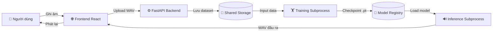

# 🎙️ ViTTS — Vietnamese Personal Voice Cloning System

> **Khóa luận tốt nghiệp** · Fine-tuning F5-TTS trên giọng nói cá nhân tiếng Việt · End-to-End Web Platform

[](https://python.org)
[](https://fastapi.tiangolo.com)
[](https://react.dev)
[](https://docs.docker.com/compose)
[](https://developer.nvidia.com/cuda-toolkit)
[](LICENSE)

---

## 📖 Tổng quan

**ViTTS** là một hệ thống nhân bản giọng nói cá nhân tiếng Việt (Vietnamese Personal TTS / Voice Cloning) hoàn chỉnh, được xây dựng dựa trên kiến trúc **F5-TTS** (Flow Matching + Diffusion Transformer). Hệ thống cung cấp một nền tảng Web khép kín, cho phép người dùng thực hiện toàn bộ quy trình — từ **thu âm dữ liệu**, **huấn luyện mô hình**, đến **sinh giọng nói** — chỉ thông qua một giao diện Web duy nhất.

Điểm đặc biệt của dự án là khả năng **fine-tuning thành công trên GPU có VRAM chỉ 4GB** (NVIDIA RTX 3050 Laptop), thông qua tổ hợp các kỹ thuật tối ưu bộ nhớ tiên tiến: 8-bit AdamW, Gradient Accumulation và Gradient Checkpointing.

### Kết quả đạt được
| Chỉ số | Mô hình Base | Mô hình Fine-tuned |
|:---|:---:|:---:|
| MOS Naturalness | 3.8 | **4.1** |
| MOS Similarity | 3.5 | **4.2** |
| WER (↓ tốt hơn) | 5.2% | **4.5%** |
| Speaker Similarity (SIM-O ↑) | 0.62 | **0.86** |

---

## 🏗️ Kiến trúc hệ thống

### Các thành phần chính

```
┌─────────────────────────────────────────────────────────────┐
│                    Client Browser                            │
│          React SPA (Vite) · Port 3000                       │
│   ┌──────────┐  ┌──────────┐  ┌──────────────────────────┐  │
│   │ Tab Thu  │  │ Tab Huấn │  │   Tab Kiểm thử           │  │
│   │  âm      │  │ luyện    │  │   (Inference)            │  │
│   └──────────┘  └──────────┘  └──────────────────────────┘  │
└──────────────────────┬──────────────────────────────────────┘
                       │ HTTP / SSE Stream
┌──────────────────────▼──────────────────────────────────────┐
│                 FastAPI Backend · Port 8000                  │
│  ┌─────────────┐  ┌──────────────┐  ┌────────────────────┐  │
│  │  /api/      │  │  /api/train  │  │  /api/infer        │  │
│  │  collect    │  │  (SSE Log)   │  │  /generate         │  │
│  └─────────────┘  └──────┬───────┘  └────────┬───────────┘  │
│                          │ subprocess          │ subprocess   │
└──────────────────────────┼─────────────────────┼────────────┘
                           │                     │
┌──────────────────────────▼─────────────────────▼────────────┐
│               Model Registry / Shared Storage                │
│  model_registry/F5-TTS/         shared_storage/              │
│  ├── training_personal_TTS.py   ├── datasets/  (audio+meta) │
│  ├── infer_personal_TTS.py      ├── outputs/   (generated)  │
│  └── ckpts/                     └── hf_cache/  (HuggingFace)│
│      ├── vietnamese/  (pretrained)                           │
│      └── thien_dataset/ (fine-tuned)                        │
└─────────────────────────────────────────────────────────────┘
```

### Luồng xử lý (Data Flow)



**Cơ chế xử lý bất đồng bộ:**
1. Frontend gửi request → Backend trả về **HTTP 202** ngay lập tức
2. Tác vụ nặng (Train/Infer) chạy trong **Background Subprocess** độc lập
3. Log tiến trình được stream về Frontend theo thời gian thực qua **Server-Sent Events (SSE)**
4. Khi subprocess kết thúc, kết quả/checkpoint được lưu vào Shared Storage

---

## ✨ Tính năng

### 🎤 Thu âm dữ liệu (Data Collection)
- Ghi âm trực tiếp bằng **MediaRecorder API** của trình duyệt, không cần phần mềm bên ngoài
- Tự động lưu file WAV chuẩn **24kHz / 16-bit PCM / Mono** (tương thích F5-TTS)
- Tự động ghi metadata định dạng `wavs/file.wav|nội dung văn bản` (chuẩn LibriSpeech/F5-TTS)
- Theo dõi tiến độ thu âm theo thời gian thực (số câu đã đọc / tổng số câu)
- Câu mẫu đa dạng: câu trần thuật, câu hỏi, câu cảm thán, câu dài, từ mượn, số

### 🏋️ Huấn luyện mô hình (Fine-tuning)
- Fine-tuning toàn bộ F5-TTS DiT backbone từ **checkpoint tiếng Việt pretrained**
- Hỗ trợ cấu hình siêu tham số trực tiếp từ giao diện Web (Learning Rate, Epochs, ...)
- Theo dõi **Training Loss** theo thời gian thực qua SSE streaming log
- **Smart Vocab System**: Tự động phát hiện và nạp `vocab.txt` tiếng Việt/Custom
- Tối ưu hóa VRAM cho GPU 4GB: **8-bit AdamW + Gradient Accumulation (×8) + Gradient Checkpointing**
- Lưu checkpoint định kỳ và hỗ trợ tiếp tục huấn luyện từ `model_last.pt` (idempotent)
- **Surgery Loading**: Kế thừa ~99% trọng số DiT backbone, chỉ thay thế text embedding phù hợp vocab mới

### 🔊 Sinh giọng nói (Inference)
- Chọn checkpoint fine-tuned bất kỳ từ giao diện
- Tải âm thanh tham chiếu (voice reference) từ bộ thu âm cá nhân hoặc upload mới
- **Tự động nhận dạng văn bản tham chiếu** bằng Whisper large-v3-turbo nếu không nhập
- Giải ODE Flow Matching qua **32 bước NFE** (RTF ≈ 0.4–0.5 trên GPU)
- Vocoder **Vocos** tổng hợp waveform 24kHz chất lượng cao
- **Persistent Vocoder Caching**: Vocos được cache lại, tránh tải lại nhiều lần
- Tự động phát âm thanh đầu ra ngay trên giao diện

---

## 💻 Yêu cầu hệ thống

### Bắt buộc
| Thành phần | Yêu cầu tối thiểu |
|:---|:---|
| **GPU** | NVIDIA GPU với **≥ 4GB VRAM** (đã kiểm thử: RTX 3050 Laptop 4GB) |
| **VRAM** | 4GB (fine-tuning) / 2GB (inference only) |
| **RAM** | 16GB (khuyến nghị 32GB để nạp model Base ~5GB) |
| **CUDA** | Toolkit 12.x + cuDNN tương ứng |
| **Driver NVIDIA** | Phiên bản hỗ trợ CUDA 12.x |
| **Docker** | Docker Desktop ≥ 24.x với **NVIDIA Container Toolkit** |
| **Dung lượng ổ cứng** | ≥ 20GB (model pretrained + dataset + outputs) |

### Tùy chọn (cho phát triển)
| Thành phần | Phiên bản |
|:---|:---|
| Python | 3.10+ |
| Node.js | 18+ |
| Git | 2.x |

---

## 🚀 Cài đặt

### 1. Clone repository

```bash
git clone https://github.com/HNgocThien/ViTTS.git
cd ViTTS
```

### 2. Tải checkpoint tiếng Việt pretrained

Tải tệp tin checkpoint tiếng Việt [model_last.pt từ HuggingFace](https://huggingface.co/hynt/F5-TTS-Vietnamese-ViVoice/blob/main/model_last.pt) và đặt vào thư mục `model_registry/F5-TTS/ckpts/vietnamese/`:

```
model_registry/F5-TTS/ckpts/vietnamese/
├── model_last.pt      # Checkpoint chính (Tải từ HuggingFace)
└── vocab.txt          # Bảng chữ cái tiếng Việt
```

> 📌 Checkpoint tiếng Việt pretrained được cộng đồng phát triển dựa trên F5-TTS Base (cấu hình V0: `dim=1024, depth=22, heads=16`).

### 3. Cấu hình Backend

Xem và chỉnh sửa file `backend/config.yaml` nếu cần thay đổi đường dẫn model hoặc cấu hình mặc định:

```bash
cat backend/config.yaml
```

### 4. Khởi động hệ thống bằng Docker Compose

```bash
docker compose up --build
```

Sau khi khởi động thành công:
- **Frontend** (Giao diện Web): http://localhost:3000
- **Backend API** (Swagger Docs): http://localhost:8000/docs

### 5. (Tùy chọn) Chạy thủ công không dùng Docker

```bash
# Backend
cd backend
pip install -r requirements.txt
uvicorn main:app --host 0.0.0.0 --port 8000 --reload

# Frontend (terminal khác)
cd frontend
npm install
npm run dev
```

---

## 📱 Sử dụng

### Bước 1 — Thu âm dữ liệu
1. Mở trình duyệt, truy cập http://localhost:3000
2. Vào **Tab Thu âm**
3. Đọc và ghi âm từng câu tiếng Việt theo hướng dẫn trên màn hình
4. Hệ thống tự động lưu và tạo metadata. Khuyến nghị thu âm **≥ 200 câu** (tốt nhất ~700 câu, ~1 giờ âm thanh) để đạt chất lượng tốt

### Bước 2 — Huấn luyện mô hình
1. Vào **Tab Huấn luyện**
2. Cấu hình siêu tham số (Learning Rate, Epochs, ...)
3. Nhấn **Start Training** — Log huấn luyện hiển thị realtime trên màn hình
4. Sau khi hoàn tất, checkpoint được lưu tự động vào `model_registry/F5-TTS/ckpts/`

### Bước 3 — Sinh giọng nói
1. Vào **Tab Kiểm thử**
2. Chọn checkpoint fine-tuned từ danh sách
3. Chọn file âm thanh tham chiếu (reference audio) làm giọng mẫu
4. Nhập văn bản cần chuyển đổi
5. Nhấn **Generate Voice** — Hệ thống tổng hợp và phát âm thanh tự động

---

## 📁 Cấu trúc dự án

```
ViTTS/
├── backend/                        # FastAPI Backend Service
│   ├── app/
│   │   └── api/
│   │       ├── collect.py          # Router: /api/collect — Thu thập dữ liệu
│   │       ├── train.py            # Router: /api/train  — Huấn luyện mô hình
│   │       └── infer.py            # Router: /api/infer  — Sinh giọng nói
│   ├── main.py                     # FastAPI app entry point
│   ├── config.yaml                 # Cấu hình đường dẫn model & tham số
│   ├── config_loader.py            # Đọc và validate config
│   ├── requirements.txt            # Python dependencies
│   └── Dockerfile
│
├── frontend/                       # React + Vite Frontend Service
│   ├── src/
│   │   └── App.jsx                 # SPA chính (3 tab: Thu âm, Huấn luyện, Kiểm thử)
│   ├── index.html
│   ├── vite.config.js
│   ├── package.json
│   └── Dockerfile
│
├── model_registry/                 # Quản lý mã nguồn và checkpoint model
│   └── F5-TTS/                     # Core model F5-TTS
│       ├── training_personal_TTS.py  # Script huấn luyện fine-tuning
│       ├── infer_personal_TTS.py     # Script sinh giọng nói (inference)
│       ├── eval_model.py             # Script đánh giá mô hình (WER, SIM-O)
│       ├── ckpts/
│       │   ├── vietnamese/           # Checkpoint tiếng Việt pretrained
│       │   └── <tên_dataset>/        # Checkpoint sau fine-tuning
│       └── src/                      # Source code F5-TTS (submodule)
│
├── shared_storage/                 # Dữ liệu dùng chung (bind-mount vào Docker)
│   ├── datasets/                   # Dữ liệu thu âm (WAV + metadata.txt)
│   ├── outputs/                    # Âm thanh được tổng hợp + training logs
│   ├── prompts/                    # Câu mẫu tiếng Việt (.csv)
│   └── hf_cache/                   # Cache HuggingFace models (Whisper, Vocos)
│
├── docker-compose.yml              # Cấu hình 2 service (backend + frontend)
└── .gitignore
```

---

## 🤝 Đóng góp

Mọi đóng góp đều được hoan nghênh! Quy trình đề xuất:

1. **Fork** repository này
2. Tạo nhánh tính năng mới: `git checkout -b feature/ten-tinh-nang`
3. Commit thay đổi của bạn: `git commit -m 'feat: mô tả thay đổi'`
4. Push lên nhánh của bạn: `git push origin feature/ten-tinh-nang`
5. Mở **Pull Request** và mô tả chi tiết thay đổi

### Hướng phát triển tiềm năng
- [ ] Hỗ trợ multi-speaker (nhiều người dùng, nhiều giọng nói)
- [ ] Quantization INT8/INT4 để giảm kích thước model xuống ~1-2GB
- [ ] Tích hợp kiểm soát cảm xúc (emotion embedding)
- [ ] Xây dựng Vietnamese TTS Benchmark công khai

---

## 📄 License

Dự án được phân phối theo giấy phép **MIT**. Xem chi tiết tại file [LICENSE](model_registry/F5-TTS/LICENSE).

> **Lưu ý**: F5-TTS gốc được phát triển bởi [SWivid](https://github.com/SWivid/F5-TTS) và nhóm nghiên cứu. Dự án này sử dụng và tinh chỉnh F5-TTS cho tiếng Việt cá nhân theo điều khoản của giấy phép gốc.

---

## 👨‍💻 Tác giả

**Hồ Ngọc Thiện**
- 🎓 Sinh viên năm cuối — Đại học Quy Nhơn
- 📘 Khóa luận tốt nghiệp: *"Xây dựng hệ thống tổng hợp và nhân bản giọng nói cá nhân tiếng Việt sử dụng F5-TTS"*

---

## 📬 Liên hệ

| Kênh | Thông tin |
|:---|:---|
| **Email** | hongocthien1526@gmail.com |
| **GitHub** | [@HNgocThien](https://github.com/HNgocThien) |
| **Repository** | [github.com/HNgocThien/ViTTS](https://github.com/HNgocThien/ViTTS) |

---

<div align="center">
  <sub>Built with ❤️ for Vietnamese Voice Technology · 2026</sub>
</div>
