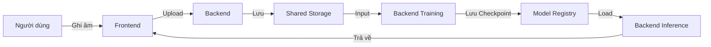

# Tài liệu thiết kế hệ thống TTS (Labeling, Training, Testing) - Monorepo Version

Hệ thống được thiết kế theo kiến trúc Monorepo hiện đại, tối ưu cho quy trình nghiên cứu và phát triển TTS cá nhân.

---

## 1. Kiến trúc tổng quan (Architecture Overview)

Hệ thống được rút gọn thành 2 service chính chạy qua Docker Compose:

- **Frontend (Port 3000)**: React/Vite (Quản lý thu âm, theo dõi huấn luyện và kiểm thử).
- **Backend API (Port 8000)**: FastAPI (Phối hợp toàn bộ logic: Thu thập dữ liệu -> Huấn luyện -> Tạo giọng nói).
- **Storage Strategy**: Sử dụng **Shared Storage** gắn trực tiếp vào Host (Windows), bỏ qua Database để tối ưu tính di động của dữ liệu.

---

## 2. Phần 1: Data Collection (Native Recording)
### Mục tiêu: Thu thập giọng nói chuẩn định dạng LibriSpeech ngay từ đầu.

- **Tích hợp Native**: Không sử dụng iframe. Giao diện thu âm được xây dựng trực tiếp trong Dashboard bằng MediaRecorder API.
- **Quy trình lưu trữ**:
    - Backend tự động tạo cấu trúc: `shared_storage/datasets/{user_id}/wavs`.
    - Tự động ghi nối file metadata: `{user_id}-metadata.txt` theo định dạng `wavs/file.wav|content` (Chuẩn F5-TTS).
- **Tiến độ**: Tự động nhận diện số câu đã đọc bằng cách quét file hệ thống.

---

## 3. Phần 2: Training Management
### Mục tiêu: Điều phối huấn luyện mô hình F5-TTS với giao diện trực quan.

- **Cấu hình**: Dataset được lấy trực tiếp từ `shared_storage/datasets`.
- **Thực thi**: Backend kích hoạt Process huấn luyện nằm trong `model_registry/F5-TTS/`.
- **Giám sát**: Theo dõi Log thời gian thực qua Server-Sent Events (SSE).

---

## 4. Phần 3: Inference & Testing
### Mục tiêu: Chạy thử mô hình và tạo âm thanh chất lượng cao.

- **Checkpoints**: Tự động quét các file `.pt` trong `model_registry/F5-TTS/ckpts/`.
- **Conditioning**: Sử dụng các file vừa thu âm trong `shared_storage/datasets` làm Voice Reference (âm thanh mồi).
- **Kết quả**: File đầu ra được lưu tại `shared_storage/outputs/`.

---

## 5. Cấu trúc Monorepo (Tree Structure)

```text
.
├── backend/               # FastAPI Unified Backend
├── frontend/              # React/Vite Unified Dashboard
├── model_registry/        # Quản lý Source code và Checkpoints của model
│   └── F5-TTS/            # Core logic của F5-TTS
│   └── (Tuơng lai) VITS/  # Các model tương lai có thể plug-and-play thông qua cấu hình `backend/config.yaml` (train_script, infer_script, type).
├── shared_storage/        # Dữ liệu dùng chung (Host-mounted)
│   ├── datasets/          # Chứa giọng nói đã thu âm + metadata
│   ├── outputs/           # Chứa âm thanh được tạo ra + logs
│   └── prompts/           # Chứa file câu mẫu (.csv)
└── docker-compose.yml     # Cấu hình 2 service duy nhất
```

---

## 6. Luồng dữ liệu (Data Flow)



---

## 7. Cấu hình Docker (Simplified)

| Service | Port | Device | Volume Mapping |
| :--- | :--- | :--- | :--- |
| **backend** | 8000 | GPU (NVIDIA) | `./shared_storage`, `./model_registry` |
| **frontend** | 3000 | CPU | `./frontend` |

---

## 8. Trạng thái Triển khai (Status)
- [x] **Monorepo Migration**: Đã hoàn tất 100%.
- [x] **Native Recording**: Hoạt động, ghi trực tiếp ra định dạng Dataset chuẩn.
- [x] **Unified API**: Tích hợp xong Train/Infer/Collect vào 1 port 8000.
