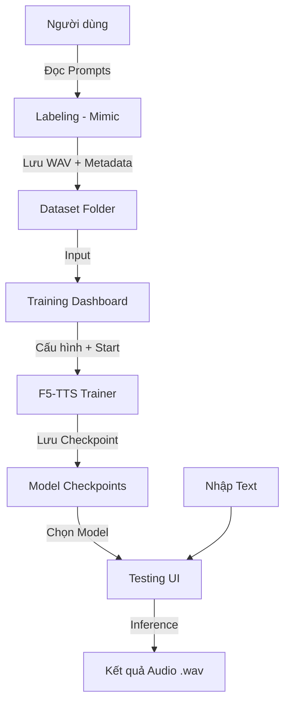

# Tài liệu thiết kế hệ thống TTS (Labeling, Training, Testing)

Hệ thống này được thiết kế để cung cấp một quy trình khép kín từ việc thu thập giọng nói cá nhân đến việc huấn luyện mô hình TTS và thực hiện chuyển đổi văn bản thành giọng nói (Inference).

---

## 1. Kiến trúc tổng quan (Architecture Overview)

Hệ thống được chia thành 3 phần chính chạy trên một nền tảng Web thống nhất:

- **Frontend**: React/Next.js (Giao diện hiện đại, responsive).
- **Backend API**: FastAPI (Python) - Phục vụ quản lý dữ liệu, điều phối huấn luyện và thực hiện inference.
- **Database**: SQLite (Lưu trữ thông tin người dùng, danh sách bản thu, cấu hình huấn luyện và lịch sử checkpoint).
- **Storage**: Directory-based storage cho audio files (.wav) và model checkpoints (.pt).

---

## 2. Phần 1: Labeling (Thu thập dữ liệu)
### Mục tiêu: Tái sử dụng Mimic Recording Studio để thu âm giọng nói chất lượng cao.

- **Tích hợp**: 
    - Sử dụng giao diện thu âm của Mimic (Frontend) để dẫn dắt người dùng đọc các câu mẫu (prompts).
    - Backend API sẽ ghi nhận các file âm thanh vào thư mục `datasets/{user_id}/wavs`.
    - Tự động tạo file metadata theo định dạng `filename|transcription|duration` (tương đương định dạng mà F5-TTS yêu cầu).
- **Chức năng chính**:
    - Hiển thị script/prompt cho người đọc.
    - Ghi âm, cắt bỏ khoảng lặng (trim silence) tự động bằng module `Audio` của Mimic.
    - Xem lại và ghi âm lại nếu cần.
    - Thống kê tiến độ (đã đọc bao nhiêu câu, tổng thời lượng đã thu được).

---

## 3. Phần 2: Training Model trên Web
### Mục tiêu: Giao diện trực quan để huấn luyện mô hình F5-TTS cho giọng nói vừa thu được.

- **Giao diện cấu hình (Configuration UI)**:
    - **Chọn Dataset**: Chọn tập dữ liệu vừa thu (hoặc các tập dữ liệu có sẵn).
    - **Chọn Model cơ sở (Base Model)**: Lựa chọn F5TTS-Base hoặc F5TTS-Small để Finetuning.
    - **Tham số huấn luyện**:
        - Batch size (mặc định: tự động theo VRAM).
        - Learning rate (mặc định: 7.5e-5).
        - Epochs: Số lần huấn luyện qua toàn bộ dữ liệu.
        - Number of warmup updates.
- **Quản lý tiến trình (Training Manager)**:
    - Nút **"Start Training"**: Kích hoạt một background process chạy `Trainer` từ F5-TTS.
    - **Real-time Monitoring**: Sử dụng WebSockets để gửi logs và giá trị Loss (MSE Loss) từ backend lên frontend.
    - Biểu đồ Loss: Hiển thị sự hội tụ của mô hình.
- **Checkpointing**: Tự động lưu các file `.pt` vào thư mục `ckpts/{run_name}/`.

---

## 4. Phần 3: Test & Generation (Inference)
### Mục tiêu: Kiểm thử mô hình đã huấn luyện và tạo giọng nói từ văn bản bất kỳ.

- **Giao diện kiểm thử**:
    - **Chọn Checkpoint**: Danh sách các model đã huấn luyện thành công.
    - **Text Input**: Ô nhập văn bản muốn chuyển đổi (Hỗ trợ tiếng Việt).
    - **Voice Generation**: Nút kích hoạt quá trình Inference (sử dụng CFM và DiT của F5-TTS).
- **Đầu ra (Output)**:
    - **File .wav**: Tạo file âm thanh để người dùng có thể tải về.
    - **Audio Player**: Trình phát nhạc tích hợp để nghe kết quả ngay lập tức.
    - **Real-time Option**: Cung cấp lựa chọn streaming audio (tạo âm thanh theo từng block) để giảm độ trễ cho người dùng.
- **Tính năng nâng cao**:
    - **Reference Audio Selection**: Cho phép chọn một đoạn âm thanh mẫu (ref audio) từ phần Labeling để làm "mồi" (conditioning) cho quá trình tạo giọng nói, đảm bảo tính ổn định của cảm xúc và ngữ điệu.

---

## 5. Luồng dữ liệu (Data Flow)

## 6. Yêu cầu hệ thống (System Requirements)
- **Phần cứng**: Khuyến nghị GPU NVIDIA (>= 8GB VRAM) để huấn luyện và inference ổn định.
- **Môi trường**: Python 3.10+, PyTorch 2.0+, CUDA 11+.

---

## 7. Kiến trúc Docker (Docker Architecture)

Hệ thống được vận hành thông qua Docker Compose với **5 container** chính:

| Service | Container Name | Port | GPU | Mục đích |
| :--- | :--- | :--- | :--- | :--- |
| **mrs-backend** | mrs-backend | 5000 | ❌ | Backend thu thập dữ liệu (Mimic Recording Studio). |
| **mrs-frontend** | mrs-frontend | 3000 | ❌ | Giao diện thu âm. |
| **tts-train** | tts-train | 8000 | ✅ | Backend FastAPI **chỉ xử lý Training** (yêu cầu GPU/CUDA). |
| **tts-infer** | tts-infer | 8001 | ❌ | Backend FastAPI **chỉ xử lý Inference/Generation** (không cần GPU). |
| **tts-dashboard** | tts-dashboard | 3001 | ❌ | Giao diện quản lý huấn luyện và kiểm thử. |

### Phân chia trách nhiệm Backend

| Endpoint | Service |
| :--- | :--- |
| `POST /train`, `GET /train/status`, `GET /train_stream` | **tts-train** (port 8000) |
| `POST /generate`, `GET /audio/{file}` | **tts-infer** (port 8001) |
| `GET /datasets`, `GET /checkpoints` | Cả hai service đều có (read-only) |

### Chia sẻ dữ liệu (Shared Volumes)
- `mrs-audio-data` (named volume): audio files từ Mimic → mount vào `/datasets` trên cả `tts-train` và `tts-infer`.
- `tts-generated` (named volume): thư mục `/app/generated` chia sẻ giữa `tts-train` (ghi log) và `tts-infer` (ghi audio output).
- `./ckpts` (bind mount): lưu model checkpoints, được mount vào cả `tts-train` (ghi) và `tts-infer` (đọc).
- **Mã nguồn App**: `./app/tts-train`, `./app/tts-infer`, `./app/tts-dashboard`.

---

## 8. Trạng thái Triển khai (Implementation Status)

- [x] **Labeling (Mimic Recording Studio)**: Đã có sẵn mã nguồn và đang hoạt động.
- [x] **Training (tts-backend & tts-dashboard)**:
    - UI/UX glassmorphism dark-mode hoàn chỉnh.
    - Cấu hình đầy đủ: `dataset`, `base_model`, `epoch`, `batch_size`, `learning_rate`, `num_warmup_updates`.
    - `POST /train` → spawn `training_personal_TTS.py` qua `subprocess.Popen`, ghi stdout → `training_log.txt`.
    - `GET /train_stream` → SSE tail log file real-time về browser, kết thúc tự động khi status `done`/`failed`.
    - `GET /train/status` → endpoint kiểm tra trạng thái training (`idle` | `running` | `done` | `failed`).
    - Badge trạng thái và auto-scroll log trong dashboard.
- [x] **Generation & Testing (Inference)**:
    - `POST /generate` → Thử F5-TTS Python API (`f5_tts.api.F5TTS`) → fallback CLI → fallback silent WAV placeholder.
    - Tự động tìm checkpoint mới nhất khi không chỉ định.
    - `GET /datasets/{name}/ref_audios` → liệt kê WAV files từ dataset để làm reference audio.
    - `GET /datasets/{name}/audio/{path}` → serve audio file để preview trực tiếp trong UI.
    - Giao diện Testing: chọn checkpoint, chọn ref audio + preview + nhập transcription, play + download WAV.
- **Tiếp theo**: Chạy `docker-compose restart tts-backend tts-dashboard` để áp dụng thay đổi và kiểm chứng end-to-end!
