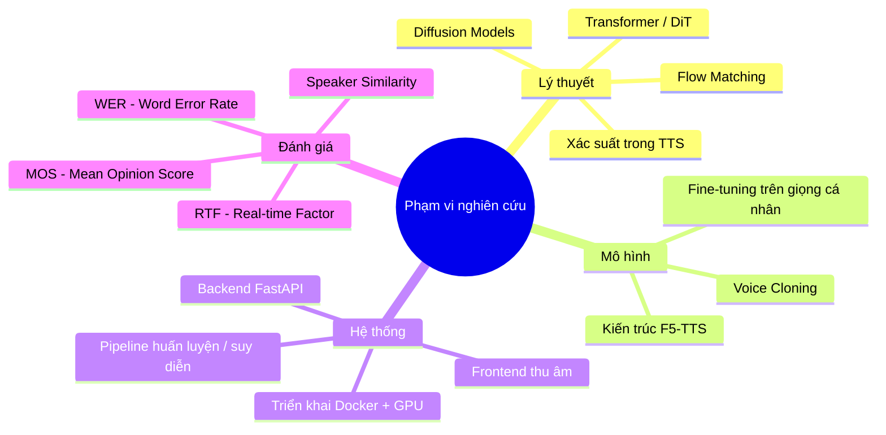
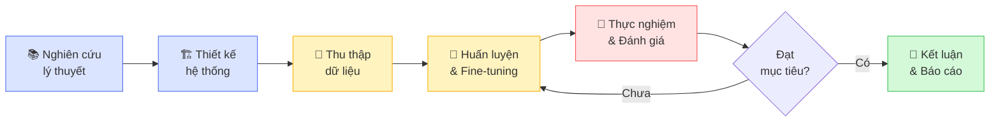
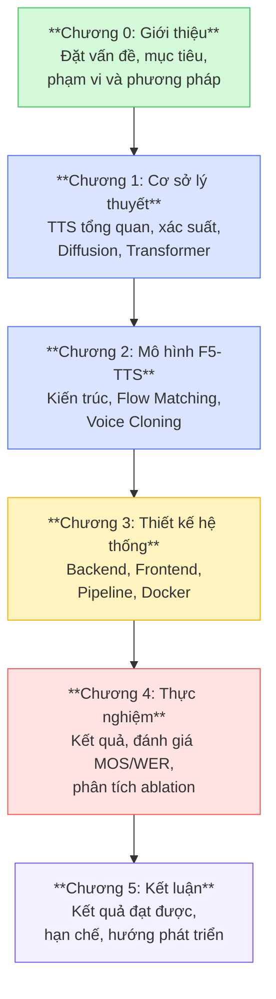

# Chương 0: Giới Thiệu

> **Trạng thái**: ✅ Done  
> **Cập nhật**: 2026-04-27  
> **File index**: [indexed.md](indexed.md)

---

## 0.1. Đặt Vấn Đề

Trong thế giới hiện đại, giao tiếp giữa con người và máy tính ngày càng đóng vai trò quan trọng trong mọi lĩnh vực — từ trợ lý ảo, hệ thống đọc sách cho người khiếm thị, đến công nghệ hỗ trợ học ngoại ngữ. **Chuyển văn bản thành giọng nói** (*Text-to-Speech*, viết tắt là **TTS**) là một bài toán cốt lõi thực hiện nhiệm vụ này: biến một chuỗi văn bản đầu vào thành tín hiệu âm thanh nghe tự nhiên như giọng người thật.

Mặc dù TTS đã có lịch sử phát triển từ những năm 1950 với các hệ thống dựa trên luật (*rule-based*) [1], nhưng cho đến những năm gần đây, các hệ thống TTS vẫn bộc lộ nhiều hạn chế:

- **Thiếu tự nhiên**: Giọng đọc mang âm điệu cơ khí, thiếu ngữ điệu phong phú.
- **Kém linh hoạt**: Không thể bắt chước giọng nói của một người cụ thể (*voice cloning*).
- **Phụ thuộc dữ liệu lớn**: Cần hàng chục giờ dữ liệu ký âm để đạt chất lượng tốt.

Với sự bùng nổ của học sâu (*deep learning*), đặc biệt là các mô hình sinh (*generative models*) như **Diffusion Models** [2] và **Flow Matching** [3], chất lượng TTS đã đạt bước ngoặt vượt trội: các hệ thống hiện đại như VALL-E [4], NaturalSpeech [5], hay **F5-TTS** [6] có thể sinh giọng nói chất lượng cao, thậm chí nhái giọng chỉ với vài giây audio tham chiếu.

Tiếng Việt là một ngôn ngữ thanh điệu (*tonal language*) với 6 thanh điệu, cấu trúc âm tiết phức tạp và ngữ điệu đặc thù — đặt ra những thách thức riêng so với tiếng Anh và các ngôn ngữ Latin [7]. Hiện nay, hầu hết các nghiên cứu TTS tiên tiến đều tập trung vào tiếng Anh, trong khi các hệ thống TTS tiếng Việt chất lượng cao còn rất hạn chế, đặc biệt ở khả năng **nhân bản giọng nói cá nhân** (*personal voice cloning*).

Luận văn này tập trung giải quyết vấn đề đó: **xây dựng một hệ thống TTS tiếng Việt có khả năng nhân bản giọng nói cá nhân**, dựa trên kiến trúc **F5-TTS** kết hợp với kỹ thuật fine-tuning hiện đại.

---

## 0.2. Mục Tiêu Nghiên Cứu

Luận văn đặt ra các mục tiêu cụ thể như sau:

### Mục tiêu tổng quát
> Xây dựng một hệ thống hoàn chỉnh cho phép người dùng **thu âm giọng nói cá nhân**, **huấn luyện mô hình** trên giọng đó và **sinh giọng nói** từ văn bản tùy ý với chất lượng tự nhiên, trung thực với giọng gốc.

### Mục tiêu cụ thể

| # | Mục tiêu | Chỉ số đánh giá |
|---|---------|----------------|
| 1 | Hiểu và triển khai kiến trúc F5-TTS dựa trên Flow Matching | Mô hình chạy thành công, sinh âm thanh nghe được |
| 2 | Fine-tune mô hình F5-TTS pretrained trên giọng nói cá nhân tiếng Việt | MOS ≥ 3.5 / 5.0 sau fine-tuning |
| 3 | Xây dựng pipeline thu thập dữ liệu, huấn luyện và suy diễn tự động hóa | Pipeline end-to-end hoạt động ổn định |
| 4 | Tối ưu triển khai trên GPU có VRAM hạn chế (≤ 4 GB) | RTF < 1.0 (sinh nhanh hơn thời gian thực) |
| 5 | Đánh giá và so sánh chất lượng trước/sau fine-tuning | WER, MOS, RTF, Speaker Similarity |

---

## 0.3. Phạm Vi và Đối Tượng Nghiên Cứu

### Phạm vi nghiên cứu

Luận văn tập trung vào các nội dung sau:

**Ngoài phạm vi:**
- Nghiên cứu các mô hình TTS khác ngoài F5-TTS (chỉ đề cập để so sánh).
- Huấn luyện mô hình từ đầu (*from scratch*) trên tập dữ liệu lớn.
- Phát triển hệ thống sản xuất (*production-grade*) với scale lớn.

### Đối tượng nghiên cứu

| Đối tượng | Mô tả |
|----------|-------|
| **Mô hình F5-TTS** | Kiến trúc, cơ chế hoạt động, quá trình huấn luyện và suy diễn |
| **Dữ liệu giọng nói** | Âm thanh tiếng Việt thu âm cá nhân (~1–5 giờ) |
| **Kỹ thuật fine-tuning** | Các chiến lược tinh chỉnh mô hình trên dữ liệu nhỏ, VRAM hạn chế |
| **Hệ thống end-to-end** | Pipeline từ thu âm → huấn luyện → sinh giọng nói |

---

## 0.4. Phương Pháp Tiếp Cận

Luận văn áp dụng phương pháp nghiên cứu kết hợp giữa **lý thuyết** và **thực nghiệm**, cụ thể theo quy trình sau:

### Bước 1 — Nghiên cứu lý thuyết
- Khảo sát tài liệu về TTS, Diffusion Models, Flow Matching và kiến trúc Transformer.
- Đọc và phân tích bài báo gốc F5-TTS [6] và các công trình liên quan.

### Bước 2 — Thiết kế hệ thống
- Thiết kế kiến trúc monorepo gồm Backend (FastAPI), Frontend (React/Vanilla JS) và Pipeline ML.
- Xác định các thành phần cần xây dựng và tích hợp.

### Bước 3 — Thu thập dữ liệu
- Xây dựng công cụ thu âm giọng nói qua giao diện web.
- Thu âm khoảng 1–5 giờ với các câu văn bản đa dạng tiếng Việt.
- Tiền xử lý: chuẩn hóa âm lượng, loại bỏ nhiễu, phân đoạn.

### Bước 4 — Huấn luyện và Fine-tuning
- Tải mô hình F5-TTS pretrained (tiếng Anh).
- Fine-tune trên tập dữ liệu giọng cá nhân tiếng Việt với các kỹ thuật tối ưu VRAM:
  - Gradient Checkpointing
  - 8-bit Optimizer (bitsandbytes)
  - Gradient Accumulation

### Bước 5 — Thực nghiệm và đánh giá
- Thực hiện các kịch bản suy diễn: single-speaker, zero-shot cloning, long-text chunking.
- Đánh giá bằng các chỉ số định lượng (RTF, WER) và định tính (MOS).

---

## 0.5. Cấu Trúc Luận Văn

Luận văn được tổ chức thành 6 chương chính:

| Chương | Tiêu đề | Nội dung tóm tắt |
|--------|---------|-----------------|
| **0** | Giới thiệu | Đặt vấn đề, mục tiêu, phạm vi nghiên cứu |
| **1** | Cơ sở lý thuyết | TTS tổng quan, mô hình xác suất, Diffusion Models, Transformer |
| **2** | Mô hình F5-TTS | Kiến trúc chi tiết, Flow Matching, Voice Cloning |
| **3** | Thiết kế hệ thống | Backend, Frontend, pipeline huấn luyện/suy diễn |
| **4** | Thực nghiệm & đánh giá | Kết quả đo lường, so sánh, phân tích |
| **5** | Kết luận | Tổng kết, hạn chế và hướng phát triển |

---

## Tài Liệu Tham Khảo

[1] Klatt, D. H. (1987). *Review of text-to-speech conversion for English*. Journal of the Acoustical Society of America, 82(3), 737–793. https://doi.org/10.1121/1.395275

[2] Ho, J., Jain, A., & Abbeel, P. (2020). *Denoising Diffusion Probabilistic Models*. NeurIPS 2020. https://arxiv.org/abs/2006.11239

[3] Lipman, Y., Chen, R. T. Q., Ben-Hamu, H., Nickel, M., & Le, M. (2022). *Flow Matching for Generative Modeling*. ICLR 2023. https://arxiv.org/abs/2210.02747

[4] Wang, C., Chen, S., Wu, Y., et al. (2023). *Neural Codec Language Models are Zero-Shot Text to Speech Synthesizers (VALL-E)*. arXiv:2301.02111. https://arxiv.org/abs/2301.02111

[5] Shen, K., Ju, Z., Tan, X., et al. (2023). *NaturalSpeech: End-to-End Text to Speech Synthesis with Human-Level Quality*. IEEE TASLP. https://arxiv.org/abs/2205.04421

[6] Chen, Y., et al. (2024). *F5-TTS: A Fairytaler that Fakes Fluent and Faithful Speech with Flow Matching*. arXiv:2410.06885. https://arxiv.org/abs/2410.06885

[7] Luong, H. T., & Vu, N. T. (2022). *Vietnamese Text-to-Speech: Challenges and Opportunities*. Proceedings of INTERSPEECH 2022.

---

## Phụ Lục — Giải Thích Thuật Ngữ Chuyên Ngành

> *Phần này giúp người đọc chưa có nền tảng chuyên sâu hiểu các khái niệm cơ bản được sử dụng trong luận văn.*

### Text-to-Speech (TTS) là gì?
**TTS** (Chuyển văn bản thành giọng nói) là công nghệ cho phép máy tính đọc to một đoạn văn bản bất kỳ thành âm thanh giống giọng người. Ví dụ: khi bạn mở Google Maps và nghe chỉ đường bằng giọng nói, đó chính là TTS.

### Voice Cloning (Nhân bản giọng nói) là gì?
**Voice Cloning** là khả năng của hệ thống TTS học và tái tạo đặc điểm giọng nói của một người cụ thể. Chỉ cần cung cấp vài giây audio tham chiếu, hệ thống có thể đọc văn bản bất kỳ bằng đúng giọng của người đó.

### Fine-tuning là gì?
**Fine-tuning** (tinh chỉnh) là kỹ thuật lấy một mô hình đã được huấn luyện trước (*pretrained model*) trên dữ liệu lớn, rồi tiếp tục huấn luyện thêm (*re-train*) trên một tập dữ liệu nhỏ hơn, chuyên biệt hơn. Thay vì học lại từ đầu (tốn kém), ta chỉ "tinh chỉnh" những gì mô hình đã biết để phù hợp với bài toán mới.

### MOS (Mean Opinion Score) là gì?
**MOS** là thang điểm đánh giá chất lượng âm thanh từ 1.0 đến 5.0, dựa trên ý kiến của nhóm người nghe thực:
| Điểm | Chất lượng |
|------|-----------|
| 5.0 | Xuất sắc — nghe như giọng người thật |
| 4.0 | Tốt — tự nhiên, dễ nghe |
| 3.0 | Trung bình — nghe được nhưng có lỗi nhỏ |
| 2.0 | Kém — nhiều lỗi, khó nghe |
| 1.0 | Rất kém — không thể hiểu |

### RTF (Real-Time Factor) là gì?
**RTF** = (Thời gian sinh âm thanh) / (Độ dài âm thanh sinh ra)

- **RTF < 1.0**: Hệ thống sinh âm thanh **nhanh hơn** thời gian thực → đủ dùng trong ứng dụng thực tế.
- **RTF = 1.0**: Sinh âm thanh 10 giây mất đúng 10 giây.
- **RTF > 1.0**: Hệ thống quá chậm, không dùng thực tế được.

### WER (Word Error Rate) là gì?
**WER** đo tỷ lệ lỗi từ khi nhận dạng ngược âm thanh sinh ra (dùng ASR). WER càng thấp, giọng nói sinh ra càng rõ ràng, dễ hiểu. WER = 0% nghĩa là hệ thống ASR nhận dạng lại đúng 100% những gì đã đọc.

### Thanh điệu tiếng Việt — vì sao khó cho TTS?
Tiếng Việt có 6 thanh điệu (ngang, huyền, sắc, hỏi, ngã, nặng), mỗi thanh thay đổi hoàn toàn nghĩa của từ (ví dụ: *ma, mà, má, mả, mã, mạ*). Mô hình TTS cần học chính xác pitch contour (đường cong cao độ) của từng thanh điệu — điều này đòi hỏi mô hình phải nắm bắt được thông tin ngữ âm học sâu hơn so với các ngôn ngữ phi thanh điệu.
