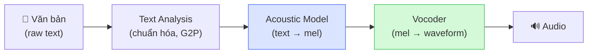
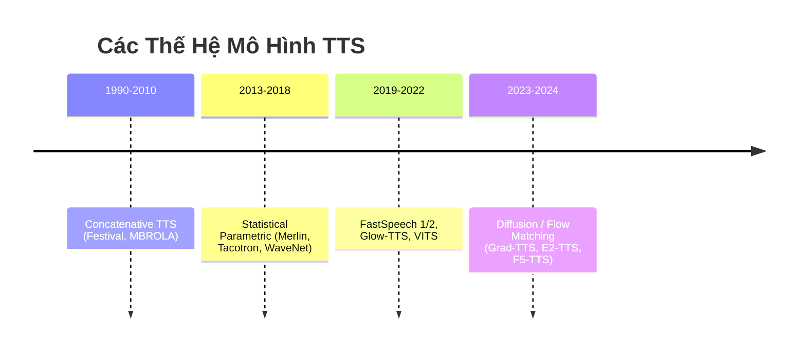

# 1.1 Tổng Quan về Bài Toán Text-to-Speech

## 1.1.1 Khái Niệm và Các Thành Phần Của Hệ Thống TTS

**Text-to-Speech (TTS)** là tác vụ ánh xạ một chuỗi ký tự $\mathbf{y} = [y_1, \ldots, y_N]$ thành tín hiệu âm thanh $\mathbf{x}$ nghe tự nhiên và trung thực với nội dung ngôn ngữ \[[1]\]. Không giống một phép biến đổi tất định, TTS là bài toán **one-to-many**: cùng một câu văn bản có thể được phát âm với vô số tốc độ, ngữ điệu và cảm xúc khác nhau, nên mô hình cần học phân phối xác suất $p(\mathbf{x}|\mathbf{y})$ thay vì hàm xác định \[[2]\].

Kiến trúc TTS truyền thống gồm ba tầng xử lý nối tiếp:

1. **Text Analysis**: Chuẩn hóa văn bản, chuyển grapheme thành phoneme (G2P), và dự đoán prosody (trọng âm, ngữ điệu) \[[3]\].
2. **Acoustic Model**: Tạo ra biểu diễn âm học trung gian — thường là **mel-spectrogram** \[[4]\] — từ chuỗi ký tự/phoneme.
3. **Vocoder**: Chuyển mel-spectrogram thành dạng sóng phát được (waveform). Các vocoder thần kinh hiện đại như HiFi-GAN \[[5]\] và Vocos \[[6]\] đạt chất lượng gần như không thể phân biệt với giọng người thật.

> **Ghi chú (F5-TTS)**: F5-TTS \[[2]\] hợp nhất Text Analysis và Acoustic Model thành một mô hình end-to-end duy nhất, dùng byte-level tokenizer nên loại bỏ bước G2P — lợi thế quan trọng với tiếng Việt có nhiều dấu thanh.

---

## 1.1.2 Tiến Trình Phát Triển Các Mô Hình TTS

Sự tiến hóa của TTS có thể tóm lược qua bốn thế hệ:

### Thế hệ 1 — Concatenative TTS

Ghép nối các đoạn âm thanh được ghi âm sẵn \[[7]\]. Chất lượng tự nhiên khi chuỗi ghép trôi chảy, nhưng cứng nhắc, cần kho dữ liệu hàng giờ và chỉ phục vụ một người nói.

### Thế hệ 2 — Statistical Parametric TTS (HMM/DNN)

Dùng mô hình xác suất (HMM, sau là DNN) để học tham số acoustic \[[8]\]. Linh hoạt hơn, hỗ trợ đa người nói, nhưng giọng nói mang tính cơ học, thiếu sắc thái do hiện tượng *oversmoothing* khi tối ưu hóa MLE \[[9]\].

### Thế hệ 3 — Deep Generative TTS (AR/NAR)

End-to-end đầu tiên: Tacotron \[[10]\] học trực tiếp text → mel, WaveNet \[[11]\] sinh waveform từng mẫu. Chất lượng vượt trội nhưng sinh tuần tự (autoregressive) nên **rất chậm**. FastSpeech \[[12]\] và FastSpeech 2 \[[13]\] chuyển sang non-autoregressive — nhanh hơn 50× nhưng cần forced alignment.

### Thế hệ 4 — Flow/Diffusion-based TTS

Diffusion Models \[[14]\] áp dụng cho TTS (Grad-TTS \[[15]\], DiffTTS \[[16]\]) cho chất lượng cao và phân phối đa dạng, nhưng cần 1000 bước suy diễn. **Flow Matching** \[[17]\] giải quyết tốc độ bằng cách học vector field xác định — F5-TTS \[[2]\] chỉ cần 10–32 bước ODE để đạt MOS ~4.5.

---

## 1.1.3 Vị Trí Của F5-TTS Trong Bức Tranh Tổng Thể

**E2-TTS** (Embarrassingly Easy TTS) \[[18]\] là tiền thân trực tiếp của F5-TTS: thay toàn bộ pipeline TTS bằng một Diffusion Transformer được điều kiện hóa bằng văn bản, học ánh xạ $\mathcal{N}(0,\mathbf{I}) \to p(\mathbf{x}|\mathbf{y})$ qua Flow Matching mà không cần alignment trung gian.

**F5-TTS** \[[2]\] kế thừa ý tưởng E2-TTS và bổ sung ba cải tiến chính:

| Thành phần | E2-TTS | F5-TTS |
|---|---|---|
| Text Encoder | Embedding đơn giản | ConvNeXt V2 \[[19]\] — nắm bắt ngữ cảnh cục bộ hiệu quả |
| Sampling | ODE chuẩn | **Sway Sampling** — giảm xuống 5–10 bước |
| Alignment | Không có | Không có (fully non-autoregressive) |

Kết quả: F5-TTS đạt tốc độ thời gian thực (RTF < 1) trên GPU tiêu dùng trong khi vẫn hỗ trợ zero-shot voice cloning đa ngôn ngữ, bao gồm tiếng Việt \[[2]\].

---

## Kết Luận Phần 1.1

TTS đã tiến từ việc ghép nối âm thanh cứng nhắc đến các mô hình sinh chất lượng cao dựa trên Flow Matching. Ba thách thức mà các thế hệ trước chưa giải quyết triệt để — *chất lượng tự nhiên*, *tốc độ suy diễn*, và *khả năng zero-shot cloning* — chính là động lực thiết kế của F5-TTS, được trình bày chi tiết trong Chương 2.

---

## Tài Liệu Tham Khảo

| # | Tác giả | Năm | Tiêu đề | Venue |
|---|---------|-----|---------|-------|
| [1] | Tan, X., et al. | 2021 | *A Survey on Neural Speech Synthesis* | arXiv:2106.15561 |
| [2] | Chen, Y., Yue, Z., et al. | 2024 | *F5-TTS: A Fairytaler that Fakes Fluent and Faithful Speech with Flow Matching* | arXiv:2410.06885 |
| [3] | Taylor, P. | 2009 | *Text-to-Speech Synthesis* | Cambridge University Press |
| [4] | Stevens, S.S., Volkmann, J., Newman, E.B. | 1937 | *A Scale for the Measurement of the Psychological Magnitude Pitch* | J. Acoust. Soc. Am. |
| [5] | Kong, J., Kim, J., Bae, J. | 2020 | *HiFi-GAN: Generative Adversarial Networks for Efficient and High Fidelity Speech Synthesis* | NeurIPS 2020 |
| [6] | Siuzdak, H. | 2023 | *Vocos: Closing the Gap Between Time-Domain and Fourier-Based Neural Vocoders* | arXiv:2306.00814 |
| [7] | Hunt, A., Black, A.W. | 1996 | *Unit Selection in a Concatenative Speech Synthesis System* | ICASSP 1996 |
| [8] | Zen, H., Tokuda, K., Black, A.W. | 2009 | *Statistical Parametric Speech Synthesis* | Speech Communication |
| [9] | Theis, L., Oord, A. v. d., Bethge, M. | 2016 | *A Note on the Evaluation of Generative Models* | ICLR 2016 |
| [10] | Wang, Y., Skerry-Ryan, R.J., et al. | 2017 | *Tacotron: Towards End-to-End Speech Synthesis* | Interspeech 2017 |
| [11] | van den Oord, A., et al. | 2016 | *WaveNet: A Generative Model for Raw Audio* | arXiv:1609.03499 |
| [12] | Ren, Y., et al. | 2019 | *FastSpeech: Fast, Robust and Controllable Text to Speech* | NeurIPS 2019 |
| [13] | Ren, Y., Hu, C., et al. | 2021 | *FastSpeech 2: Fast and High-Quality End-to-End Text to Speech* | ICLR 2021 |
| [14] | Ho, J., Jain, A., Abbeel, P. | 2020 | *Denoising Diffusion Probabilistic Models* | NeurIPS 2020 |
| [15] | Popov, V., et al. | 2021 | *Grad-TTS: A Diffusion Probabilistic Model for Text-to-Speech* | ICML 2021 |
| [16] | Jeong, M., et al. | 2021 | *DiffTTS: A Denoising Diffusion Probabilistic Model for Text-to-Speech* | arXiv:2104.01409 |
| [17] | Lipman, Y., Chen, R.T.Q., et al. | 2022 | *Flow Matching for Generative Modeling* | ICLR 2023 |
| [18] | Eskimez, S.E., Wang, X., et al. | 2024 | *E2 TTS: Embarrassingly Easy Fully Non-Autoregressive Zero-Shot TTS* | arXiv:2406.18009 |
| [19] | Woo, S., et al. | 2023 | *ConvNeXt V2: Co-designing and Scaling ConvNets with Masked Autoencoders* | CVPR 2023 |

---

## 📎 Phụ Lục — Giải Thích Thuật Ngữ

### Mel-Spectrogram là gì?

Là **"bức ảnh" của âm thanh** theo trục thời gian (ngang) và tần số (dọc), trong đó trục tần số được co theo thang mel — thang đo cảm nhận âm thanh của tai người (dày ở tần số thấp, thưa ở tần số cao) \[[4]\]:

$$\text{Mel}(f) = 2595 \cdot \log_{10}\!\left(1 + \frac{f}{700}\right)$$

Mô hình học ánh xạ text → mel-spectrogram, sau đó Vocoder chuyển mel về waveform phát được.

### Vocoder là gì?

Phần mềm/mô hình chuyển mel-spectrogram ngược về dạng sóng âm thanh. HiFi-GAN \[[5]\] và Vocos \[[6]\] là hai vocoder thần kinh hiện đại đạt chất lượng không phân biệt được với giọng người thật.

### Prosody là gì?

Tập hợp các đặc tính siêu âm vị (suprasegmental) quyết định "cảm xúc" của giọng nói:

| Thành phần | Ý nghĩa |
|---|---|
| **Duration** | Thời gian phát âm mỗi âm vị |
| **Pitch (F0)** | Cao độ cơ bản — lên/xuống theo câu hỏi, khẳng định |
| **Energy** | Âm lượng — nhấn hay không nhấn trọng âm |
| **Speaking rate** | Tốc độ nói — nhanh khi hứng khởi, chậm khi giải thích |

### Zero-shot Voice Cloning là gì?

Khả năng tái tạo giọng nói của một người lạ chỉ từ vài giây audio tham chiếu, **không cần fine-tune lại mô hình**. F5-TTS đạt điều này bằng cách concatenate mel của audio tham chiếu vào đầu vào của Diffusion Transformer.

### Autoregressive vs Non-Autoregressive

- **Autoregressive (AR)**: Sinh frame $m_i$ dựa vào các frame trước $m_{1:i-1}$ → tuần tự, chậm.  
  $$p(\mathbf{m}|\mathbf{y}) = \prod_{i=1}^{M} p(m_i \mid m_{1:i-1}, \mathbf{y})$$
- **Non-Autoregressive (NAR)**: Sinh tất cả frames song song → nhanh hơn 50–100×.  
  $$p(\mathbf{m}|\mathbf{y}) = \prod_{i=1}^{M} p(m_i \mid \mathbf{y})$$

F5-TTS thuộc loại NAR — đây là lý do nó đạt được tốc độ thời gian thực.
