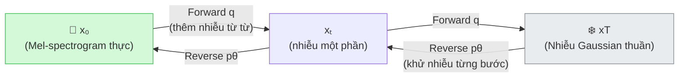

# 1.3 Diffusion Models và Flow Matching

Chương 1.2 xác lập rằng TTS cần học phân phối $p_\theta(\mathbf{x}|\mathbf{y})$ thông qua một *objective* phù hợp. Chương này trình bày hai phương pháp cốt lõi để hiện thực hóa điều đó: **Diffusion Models** — nền tảng lý thuyết, và **Flow Matching** — cải tiến trực tiếp mà F5-TTS áp dụng.

---

## 1.3.1 Diffusion Models — Ý Tưởng Và Cơ Chế

### Nguyên Lý: Hai Quá Trình Đối Nghịch

Diffusion Models \[[1]\] xây dựng hai quá trình Markov đối nghịch trên không gian dữ liệu $\mathcal{X}$:

- **Forward Process** $q$ (cố định, không học): Thêm nhiễu Gaussian vào $x_0$ qua $T$ bước cho đến khi $x_T \sim \mathcal{N}(0, \mathbf{I})$.
- **Reverse Process** $p_\theta$ (cần học): Dùng mạng nơ-ron học cách khử nhiễu từ $x_T$ về $x_0$.

Ưu điểm so với GAN \[[2]\]: Forward process là cố định nên mục tiêu huấn luyện luôn ổn định, không có hiện tượng mode collapse.

### Forward Process

Tại mỗi bước $t$, thêm một lượng nhỏ nhiễu Gaussian:

$$q(x_t | x_{t-1}) = \mathcal{N}\!\left(x_t;\; \sqrt{1-\beta_t}\, x_{t-1},\; \beta_t \mathbf{I}\right)$$

Nhờ tính chất tái tham số hóa (reparameterization), có thể tính trực tiếp $x_t$ từ $x_0$ mà không qua $T$ bước \[[1]\]:

$$\boxed{x_t = \sqrt{\bar{\alpha}_t}\, x_0 + \sqrt{1-\bar{\alpha}_t}\, \boldsymbol{\epsilon}, \quad \boldsymbol{\epsilon} \sim \mathcal{N}(0, \mathbf{I})}$$

với $\bar{\alpha}_t = \prod_{s=1}^{t}(1-\beta_s)$. Khi $t \to T$: $\bar{\alpha}_T \approx 0 \Rightarrow x_T \approx \boldsymbol{\epsilon}$ — thuần nhiễu Gaussian.

### Hàm Mất Mát

Mặc dù mục tiêu lý thuyết là cực đại $\log p_\theta(x_0)$, Ho et al. \[[1]\] chứng minh hàm mất mát đơn giản hóa sau cho kết quả thực nghiệm tốt hơn:

$$\boxed{\mathcal{L}_{\text{simple}} = \mathbb{E}_{t,\, x_0,\, \boldsymbol{\epsilon}}\left[\bigl\|\boldsymbol{\epsilon} - \epsilon_\theta\!\left(\sqrt{\bar{\alpha}_t}\, x_0 + \sqrt{1-\bar{\alpha}_t}\, \boldsymbol{\epsilon},\; t\right)\bigr\|^2\right]}$$

Mạng $\epsilon_\theta(x_t, t)$ học dự đoán nhiễu $\boldsymbol{\epsilon}$ đã thêm vào. Mỗi bước training: lấy $x_0$ thực, lấy ngẫu nhiên $t$ và $\boldsymbol{\epsilon}$, tính $x_t$, rồi phạt mô hình nếu dự đoán sai nhiễu.

### Hạn Chế: Tốc Độ Suy Diễn Chậm

Sampling đòi hỏi chạy $p_\theta$ lần lượt từ $t=T$ xuống $t=0$ — tức $T=1000$ bước forward pass qua mạng. DDIM \[[3]\] giảm xuống 10–50 bước bằng cách xây dựng quá trình **xác định** (không ngẫu nhiên), nhưng vẫn còn chậm so với yêu cầu thời gian thực.

---

## 1.3.2 Flow Matching — Cải Tiến Cho F5-TTS

### Ý Tưởng: Học Vector Field Thay Vì Dự Đoán Nhiễu

**Flow Matching** \[[4]\] thay đổi căn bản cách nhìn bài toán: thay vì học cách khử nhiễu từng bước (như Diffusion), mô hình học một **vector field** $v_\theta(x_t, t)$ điều khiển dòng chảy liên tục từ phân phối nguồn $p_0 = \mathcal{N}(0, \mathbf{I})$ đến phân phối đích $p_1 = p_{\text{data}}$.

Dòng chảy này được mô tả bởi một **ODE**:

$$\frac{dx_t}{dt} = v_\theta(x_t, t), \quad t \in [0, 1]$$

Sampling = giải ODE từ $t=0$ (noise) đến $t=1$ (data). Với ODE solver tốt (Euler, Runge-Kutta), chỉ cần **10–32 bước** thay vì 1000.

### Conditional Flow Matching (CFM)

Vấn đề: không biết vector field $v_t$ của toàn bộ phân phối. Giải pháp của **Conditional Flow Matching** \[[4]\]: huấn luyện trên các **đường điều kiện** đơn giản (per-sample path), sau đó kỳ vọng trên tất cả mẫu sẽ hội tụ về marginal vector field đúng.

Với lựa chọn đường thẳng từ Optimal Transport \[[5]\] (đường ngắn nhất từ noise $x_0$ đến data $x_1$):

$$x_t = (1-t)\, x_0 + t\, x_1, \quad u_t(x_t \mid x_1) = x_1 - x_0$$

Hàm mục tiêu CFM:

$$\boxed{\mathcal{L}_{\text{CFM}} = \mathbb{E}_{t,\, x_0 \sim \mathcal{N}(0,\mathbf{I}),\, x_1 \sim p_{\text{data}}}\left[\|v_\theta(x_t, t) - (x_1 - x_0)\|^2\right]}$$

Vector field cần học là hằng số $(x_1 - x_0)$ — **hướng thẳng từ noise đến data**. Đây là mục tiêu đơn giản hơn nhiều so với $\epsilon_\theta$ trong Diffusion.

### Ứng Dụng Trong F5-TTS

Trong F5-TTS \[[6]\], Flow Matching được áp dụng có điều kiện (conditioned) trên văn bản $\mathbf{y}$:

$$\mathcal{L}_{\text{CFM}}^{\text{F5}} = \mathbb{E}_{t,\, x_0,\, x_1,\, \mathbf{y}}\left[\|v_\theta(x_t, t, \mathbf{y}) - (x_1 - x_0)\|^2\right]$$

Trong đó $x_1$ là mel-spectrogram thực tế (bao gồm cả audio tham chiếu cho voice cloning), và $\mathbf{y}$ là chuỗi văn bản được mã hóa bởi ConvNeXt V2. Mô hình học đồng thời cả nội dung lời nói lẫn đặc trưng giọng nói từ audio tham chiếu.

**Sway Sampling** \[[6]\]: F5-TTS dùng lịch bước thời gian phi tuyến (skewed toward $t=0$) thay vì chia đều, giảm số bước ODE cần thiết xuống 10–32 mà không giảm chất lượng.

---

## So Sánh Diffusion và Flow Matching

| Tiêu chí | Diffusion (DDPM) | Flow Matching (CFM) |
|---|---|---|
| Đường dẫn | Ngẫu nhiên (stochastic) | Thẳng tuyến tính (OT path) |
| Bước suy diễn | 1000 (DDPM), 10–50 (DDIM) | 10–32 (F5-TTS: 10 bước) |
| Mục tiêu học | Dự đoán nhiễu $\boldsymbol{\epsilon}$ | Dự đoán vector field $(x_1 - x_0)$ |
| Tính ổn định training | Cao | Cao |
| Chất lượng output | Cao | Tương đương hoặc cao hơn |

---

## Kết Luận Phần 1.3

Diffusion Models cung cấp framework lý thuyết vững chắc: forward/reverse process và hàm mất mát ổn định. Flow Matching kế thừa ưu điểm này, đồng thời giải quyết hạn chế tốc độ bằng đường OT thẳng và mục tiêu học đơn giản hơn. Đây là lý do F5-TTS chọn Flow Matching làm cơ sở, với Diffusion Transformer (DiT) \[[7]\] làm backbone — kiến trúc này được trình bày trong Chương 1.4 và Chương 2.

---

## Tài Liệu Tham Khảo

| # | Tác giả | Năm | Tiêu đề | Venue |
|---|---------|-----|---------|-------|
| [1] | Ho, J., Jain, A., Abbeel, P. | 2020 | *Denoising Diffusion Probabilistic Models (DDPM)* | NeurIPS 2020 |
| [2] | Goodfellow, I., et al. | 2014 | *Generative Adversarial Nets* | NeurIPS 2014 |
| [3] | Song, J., Meng, C., Ermon, S. | 2021 | *Denoising Diffusion Implicit Models (DDIM)* | ICLR 2021 |
| [4] | Lipman, Y., Chen, R.T.Q., et al. | 2022 | *Flow Matching for Generative Modeling* | ICLR 2023 |
| [5] | Villani, C. | 2009 | *Optimal Transport: Old and New* | Springer |
| [6] | Chen, Y., Yue, Z., et al. | 2024 | *F5-TTS: A Fairytaler that Fakes Fluent and Faithful Speech with Flow Matching* | arXiv:2410.06885 |
| [7] | Peebles, W., Xie, S. | 2023 | *Scalable Diffusion Models with Transformers (DiT)* | ICCV 2023 |
| [8] | Popov, V., et al. | 2021 | *Grad-TTS: A Diffusion Probabilistic Model for Text-to-Speech* | ICML 2021 |

---

## 📎 Phụ Lục — Giải Thích Thuật Ngữ

### "Diffusion" — Khuếch Tán Là Gì?

Hãy tưởng tượng nhỏ một giọt mực vào cốc nước — mực dần lan ra. **Forward process** mô phỏng điều này: mel-spectrogram rõ ràng → từng bước thêm nhiễu → cuối cùng thành nhiễu thuần. **Reverse process** là AI học cách làm ngược lại.

> 📸 **Ví dụ ảnh**: Chụp ảnh rõ nét, rồi thêm dần bộ lọc mờ qua 1000 bước cho đến khi chỉ còn màu xám đồng nhất. Mô hình học cách đảo ngược quá trình đó.

### $\bar{\alpha}_t$ Là Gì?

Con số điều khiển **bao nhiêu phần trăm dữ liệu gốc** còn lại trong $x_t$:
- $t$ nhỏ → $\bar{\alpha}_t \approx 1$ → $x_t$ gần giống $x_0$
- $t$ lớn → $\bar{\alpha}_t \approx 0$ → $x_t$ gần như thuần nhiễu

### Vector Field Là Gì?

Hãy tưởng tượng một bản đồ thời tiết với mũi tên chỉ hướng gió tại mỗi điểm. **Vector field** $v_\theta(x_t, t)$ là tương tự: tại mỗi điểm trong không gian mel-spectrogram và tại mỗi thời điểm $t$, nó chỉ hướng cần di chuyển để tiến từ noise về data.

### ODE Solver Là Gì?

Phương trình vi phân thường (ODE) $\frac{dx}{dt} = v(x,t)$ mô tả cách một điểm di chuyển theo thời gian. **ODE Solver** như Euler hay Runge-Kutta là các thuật toán tính xấp xỉ đường đi bằng cách chia nhỏ khoảng $[0,1]$ thành các bước nhỏ. Càng nhiều bước → càng chính xác nhưng càng chậm.

### Tại Sao Đường OT Thẳng Tốt Hơn?

Trong Diffusion, đường từ noise đến data là ngẫu nhiên và cong. Flow Matching với Optimal Transport chọn đường **thẳng ngắn nhất** — ODE solver cần ít bước hơn để theo dõi đường thẳng so với đường cong phức tạp.

> 🚗 **Ví dụ**: Đi từ Hà Nội đến TP.HCM. Đường thẳng (OT) nhanh hơn đường vòng vèo (Diffusion ngẫu nhiên), dù điểm xuất phát và điểm đích như nhau.

### Sway Sampling Là Gì?

Thay vì chia đều bước $t \in [0, 1]$ thành 32 bước, Sway Sampling dùng nhiều bước hơn ở vùng $t$ gần 0 (noise → bắt đầu có cấu trúc) — vùng mô hình cần nhiều "quyết định" hơn. Điều này giúp giảm tổng số bước cần thiết mà không mất chất lượng.
