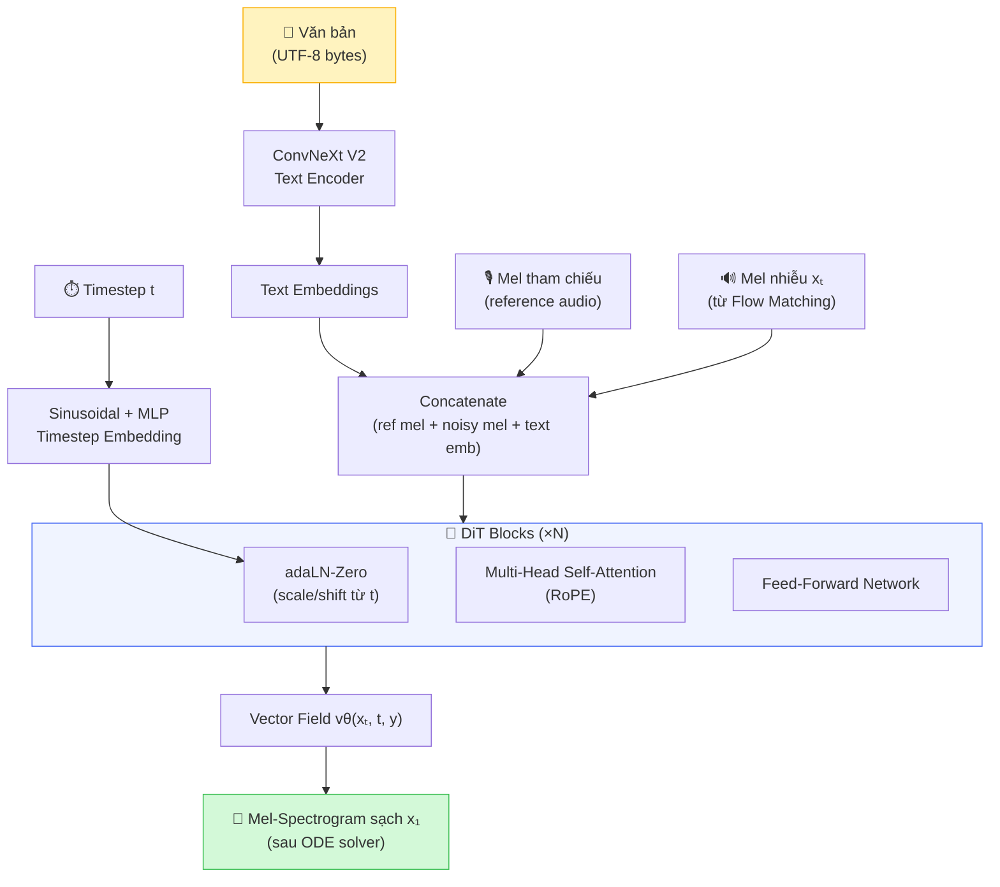

# 1.4 Transformer và Diffusion Transformer (DiT)

Chương 1.3 trình bày Flow Matching như cơ chế học phân phối của F5-TTS. Câu hỏi còn lại: **kiến trúc mạng nơ-ron nào hiện thực hóa vector field $v_\theta$?** Câu trả lời là **Diffusion Transformer (DiT)** \[[1]\] — một biến thể của Transformer \[[2]\] được thiết kế đặc thù để điều kiện hóa theo timestep và ngữ cảnh văn bản.

---

## 1.4.1 Transformer — Backbone Của DiT

### Cơ Chế Self-Attention

Đơn vị tính toán cốt lõi của Transformer là **Scaled Dot-Product Attention** \[[2]\]. Cho một chuỗi đầu vào, mỗi vị trí chiếu thành ba vector: Query ($Q$), Key ($K$), Value ($V$), rồi tính:

$$\text{Attention}(Q, K, V) = \text{softmax}\!\left(\frac{QK^\top}{\sqrt{d_k}}\right) V$$

Ý nghĩa: điểm $\frac{QK^\top}{\sqrt{d_k}}$ đo độ tương đồng giữa từng cặp (query, key). Softmax chuyển điểm thành trọng số chú ý. Output là tổng có trọng số của các Value — tức vị trí nào "quan trọng" thì đóng góp nhiều hơn.

Chia $\sqrt{d_k}$ để tránh điểm tương đồng quá lớn khi $d_k$ lớn, khiến softmax bão hòa và gradient về 0 \[[2]\].

### Multi-Head Attention (MHA)

Thay vì một không gian attention, **MHA** \[[2]\] học $h$ "đầu" song song:

$$\text{MultiHead}(Q, K, V) = \text{Concat}(\text{head}_1, \ldots, \text{head}_h)\,W^O$$
$$\text{head}_i = \text{Attention}(QW_i^Q,\; KW_i^K,\; VW_i^V)$$

Mỗi head có thể tập trung vào loại quan hệ khác nhau (cú pháp, ngữ nghĩa, prosody, vị trí). Kết hợp tất cả head cho biểu diễn phong phú hơn.

### Positional Encoding — RoPE

Attention thuần túy không phân biệt thứ tự. Trong F5-TTS, vị trí được mã hóa bằng **RoPE (Rotary Position Embedding)** \[[3]\] — mã hóa **vị trí tương đối** giữa các token bằng phép xoay trong không gian phức:

$$\text{Attention}(q_m, k_n) = \text{Re}\left[(W_q x_m)\, e^{im\theta}\, \overline{(W_k x_n)\, e^{in\theta}}\right]$$

Ưu điểm so với positional encoding tuyệt đối: tổng quát hóa tốt hơn với chuỗi mel dài (vài trăm frame), là điều cần thiết trong TTS.

### Feed-Forward Network (FFN)

Sau mỗi lớp Attention, FFN xử lý độc lập từng vị trí \[[2]\]:

$$\text{FFN}(x) = \max(0,\; xW_1 + b_1)\,W_2 + b_2$$

FFN với chiều ẩn $d_{ff} = 4 \times d_{\text{model}}$ lưu trữ "kiến thức thực tế" về đặc trưng âm thanh, trong khi Attention xử lý quan hệ cấu trúc giữa các vị trí.

Mỗi Transformer block kết hợp MHA và FFN với residual connection và LayerNorm \[[4]\]:

$$h' = \text{LayerNorm}(x + \text{MHA}(x))$$
$$\text{output} = \text{LayerNorm}(h' + \text{FFN}(h'))$$

---

## 1.4.2 Diffusion Transformer (DiT) — Tích Hợp Timestep Và Ngữ Cảnh

**DiT** \[[1]\] là biến thể Transformer được thiết kế để thay thế backbone U-Net trong Diffusion/Flow Matching Models. Điểm khác biệt chính: DiT xử lý thêm thông tin **timestep $t$** và **điều kiện ngoài** (văn bản) — hai yếu tố không có trong Transformer chuẩn.

### Adaptive Layer Normalization — adaLN-Zero

Cơ chế điều kiện hóa trong DiT là **adaLN-Zero** \[[1]\]: thay vì LayerNorm thông thường, các tham số scale $\gamma$ và shift $\beta$ được tạo ra **động** từ thông tin timestep $t$ và điều kiện $\mathbf{y}$:

$$\text{adaLN}(h,\; t,\; \mathbf{y}) = \bigl(1 + \gamma(t, \mathbf{y})\bigr) \cdot \text{LayerNorm}(h) + \beta(t, \mathbf{y})$$

$\gamma$ và $\beta$ được sinh bởi một MLP nhỏ từ embedding của $t$ và $\mathbf{y}$. Hậu tố "-Zero" chỉ việc khởi tạo $\gamma = 0$, $\beta = 0$ — đảm bảo lớp đầu tiên cư xử như identity, ổn định training \[[1]\].

**Tại sao cần adaLN?** Bởi vì hành vi mạng cần khác nhau tùy theo giai đoạn khử nhiễu:
- Bước $t$ gần $T$ (nhiều noise): tập trung phục hồi cấu trúc tổng thể
- Bước $t$ gần 0 (ít noise): tinh chỉnh chi tiết fine-grained

### Kiến Trúc DiT Trong F5-TTS

**Luồng xử lý**:
1. Văn bản $\mathbf{y}$ qua **ConvNeXt V2** \[[5]\] (Text Encoder) → embeddings nắm bắt ngữ cảnh cục bộ.
2. Mel tham chiếu (reference audio) + mel nhiễu $x_t$ được concatenate cùng text embeddings thành chuỗi đầu vào.
3. Timestep $t$ qua sinusoidal embedding + MLP → điều khiển adaLN-Zero trong mỗi DiT block.
4. DiT block (MHA với RoPE + FFN + adaLN-Zero) xử lý chuỗi hợp nhất.
5. Output là **vector field** $v_\theta(x_t, t, \mathbf{y})$ — hướng di chuyển từ noise về data.

> **Ghi chú**: Việc concatenate mel tham chiếu vào đầu vào (thay vì dùng cross-attention riêng) là thiết kế đặc trưng của E2-TTS/F5-TTS — giúp mô hình học cả nội dung lẫn đặc trưng giọng nói từ một cơ chế attention thống nhất \[[6]\].

---

## 1.4.3 Lý Do Chọn Transformer Cho TTS

Âm thanh biểu diễn dưới dạng mel-spectrogram là chuỗi rất dài (86 frames/giây × vài giây = hàng trăm frames). Transformer xử lý hiệu quả hơn RNN/CNN vì:

| Tiêu chí | RNN/LSTM | CNN | Transformer |
|---|---|---|---|
| Phụ thuộc dài hạn | ❌ Vanishing gradient | ⚠️ Giới hạn receptive field | ✅ Trực tiếp $O(1)$ |
| Song song hóa | ❌ Tuần tự | ✅ | ✅ Rất tốt |
| Điều kiện hóa linh hoạt | ⚠️ | ⚠️ | ✅ (adaLN, cross-attn) |

Đặc biệt, khả năng xử lý **phụ thuộc dài hạn** là yếu tố quyết định cho TTS: ngữ điệu (prosody) của từ cuối câu phụ thuộc vào cấu trúc cú pháp từ đầu câu — điều RNN khó học do vanishing gradient \[[7]\].

---

## Kết Luận Phần 1.4

Transformer cung cấp khung kiến trúc tối ưu cho TTS nhờ khả năng mô hình hóa phụ thuộc dài hạn và song song hóa hiệu quả. DiT mở rộng Transformer để tích hợp timestep và điều kiện văn bản thông qua adaLN-Zero, trong khi RoPE xử lý vị trí tương đối trong chuỗi mel dài. Đây là nền tảng kiến trúc trực tiếp cho Chương 2: toàn bộ cơ chế sinh giọng nói của F5-TTS được hiện thực hóa trên nền DiT này.

---

## Tài Liệu Tham Khảo

| # | Tác giả | Năm | Tiêu đề | Venue |
|---|---------|-----|---------|-------|
| [1] | Peebles, W., Xie, S. | 2023 | *Scalable Diffusion Models with Transformers (DiT)* | ICCV 2023 |
| [2] | Vaswani, A., et al. | 2017 | *Attention Is All You Need* | NeurIPS 2017 |
| [3] | Su, J., et al. | 2024 | *RoFormer: Enhanced Transformer with Rotary Position Embedding* | Neurocomputing |
| [4] | Ba, J.L., Kiros, J.R., Hinton, G.E. | 2016 | *Layer Normalization* | arXiv:1607.06450 |
| [5] | Woo, S., et al. | 2023 | *ConvNeXt V2: Co-designing and Scaling ConvNets with Masked Autoencoders* | CVPR 2023 |
| [6] | Eskimez, S.E., Wang, X., et al. | 2024 | *E2 TTS: Embarrassingly Easy Fully Non-Autoregressive Zero-Shot TTS* | arXiv:2406.18009 |
| [7] | Hochreiter, S., Schmidhuber, J. | 1997 | *Long Short-Term Memory* | Neural Computation |
| [8] | Chen, Y., Yue, Z., et al. | 2024 | *F5-TTS: A Fairytaler that Fakes Fluent and Faithful Speech with Flow Matching* | arXiv:2410.06885 |

---

## 📎 Phụ Lục — Giải Thích Thuật Ngữ

### Attention — "Chú Ý" Là Gì?

Khi đọc câu *"Con mèo ngồi trên chiếc ghế đó"*, để hiểu từ **"đó"** ta phải nhìn lại **"ghế"**. Attention mô phỏng điều này: mỗi token có thể "chú ý" đến toàn bộ các token khác trong cùng chuỗi, không bị giới hạn bởi khoảng cách.

### Query, Key, Value — Thư Viện

- **Query**: Bạn bước vào thư viện và hỏi "Tôi cần sách về TTS"
- **Key**: Nhãn dán trên gáy từng quyển sách: "TTS", "NLP", "Lịch sử",...
- **Value**: Nội dung thực sự bên trong mỗi quyển sách

Attention tính điểm giống nhau giữa Query và từng Key → sách nào Key gần Query nhất → lấy Value của sách đó nhiều nhất.

### Tại Sao RoPE Tốt Hơn Positional Encoding Tuyệt Đối?

- **Tuyệt đối (sinusoidal)**: "Token A ở vị trí số 15" → khó tổng quát hóa khi chuỗi dài hơn training.
- **Tương đối (RoPE)**: "Token A cách token B 3 vị trí" → thông tin này không thay đổi dù chuỗi dài bao nhiêu.

> 📐 **Ví dụ**: Thay vì nói "tôi ở số nhà 15", RoPE nói "tôi cách ngân hàng 3 nhà" — thông tin tương đối hữu ích hơn khi so sánh với các vị trí khác.

### adaLN-Zero — Tại Sao Cần "Zero"?

Khởi tạo $\gamma = 0$, $\beta = 0$ làm cho lớp đầu tiên cư xử như phép chiếu đồng nhất (identity). Điều này giúp gradient chảy qua tốt ở giai đoạn đầu training — quan trọng với mạng sâu nhiều lớp DiT.

> 🎛️ **Ví dụ**: Như một kỹ sư âm thanh mới bắt đầu với tất cả equalizer ở vị trí 0 (flat), sau đó điều chỉnh dần theo ngữ cảnh âm nhạc. Bắt đầu từ "không ảnh hưởng gì" an toàn hơn bắt đầu với cài đặt ngẫu nhiên.

### Vanishing Gradient Trong RNN Là Gì?

RNN truyền thông tin qua các bước thời gian bằng cách nhân nhiều lần với cùng một ma trận. Nếu giá trị ma trận < 1, gradient sau 100 bước nhân liên tiếp → gần bằng 0 → mô hình không học được phụ thuộc xa. Transformer tránh điều này bằng cách kết nối trực tiếp bất kỳ hai vị trí nào qua Attention.
