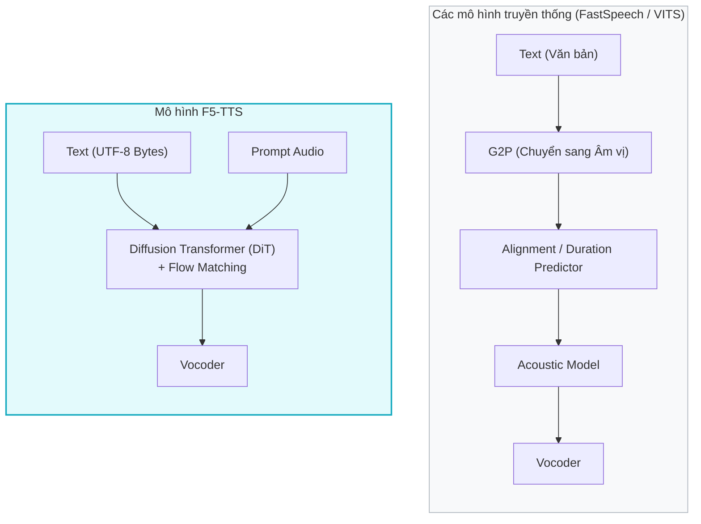

# 2.1 Tổng quan về mô hình F5-TTS

## 2.1.1 Động lực và ý tưởng thiết kế

### Động lực từ các hệ thống tiền nhiệm
Trong nhiều năm, các hệ thống chuyển văn bản thành giọng nói (TTS) thường được thiết kế với các đường ống (pipeline) có kiến trúc xếp tầng phức tạp. Các họ mô hình tiêu biểu như FastSpeech \[[1]\] hay VITS \[[2]\] yêu cầu những thành phần phụ trợ đặc thù để xử lý dữ liệu:
- **Grapheme-to-Phoneme (G2P)**: Bộ chuyển đổi ký tự văn bản sang âm vị để cung cấp cho mô hình.
- **Text-Audio Alignment**: Trích xuất độ dài (duration) của mỗi âm vị để căn chỉnh văn bản với âm thanh (thường dùng Montreal Forced Aligner).
- **Prosody/Duration Predictors**: Các mạng nơ-ron phụ trợ để dự đoán cao độ, nhịp điệu và thời lượng phát âm.

Sự phức tạp này gây ra hiệu ứng "thắt cổ chai" (bottleneck), làm tăng nguy cơ lan truyền lỗi (error propagation) từ các mô hình phụ trợ sang chất lượng âm thanh cuối. Đồng thời, cấu trúc này khiến việc hỗ trợ các ngôn ngữ mới (như tiếng Việt) trở nên khó khăn vì yêu cầu hệ thống từ điển âm vị riêng biệt và phức tạp \[[3]\].

Động lực chính của F5-TTS \[[4]\] (cũng như mô hình tiền nhiệm E2-TTS \[[5]\]) là **đơn giản hóa tối đa** đường ống này, tiến tới một hệ thống TTS "End-to-End" (từ đầu đến cuối) thực sự, trong đó:
1. Không cần bộ căn chỉnh (alignment-free).
2. Không cần bộ dự đoán thời lượng (duration-free).
3. Không cần chuyển đổi ngôn ngữ học sang âm vị (phoneme-free).

### Ý tưởng thiết kế cốt lõi

F5-TTS (A Fairytaler that Fakes Fluent and Faithful Speech) \[[4]\] được xây dựng dựa trên những ý tưởng thiết kế đột phá sau:

1. **Byte-level Text Representation**: 
   Thay vì dùng công cụ G2P hay từ điển phức tạp, F5-TTS biểu diễn văn bản trực tiếp dưới dạng chuỗi byte UTF-8. Nhờ đó, mô hình hỗ trợ đa ngôn ngữ ngay từ thiết kế cốt lõi (bao gồm tiếng Việt) mà không cần bất kỳ công cụ xử lý ngôn ngữ học nào \[[4]\].

2. **Flow Matching với Diffusion Transformer (DiT)**:
   Thay vì dùng Diffusion Model truyền thống với hàng ngàn bước khử nhiễu ngẫu nhiên, F5-TTS sử dụng **Flow Matching** \[[6]\] - một framework học một trường vector (vector field) xác định để chuyển dần từ nhiễu sang dữ liệu thực. Kết hợp với kiến trúc DiT \[[7]\], mô hình có thể dự đoán trực tiếp toàn bộ chuỗi mel-spectrogram mà không cần thông tin độ dài cho từng từ một cách tường minh.

3. **Infilling-based Zero-Shot Voice Cloning**:
   F5-TTS thực hiện voice cloning (sao chép giọng nói) bằng cách định hình bài toán sinh giọng nói như một bài toán "infilling" (điền vào chỗ trống). Mô hình nhận đầu vào là đoạn âm thanh mẫu (prompt audio) nối tiếp với các token nhiễu, cùng với văn bản đích. Nhiệm vụ của mô hình là "điền" âm thanh phần nhiễu sao cho trôi chảy, tự nhiên và đồng nhất với giọng của đoạn prompt \[[4, 5]\].

4. **Sway Sampling**:
   Để tối ưu hóa tốc độ suy diễn (inference), F5-TTS giới thiệu kỹ thuật Sway Sampling. Đây là một chiến lược lấy mẫu phi tuyến tính, thay đổi quỹ đạo giải phương trình vi phân (ODE solver), cho phép sinh ra âm thanh chất lượng cao chỉ với số lượng bước suy diễn cực nhỏ (khoảng 2-8 bước) \[[4]\].

---

## 2.1.2 So sánh với các mô hình TTS khác

F5-TTS đại diện cho thế hệ mô hình TTS mới nhất, vượt qua nhiều giới hạn của các họ mô hình trước đó.

### So sánh với các mô hình Autoregressive (AR)
Các mô hình AR như VALL-E \[[8]\] hay XTTS sinh âm thanh theo từng bước tuần tự (từ trái sang phải).
- **Hạn chế của AR**: Tốc độ sinh chậm (do tính toán tuần tự), dễ bị ảo giác (hallucination), có xu hướng gặp lỗi "word skipping" (bỏ sót từ), "repeating" (lặp từ) hoặc mất kiểm soát nhịp điệu khi xử lý câu quá dài.
- **Ưu điểm của F5-TTS**: Là mô hình **Non-Autoregressive (NAR)** đầy đủ. Mô hình sinh toàn bộ câu cùng một lúc, giải quyết triệt để lỗi bỏ sót từ và lặp từ, đồng thời tốc độ suy diễn nhanh hơn đáng kể \[[4]\].

### So sánh với các mô hình NAR truyền thống
Các mô hình như FastSpeech 2 \[[9]\] yêu cầu quá trình forced alignment (căn chỉnh cưỡng bức) giữa text và audio.
- **Hạn chế của NAR cũ**: Quá trình huấn luyện cực kỳ phức tạp vì phụ thuộc chặt chẽ vào độ chính xác của bộ aligner bên ngoài. Cảm xúc giọng nói tạo ra thường phẳng, ít điểm nhấn và thiếu tự nhiên do Duration Predictor hoạt động quá cứng nhắc.
- **Ưu điểm của F5-TTS**: Tự động học alignment trong quá trình giải phương trình ODE thông qua cơ chế Attention linh hoạt của DiT. Không cần external aligner hay dự đoán thời lượng từng từ, giúp giọng nói biểu cảm và có nhịp điệu tự nhiên hơn.

### So sánh với E2-TTS
F5-TTS là phiên bản tối ưu và nâng cấp trực tiếp từ E2-TTS \[[5]\].
- **E2-TTS**: Sử dụng DiT thuần túy, text input chưa được trích xuất đặc trưng sâu, suy diễn bằng phương pháp lấy mẫu Euler tiêu chuẩn.
- **Sự cải tiến của F5-TTS**: 
  - Sử dụng **ConvNeXt V2** \[[10]\] làm Text Encoder để trích xuất đặc trưng văn bản tinh vi hơn trước khi đưa vào DiT.
  - Áp dụng **Sway Sampling**, giảm số bước ODE solver cần thiết, làm tăng tốc độ inference lên đáng kể trong khi cải thiện điểm MOS (Mean Opinion Score) \[[4]\].
  - Cơ chế **Padding** cho văn bản linh hoạt hơn, giúp cải thiện khả năng sinh giọng cho các đoạn hội thoại dài.

| Đặc điểm | Tacotron 2 | FastSpeech 2 | VALL-E | E2-TTS | **F5-TTS** |
|----------|------------|--------------|--------|---------|------------|
| Kiến trúc lõi | LSTM + Attention | Transformer | AR Transformer | DiT | **DiT + ConvNeXt** |
| Phụ thuộc Âm vị (G2P) | Có | Có | Có | Không | **Không (UTF-8 Bytes)** |
| Alignment/Duration | Mạng Attention | Duration Predictor| Không | Tự động | **Tự động** |
| Voice Cloning | Hạn chế | Cần fine-tuning | Zero-shot | Zero-shot | **Zero-shot** |
| Tốc độ sinh (Inference) | Chậm | Rất nhanh | Chậm | Nhanh | **Rất nhanh (Sway Sampling)** |
| Framework sinh mẫu | Autoregressive | Non-Autoregressive | Autoregressive | Flow Matching | **Flow Matching** |

---

## Tài Liệu Tham Khảo

| # | Tác giả | Năm | Tiêu đề | Venue |
|---|---------|-----|---------|-------|
| [1] | Ren, Y., Ruan, Y., et al. | 2019 | *FastSpeech: Fast, Robust and Controllable Text to Speech* | NeurIPS 2019 |
| [2] | Kim, J., Kong, J., Son, J. | 2021 | *Conditional Variational Autoencoder with Adversarial Learning for End-to-End Text-to-Speech (VITS)* | ICML 2021 |
| [3] | Tan, X., et al. | 2021 | *A Survey on Neural Speech Synthesis* | arXiv:2106.15561 |
| [4] | Chen, Y., Yue, Z., et al. | 2024 | *F5-TTS: A Fairytaler that Fakes Fluent and Faithful Speech with Flow Matching* | arXiv:2410.06885 |
| [5] | Eskimez, S.E., et al. | 2024 | *E2 TTS: Embarrassingly Easy Fully Non-Autoregressive Zero-Shot TTS* | arXiv:2406.18009 |
| [6] | Lipman, Y., et al. | 2023 | *Flow Matching for Generative Modeling* | ICLR 2023 |
| [7] | Peebles, W., Xie, S. | 2023 | *Scalable Diffusion Models with Transformers (DiT)* | ICCV 2023 |
| [8] | Wang, C., et al. | 2023 | *Neural Codec Language Models are Zero-Shot Text to Speech Synthesizers (VALL-E)* | arXiv:2301.02111 |
| [9] | Ren, Y., Hu, C., et al. | 2021 | *FastSpeech 2: Fast and High-Quality End-to-End Text to Speech* | ICLR 2021 |
| [10] | Woo, S., et al. | 2023 | *ConvNeXt V2: Co-designing and Scaling ConvNets with Masked Autoencoders* | CVPR 2023 |

---

## 📎 Phụ Lục — Giải Thích Thuật Ngữ Cho Người Mới Bắt Đầu

> Phần này giải thích các khái niệm kỹ thuật cốt lõi xuất hiện trong Section 2.1 bằng ngôn ngữ đơn giản, thông qua các ví dụ trực quan.

---

### 🎤 A. Zero-Shot Voice Cloning là gì?

- **Voice Cloning (Nhân bản giọng nói)**: Là kỹ thuật làm cho AI có thể tạo ra âm thanh bằng giọng của một người bất kỳ.
- **Fine-tuning (Phương pháp cũ)**: Bạn phải thu âm 1-2 tiếng đồng hồ giọng của mình, sau đó cho AI "học lại" (train) trong nhiều giờ. Quá trình này tốn nhiều thời gian và tài nguyên máy tính.
- **Zero-Shot (Phương pháp mới của F5-TTS)**: Bạn chỉ cần cung cấp cho hệ thống **1 đoạn ghi âm dài 3-10 giây** của bạn. Ngay lập tức, AI có thể đọc bất kỳ đoạn văn bản mới nào bằng chính giọng nói đó. Chữ "Zero-Shot" mang ý nghĩa "không cần thêm bất kỳ bước huấn luyện nào cả".

> 🎭 **Ví dụ**: Giống như một diễn viên nhại giọng thiên tài. Chỉ cần nghe bạn nói một câu ngắn, họ có thể ngay lập tức bắt chước ngữ điệu của bạn để kể một câu chuyện dài.

---

### 🧩 B. "Infilling" trong TTS có nghĩa là gì?

F5-TTS thực hiện Zero-Shot Voice Cloning thông qua cơ chế "Infilling" (điền vào chỗ trống).

Hãy tưởng tượng bạn có một cuộn băng cassette:
1. **Phần đầu băng**: Chứa đoạn ghi âm 5 giây giọng mẫu của bạn (ví dụ: giọng bạn đang nói *"Chào mọi người"*).
2. **Phần sau băng**: Chỉ toàn tiếng "xì xì" (nhiễu/noise).
3. **Chỉ thị văn bản**: Bạn muốn cuộn băng tiếp tục nói câu *"Hôm nay trời rất đẹp"*.

Nhiệm vụ của AI là nghe phần đầu băng để "bắt tone" giọng, sau đó "hô biến" phần tiếng xì xì phía sau thành câu *"Hôm nay trời rất đẹp"* sao cho nối tiếp một cách mượt mà và tự nhiên nhất với đoạn đầu. Việc chuyển nhiễu thành âm thanh có ý nghĩa này chính là thao tác **Infilling**.

---

### ⏳ C. Tại sao loại bỏ "Duration Predictor" lại là một đột phá?

Trong các hệ thống AI cũ, việc nói được thực hiện theo kiểu "ráp nối cứng nhắc":
1. Nhìn thấy chữ "Xin", máy tính dự đoán âm thanh cần kéo dài 0.2 giây.
2. Nhìn thấy chữ "Chào", máy tính dự đoán kéo dài 0.3 giây.
Mạng thần kinh chuyên làm việc này được gọi là **Duration Predictor** (Bộ dự đoán thời lượng).

- **Vấn đề**: Nếu máy dự đoán thời lượng sai một chút, giọng nói sẽ trở nên vô hồn, giống robot và ngắt nghỉ không tự nhiên. Mô hình cũng rất hay vấp nếu câu quá dài do dự đoán sai lệch dần.
- **Giải pháp của F5-TTS**: Loại bỏ hoàn toàn Duration Predictor. AI tự động gióng hàng văn bản với âm thanh bằng cơ chế Attention (sự chú ý) bên trong mạng Transformer (DiT). Nó không gán cứng thời lượng cho từng từ, mà tự động kéo dài hoặc rút ngắn các âm tiết theo ngữ cảnh sao cho tự nhiên nhất.

> 🌊 **Ví dụ**: Cách làm cũ giống như đánh nhịp bằng Metronome (máy đánh nhịp) — đúng nhịp nhưng cứng nhắc. Cách của F5-TTS giống như một người ca sĩ thực thụ tự "phiêu" theo cảm xúc — linh hoạt, mượt mà nhưng vẫn rất chính xác.

---

### 🔤 D. Byte-level Text Representation là gì?

Thông thường, máy tính không "hiểu" văn bản giống con người. Nó phải đi qua một bộ chuyển đổi:
`Chữ viết (Grapheme)` ➡️ `Phát âm (Phoneme / Âm vị)`

Ví dụ trong tiếng Anh: từ "Read" có lúc đọc là /riːd/ (hiện tại), có lúc đọc là /red/ (quá khứ). AI cần một bộ từ điển phát âm (G2P) khổng lồ để biết khi nào đọc thế nào. Điều này lại càng phức tạp khi áp dụng cho tiếng Việt vì hệ thống thanh điệu.

**F5-TTS sử dụng Byte-level**:
Trên máy tính, mọi chữ cái đều được lưu dưới dạng con số (byte UTF-8). Chữ "A" là số 65, chữ "Á" là một chuỗi 2 số byte. F5-TTS lấy trực tiếp các con số này và đẩy thẳng vào mô hình!
- AI sẽ **tự học** quy luật phát âm thông qua hàng triệu giờ nghe audio thay vì cần con người dạy bộ từ điển âm vị.
- Ưu điểm tuyệt đối: Bất kể bạn nhập vào ngôn ngữ nào (Tiếng Anh, Tiếng Việt, Tiếng Trung, v.v.), mô hình cũng tự xử lý được mà không cần cài đặt thêm hệ thống ngôn ngữ phức tạp nào.

---

### ⛷️ E. Sway Sampling là gì?

Trong kỹ thuật Flow Matching, việc tạo ra âm thanh giống như điêu khắc một bức tượng từ tảng đá: đi dần từ Nhiễu $\rightarrow$ Dữ liệu sạch qua nhiều bước đục đẽo.
- Nếu các nhát đục (sampling steps) chia đều đặn, AI sẽ tốn rất nhiều bước để bức tượng thành hình.
- **Sway Sampling** là một chiến lược toán học thông minh: nó đẩy mạnh việc "đục phá" ở những nhát đầu tiên khi tảng đá (nhiễu) còn thô, và chỉ gọt giũa nhẹ nhàng ở những bước cuối. Kết quả là thay vì cần 50-100 bước để tạo ra âm thanh hay, F5-TTS chỉ cần **2 đến 5 bước**. Tốc độ sinh âm thanh nhờ đó được tăng lên gấp nhiều lần mà vẫn đảm bảo chất lượng sắc nét!
