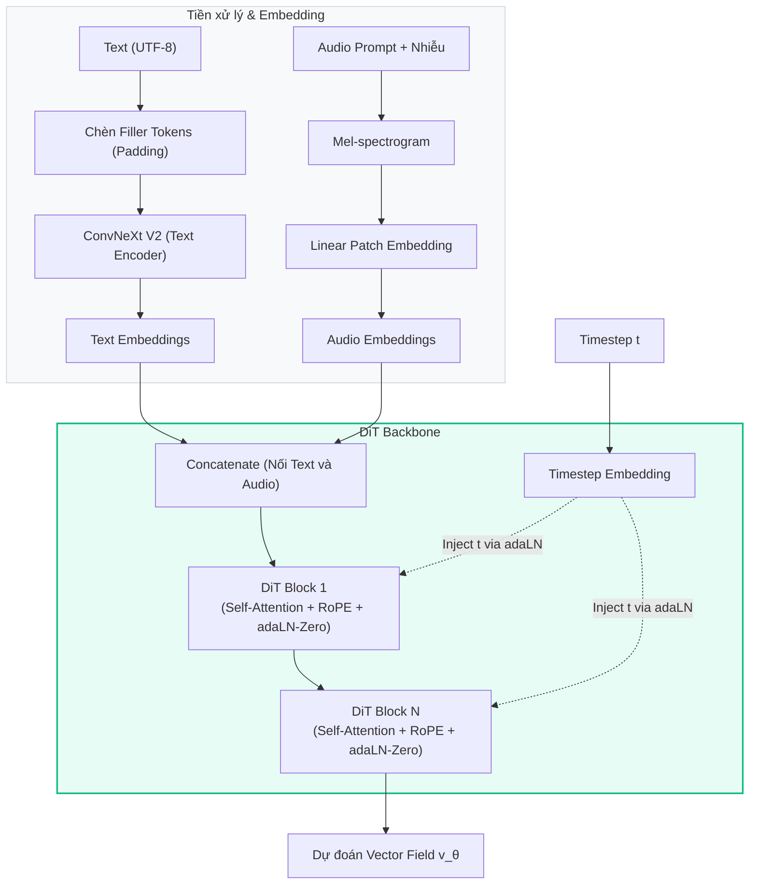

# 2.2 Kiến trúc mô hình

Trái ngược với các hệ thống TTS truyền thống bao gồm nhiều module phức tạp rải rác, F5-TTS sở hữu một kiến trúc vô cùng tinh gọn. Hệ thống chủ yếu dựa trên một luồng dữ liệu hợp nhất (unified data flow) đi qua ba thành phần chính: Text Encoder, Audio Representation (chuyển đổi đầu vào âm thanh), và mạng lõi Diffusion Transformer (DiT).

---

## 2.2.1 Text Encoder (Bộ mã hóa văn bản)

Trong F5-TTS, "Text Encoder" không phải là một mô hình ngôn ngữ khổng lồ (như BERT hay T5) hay một mạng xử lý ngữ âm phức tạp. Chức năng này được tối giản hóa tối đa, sử dụng kiến trúc **ConvNeXt V2** \[[1]\].

### Xử lý đầu vào (Padding và Byte-level)
1. **Đầu vào Byte-level**: Văn bản được mã hóa trực tiếp dưới dạng chuỗi byte UTF-8. Điều này loại bỏ hoàn toàn module Grapheme-to-Phoneme (G2P), giúp mô hình "miễn nhiễm" với các ngoại lệ phát âm phức tạp và dễ dàng mở rộng sang các ngôn ngữ mới (như tiếng Việt) mà không cần cấu hình thêm \[[2]\].
2. **Filler Tokens (Padding)**: Một trong những đổi mới quan trọng từ E2-TTS \[[3]\] được F5-TTS kế thừa là phương pháp đệm (padding). Vì chuỗi văn bản thường ngắn hơn rất nhiều so với chuỗi âm thanh (mel-spectrogram), F5-TTS chèn các *filler tokens* một cách có chiến lược vào giữa các ký tự văn bản sao cho tổng chiều dài của chuỗi văn bản bằng đúng với số lượng frame của chuỗi âm thanh \[[2]\].

### Tinh chỉnh qua ConvNeXt V2
Sau khi được đệm đến độ dài tương đương với âm thanh, chuỗi văn bản đi qua các khối của mạng **ConvNeXt V2**.
- ConvNeXt V2 là một mạng tích chập (CNN) hiện đại, ban đầu được thiết kế cho thị giác máy tính nhưng tỏ ra cực kỳ hiệu quả trong xử lý chuỗi 1D nhờ khả năng trích xuất đặc trưng cục bộ (local features).
- **Vai trò**: Nó giúp "tinh chỉnh" (refine) biểu diễn văn bản, học cách phân bổ thông tin ngữ nghĩa dọc theo chuỗi đã được đệm để tạo ra sự gióng hàng (alignment) ẩn với các đặc trưng âm thanh \[[2]\]. Đầu ra của khối này là một chuỗi vector đặc trưng văn bản tinh xảo có cùng độ dài với chuỗi âm thanh.

---

## 2.2.2 Tích hợp đặc trưng âm thanh (Audio Encoder / Audio Representation)

Thay vì sử dụng các bộ mã hóa âm thanh có thiết kế phức tạp như VAE (Variational Autoencoder) thường thấy trong các mô hình sinh ảnh (như Stable Diffusion), F5-TTS xử lý âm thanh một cách trực tiếp và tuyến tính hơn:

1. **Biểu diễn Mel-spectrogram**: Âm thanh gốc (ground truth hoặc prompt) được chuyển đổi thành mel-spectrogram (thường có kích thước 100 channels). Biểu diễn này chứa đựng thông tin về cao độ, năng lượng và tần số của giọng nói một cách trực quan.
2. **Patch Embedding (Mã hóa mảng)**: Tương tự như cách Vision Transformer (ViT) xử lý hình ảnh, mel-spectrogram được chia thành các khung (frames/patches). Sau đó, nó đi qua một lớp chiếu tuyến tính (Linear Projection Layer) để biến mỗi khung tần số thành một vector đặc trưng có cùng số chiều (hidden size) với vector văn bản \[[2, 3]\].
3. **Cơ chế Masking cho Infilling**: Trong quá trình huấn luyện và suy diễn, một phần của chuỗi âm thanh (đoạn prompt để làm mẫu giọng) được giữ nguyên, phần còn lại (đoạn cần sinh ra) được thay thế bằng nhiễu (noise) lấy từ phân phối chuẩn Gaussian \[[2]\].

Cuối cùng, đặc trưng văn bản (từ ConvNeXt V2) và đặc trưng âm thanh (prompt + noise) được nối lại với nhau (concatenate) dọc theo chiều kênh (channel dimension) trước khi được đưa vào mạng lõi.

---

## 2.2.3 Diffusion Transformer (DiT)

**Diffusion Transformer (DiT)** \[[4]\] là "trái tim" của toàn bộ hệ thống F5-TTS. Đây là nơi diễn ra quá trình Flow Matching — biến đổi nhiễu thành âm thanh thực tế dựa trên điều kiện dẫn dắt là văn bản và giọng nói mẫu.

### Kiến trúc DiT trong F5-TTS
Kiến trúc DiT thay thế hoàn toàn mạng U-Net truyền thống (vốn thường dùng trong các mô hình Diffusion) bằng một loạt các khối Transformer Decoder-only (hoặc Bidirectional Encoder). Những cải tiến cốt lõi bao gồm:

1. **Cơ chế Self-Attention với RoPE**:
   DiT sử dụng Multi-Head Self-Attention để mô hình hóa mối quan hệ giữa mọi vị trí trong chuỗi. Để giữ được thông tin về thứ tự thời gian (đặc biệt quan trọng với tín hiệu âm thanh), F5-TTS tích hợp **RoPE (Rotary Position Embedding)** \[[5]\]. RoPE xử lý khoảng cách tương đối giữa các token hiệu quả hơn nhiều so với mã hóa vị trí tuyệt đối (Absolute Positional Encoding), giúp mô hình duy trì nhịp điệu khi suy diễn các câu dài.

2. **Cơ chế điều kiện hóa adaLN-Zero**:
   Trong Flow Matching, mô hình phải biết nó đang ở bước thời gian $t$ nào trong quá trình giải phương trình vi phân (ODE). DiT tiêm (inject) thông tin $t$ này vào mạng thông qua cơ chế **adaLN-Zero (Adaptive Layer Normalization)** \[[4]\].
   Thay vì chỉ chuẩn hóa dữ liệu thông thường, adaLN-Zero dùng một mạng MLP nhỏ (Multilayer Perceptron) để dự đoán các tham số scale và shift của LayerNorm dựa trên bước thời gian $t$. Điều này giúp mỗi lớp của Transformer tự động thay đổi hành vi xử lý tùy thuộc vào mức độ nhiễu hiện tại của dữ liệu.

3. **Dự đoán Vector Field (Trường vector)**:
   Khác với các mô hình Diffusion truyền thống (như DDPM) được huấn luyện để dự đoán nhiễu ($\epsilon$), DiT trong F5-TTS được tối ưu hóa bằng hàm mất mát Conditional Flow Matching (CFM) \[[6]\]. Đầu ra cuối cùng của DiT là một **Vector Field** ($v_\theta$), chỉ ra "hướng" và "vận tốc" cần thiết để đẩy các hạt nhiễu về trạng thái âm thanh rõ nét. Quá trình sinh âm thanh (inference) được mô hình hóa thành việc giải phương trình vi phân thường (ODE):
   
   $$ \frac{dx_t}{dt} = v_\theta(x_t, t) $$

   Trong đó, $x_t$ là trạng thái dữ liệu tại bước thời gian $t$, và $v_\theta(x_t, t)$ là trường vector được DiT dự đoán. Thông qua phương trình này, mô hình định hướng quỹ đạo biến đổi liên tục từ nhiễu thuần túy ($x_0$) đến dữ liệu giọng nói chất lượng cao ($x_1$).

### Luồng xử lý tổng thể

---

## Tài Liệu Tham Khảo

| # | Tác giả | Năm | Tiêu đề | Venue |
|---|---------|-----|---------|-------|
| [1] | Woo, S., et al. | 2023 | *ConvNeXt V2: Co-designing and Scaling ConvNets with Masked Autoencoders* | CVPR 2023 |
| [2] | Chen, Y., Yue, Z., et al. | 2024 | *F5-TTS: A Fairytaler that Fakes Fluent and Faithful Speech with Flow Matching* | arXiv:2410.06885 |
| [3] | Eskimez, S.E., et al. | 2024 | *E2 TTS: Embarrassingly Easy Fully Non-Autoregressive Zero-Shot TTS* | arXiv:2406.18009 |
| [4] | Peebles, W., Xie, S. | 2023 | *Scalable Diffusion Models with Transformers (DiT)* | ICCV 2023 |
| [5] | Su, J., et al. | 2024 | *RoFormer: Enhanced Transformer with Rotary Position Embedding* | Neurocomputing |
| [6] | Lipman, Y., et al. | 2023 | *Flow Matching for Generative Modeling* | ICLR 2023 |

---

## 📎 Phụ Lục — Giải Thích Thuật Ngữ Cho Người Mới Bắt Đầu

### 🖼️ A. ConvNeXt V2 là gì?
Ban đầu, AI chuyên đọc hình ảnh thường dùng mạng **CNN** (Mạng nơ-ron tích chập). Sau này, mô hình **Transformer** (với cơ chế Attention) ra đời và đánh bại CNN ở nhiều mặt. Tuy nhiên, ConvNeXt là nỗ lực của các nhà khoa học nhằm mang các cấu trúc hiện đại của Transformer "lắp" ngược lại vào CNN, giúp nó trở nên mạnh mẽ không kém gì Transformer nhưng lại tính toán nhẹ nhàng và nhanh chóng hơn rất nhiều.
Trong F5-TTS, thay vì xem ảnh, ConvNeXt được dùng để "đọc lướt" qua chuỗi văn bản, giúp nhóm các chữ cái lại với nhau để hiểu thành từ và nắm bắt ngữ điệu cơ bản.

### 🧩 B. Patch Embedding là gì?
Hãy tưởng tượng bạn có một bức tranh rất lớn. Để AI có thể xem bức tranh đó dễ dàng, bạn dùng kéo cắt nó thành nhiều hình vuông nhỏ bằng nhau (gọi là các Patch). Sau đó, mỗi hình vuông được ép thành một chuỗi số để AI đọc được.
Trong âm thanh (cụ thể là biểu đồ mel-spectrogram), mô hình cũng làm thao tác tương tự: cắt bản đồ âm thanh thành các "khung" thời gian siêu ngắn, sau đó biến mỗi khung thành một vector (chuỗi số) thông qua một phép nhân toán học cơ bản (Linear layer). Thao tác này gọi là **Patch Embedding**.

### 💉 C. adaLN-Zero (Adaptive Layer Normalization) là gì?
Mọi mạng nơ-ron đều cần các lớp "chuẩn hóa" (Normalization) để giữ cho các con số không bị phình quá to hoặc teo quá nhỏ trong quá trình tính toán.
Nhưng trong mô hình sinh âm thanh (như Diffusion hay Flow Matching), AI cần biết một thông tin quan trọng: *"Mình đang ở bước đẽo gọt thứ mấy?"* (gọi là bước thời gian $t$).
**adaLN** giống như một chiếc van thông minh. Tùy thuộc vào thời điểm $t$, nó tự động "tiêm" (inject) thông tin vào mô hình, ra lệnh: *"Đang ở bước đầu rất nhiều nhiễu, hãy bóp âm thanh mạnh tay vào!"* hoặc *"Đã ở bước cuối rồi, chỉ tinh chỉnh nhẹ nhàng thôi"*. Chữ "Zero" có nghĩa là ở thời điểm máy mới học (khởi tạo), mạng nơ-ron coi như chiếc van này không tác động gì để quá trình học diễn ra mượt mà và dễ dàng hơn.

### 🧭 D. Vector Field (Trường vector) là gì?
Nếu các mô hình Diffusion cũ học cách dự đoán "Nhiễu" (để trừ nhiễu đi), thì Flow Matching học một **Trường vector** (Vector Field).
Hãy tưởng tượng một dòng sông đang chảy xiết. Bạn thả một chiếc lá (tượng trưng cho hạt nhiễu) xuống nước. Chiếc lá sẽ trôi về đâu hoàn toàn phụ thuộc vào dòng chảy của nước tại mỗi điểm nó đi qua. Toàn bộ dòng chảy đó chính là **Vector Field**.
Thay vì dự đoán vị trí chiếc lá, mô hình F5-TTS dự đoán **dòng chảy** — tức là vận tốc và hướng đi tại mỗi điểm — để đẩy chiếc lá từ trạng thái "Nhiễu vô nghĩa" trôi mượt mà về trạng thái "Giọng nói con người rõ ràng". Mô hình nào dự đoán dòng chảy chuẩn hơn, mô hình đó sinh âm thanh tự nhiên hơn.
