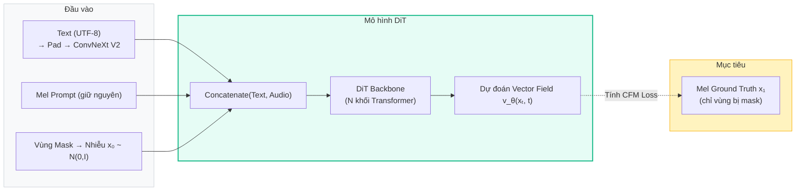
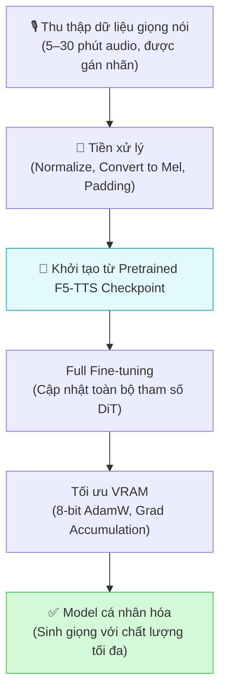

# 2.3 Quy trình huấn luyện mô hình

Ở Section 2.2, ta đã phân tích kiến trúc các thành phần của F5-TTS. Section này trả lời câu hỏi tiếp theo: **mô hình đó được huấn luyện như thế nào?** — tức là, dữ liệu được tổ chức ra sao, mô hình học để tối thiểu hóa mục tiêu nào, và sau khi pretrain xong có thể thích nghi với giọng nói cá nhân bằng cách nào.

---

## 2.3.1 Dữ liệu đầu vào và đầu ra

### Cấu trúc một mẫu huấn luyện

Trong quá trình huấn luyện, mỗi mẫu dữ liệu gồm một cặp *(văn bản, âm thanh)* được tổ chức theo cơ chế **Infilling** đã giới thiệu ở Section 2.1:

1. **Phía văn bản**: Chuỗi ký tự UTF-8 được đệm bằng *filler tokens* đến đúng độ dài $L$ (số frame của mel-spectrogram), sau đó đi qua ConvNeXt V2 để tạo ra chuỗi text embedding $\mathbf{c} \in \mathbb{R}^{L \times d}$.

2. **Phía âm thanh**: Toàn bộ đoạn âm thanh (kể cả phần "ground truth" cần sinh ra) được biến đổi thành mel-spectrogram $\mathbf{x}_1 \in \mathbb{R}^{L \times 100}$.

3. **Masking**: Mô hình áp dụng một **mask ngẫu nhiên** trên chuỗi mel-spectrogram:
   - Vùng **không bị mask** (prompt region): Dữ liệu mel thực được giữ nguyên — đây là giọng mẫu mà mô hình "nhìn" thấy.
   - Vùng **bị mask** (target region): Được thay thế bằng nhiễu Gaussian $\mathbf{x}_0 \sim \mathcal{N}(0, \mathbf{I})$ — đây là vùng mô hình phải học cách "điền vào".

### Quy trình xây dựng trajectory huấn luyện

Để huấn luyện theo **Conditional Flow Matching** \[[1]\], tại mỗi bước ta cần một trajectory ngẫu nhiên giữa nhiễu và dữ liệu thực:

$$x_t = (1 - t) \cdot \mathbf{x}_0 + t \cdot \mathbf{x}_1, \quad t \sim \mathcal{U}(0, 1)$$

Trong đó $\mathbf{x}_0$ là nhiễu Gaussian và $\mathbf{x}_1$ là mel-spectrogram thực. Điều kiện hóa $x_t$ được đưa vào DiT cùng với timestep $t$ và điều kiện văn bản $\mathbf{c}$, sau đó DiT học để dự đoán **Vector Field mục tiêu** tại điểm đó.

---

## 2.3.2 Hàm mất mát (Loss Function)

### Conditional Flow Matching Loss (CFM Loss)

F5-TTS được huấn luyện bằng mục tiêu **Conditional Flow Matching** \[[1]\], là một framework đơn giản hóa và ổn định hơn so với các hàm mất mát Diffusion truyền thống (như DDPM):

$$\mathcal{L}_{\text{CFM}} = \mathbb{E}_{t, \mathbf{x}_0, \mathbf{x}_1} \left[ \left\| v_\theta(x_t, t, \mathbf{c}) - (\mathbf{x}_1 - \mathbf{x}_0) \right\|^2 \right]$$

Giải thích các thành phần:
- $v_\theta(x_t, t, \mathbf{c})$: Vector field do DiT dự đoán tại trạng thái $x_t$, bước $t$, với điều kiện $\mathbf{c}$ (văn bản + giọng prompt).
- $(\mathbf{x}_1 - \mathbf{x}_0)$: Vector field **mục tiêu thực** — đây là hướng thẳng từ nhiễu $\mathbf{x}_0$ đến dữ liệu thực $\mathbf{x}_1$.
- Hàm mất mát là **Mean Squared Error (MSE)** giữa vector field được dự đoán và vector field mục tiêu.

> **Tại sao CFM ổn định hơn DDPM?** Trong DDPM, mô hình học dự đoán nhiễu $\epsilon$ thêm vào — một tín hiệu gián tiếp và phức tạp. CFM học trực tiếp **hướng đi** của trajectory, tạo ra bề mặt tối ưu hóa mượt mà hơn và hội tụ nhanh hơn đáng kể \[[1, 2]\].

### Áp dụng Loss chỉ trên vùng bị Mask

Điểm quan trọng: **CFM Loss chỉ được tính trên vùng bị mask** (target region), không tính trên phần prompt đã có sẵn. Điều này buộc mô hình tập trung học cách sinh âm thanh mới đồng nhất với giọng prompt, thay vì "gian lận" bằng cách sao chép phần prompt \[[2]\].

---

## 2.3.3 Fine-tuning cho giọng nói cá nhân

### Tại sao cần Fine-tuning?

Mô hình F5-TTS pretrained hoạt động tốt theo cơ chế Zero-Shot: chỉ cần 3-10 giây giọng mẫu là có thể clone giọng. Tuy nhiên, với ứng dụng **TTS cá nhân hóa** (mục tiêu của đề tài này), chất lượng có thể được cải thiện đáng kể thêm thông qua **fine-tuning** — tức là tiếp tục huấn luyện mô hình trên một tập dữ liệu nhỏ chứa riêng giọng của người dùng mục tiêu.

### Chiến lược Fine-tuning

F5-TTS cho phép linh hoạt giữa các chiến lược fine-tuning. Trong dự án này, chiến lược **Full Fine-tuning** (cập nhật toàn bộ trọng số của DiT) được lựa chọn thay vì LoRA nhằm đạt được chất lượng clone giọng cao nhất. 

Tuy nhiên, Full Fine-tuning một mô hình DiT lớn đòi hỏi lượng VRAM (bộ nhớ GPU) khổng lồ. Để vượt qua rào cản phần cứng và có thể huấn luyện trên các GPU cá nhân thông thường, dự án áp dụng tổ hợp các kỹ thuật tối ưu hóa bộ nhớ sâu:

1. **Gradient Accumulation (Tích lũy Gradient)**: Giữ `batch_size=1` để tránh tràn RAM, nhưng tích lũy gradient qua nhiều bước (ví dụ: 8 bước) trước khi cập nhật trọng số. Kỹ thuật này giả lập một batch size lớn (effective batch size = 8) mà không yêu cầu thêm bộ nhớ.
2. **Checkpoint Activations (Gradient Checkpointing)**: Thay vì lưu toàn bộ các giá trị trung gian (activations) của tất cả các lớp Transformer trong quá trình feed-forward để dùng cho back-propagation, hệ thống sẽ xóa chúng và tính toán lại khi cần. Điều này đánh đổi thêm khoảng 20% thời gian tính toán nhưng giảm VRAM đi đáng kể.
3. **8-bit AdamW (bnb_optimizer)** \[[3]\]: Thuật toán tối ưu hóa (Optimizer) thường chiếm trạng thái bộ nhớ gấp 2 lần trọng số mô hình. Bằng cách nén trạng thái của AdamW từ 32-bit xuống 8-bit, lượng bộ nhớ yêu cầu giảm đi theo cấp số nhân mà gần như không làm suy giảm độ chính xác.

### Quy trình Fine-tuning trong dự án

Trong phạm vi đề tài này, quy trình fine-tuning cho giọng nói cá nhân được thực hiện theo các bước sau:

Chi tiết về dữ liệu huấn luyện, cấu hình siêu tham số và kết quả của bước fine-tuning sẽ được trình bày chi tiết trong **Chương 3** (Thiết kế và Triển khai).

---

## Tài Liệu Tham Khảo

| # | Tác giả | Năm | Tiêu đề | Venue |
|---|---------|-----|---------|-------|
| [1] | Lipman, Y., et al. | 2023 | *Flow Matching for Generative Modeling* | ICLR 2023 |
| [2] | Chen, Y., Yue, Z., et al. | 2024 | *F5-TTS: A Fairytaler that Fakes Fluent and Faithful Speech with Flow Matching* | arXiv:2410.06885 |
| [3] | Dettmers, T., et al. | 2022 | *8-bit Optimizers via Block-wise Quantization* | ICLR 2022 |

---

## 📎 Phụ Lục — Giải Thích Thuật Ngữ Cho Người Mới Bắt Đầu

### 📐 A. Hàm mất mát (Loss Function) là gì?

Hãy tưởng tượng bạn đang học ném phi tiêu. Sau mỗi lần ném, bạn nhìn xem phi tiêu cách tâm bia bao nhiêu — đó chính là "sai số". Bạn học cách điều chỉnh lực ném để giảm sai số đó theo thời gian.

Trong học máy, **Loss Function** (Hàm mất mát) cũng làm đúng điều đó: đo lường mức độ sai lệch giữa những gì mô hình dự đoán và kết quả thực tế. Sau mỗi lần dự đoán sai, thuật toán tối ưu (như Adam) sẽ tinh chỉnh lại các tham số của mô hình để lần sau ít sai hơn. Cứ lặp đi lặp lại hàng triệu lần như vậy — đó là quá trình **huấn luyện**.

---

### 📉 B. MSE (Mean Squared Error) là gì?

**MSE** là cách đo "khoảng cách" phổ biến nhất. Nếu mô hình dự đoán vector $\hat{v}$ nhưng vector thực là $v$, thì:

$$\text{MSE} = \|v - \hat{v}\|^2$$

Bình phương được dùng vì nó phạt nặng hơn các sai số lớn (sai ít thì $1^2 = 1$, sai nhiều thì $10^2 = 100$ — sự chênh lệch cực kỳ rõ ràng), buộc mô hình ưu tiên tránh những sai lầm nghiêm trọng.

---

### 🧬 C. Fine-tuning là gì và tại sao không cần train lại từ đầu?

**Pretrained model** (mô hình đã pretrain) giống như một người đã học hàng nghìn giờ tiếng Anh tổng quát và nắm vững ngữ pháp, từ vựng, ngữ điệu. 

**Fine-tuning** giống như cho người đó học thêm 1 tuần trong một môi trường chuyên biệt (ví dụ: giọng nói của bác sĩ, hay giọng MC). Người đó không cần học lại từ đầu — chỉ cần "tinh chỉnh" lại một chút kỹ năng sẵn có.

Tương tự, F5-TTS đã được pretrain trên hàng nghìn giờ audio đa giọng nói. Khi fine-tune với 10 phút giọng của một người cụ thể, mô hình sẽ nhanh chóng "học thuộc" đặc điểm giọng đó mà không mất đi những kiến thức nền đã có.

---

### 🎯 D. Gradient Accumulation (Tích lũy Gradient) là gì?

Hãy tưởng tượng bạn phải dọn một đống gạch khổng lồ (Batch size = 8). Nếu bạn cố bê tất cả cùng lúc, bạn sẽ bị gãy lưng (Tràn bộ nhớ GPU / Out of Memory).

**Gradient Accumulation** giống như việc bạn chỉ bê 1 viên gạch mỗi lần (Batch size = 1), đem xếp gọn sang một bên (tích lũy lại). Sau khi bê đủ 8 lần, bạn mới tiến hành xây bức tường (cập nhật mô hình). Nhờ vậy, bạn vẫn xây được bức tường vững chắc như khi bê 8 viên một lúc, nhưng lại không bao giờ bị quá tải sức lực.
