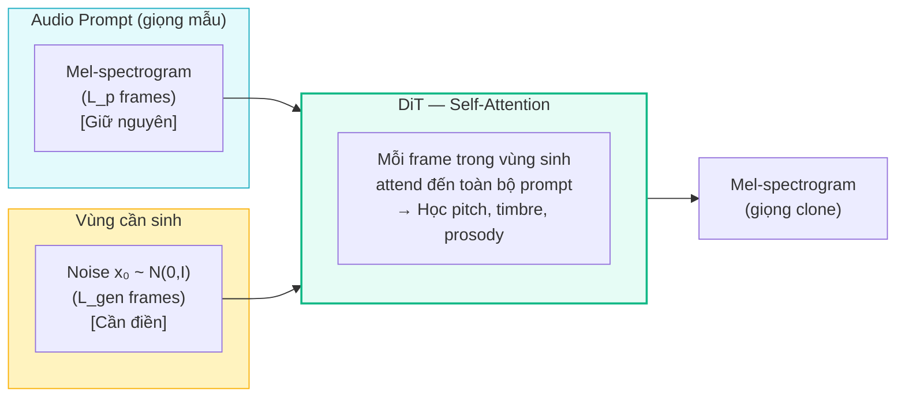
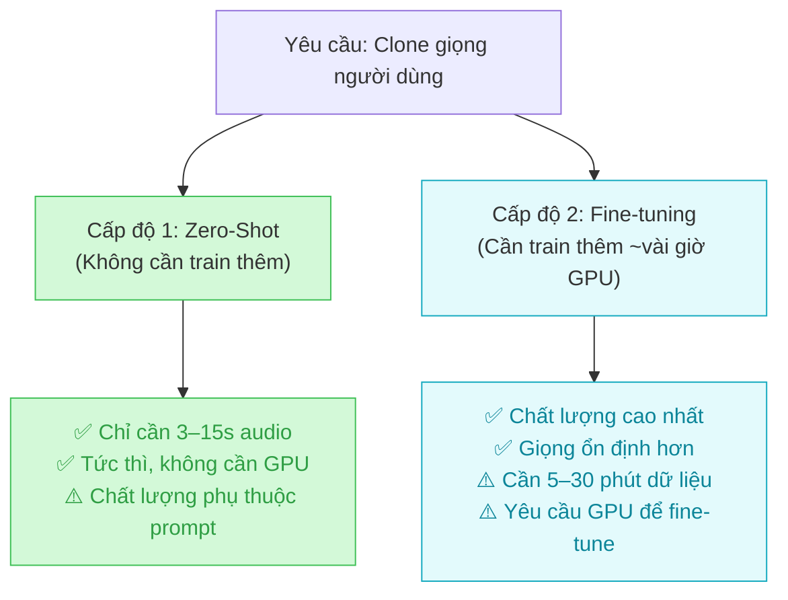

# 2.5 Cơ chế Voice Cloning

Các section trước đã phân tích kiến trúc mô hình (2.2), quy trình huấn luyện (2.3) và suy diễn (2.4). Section này tập trung trả lời câu hỏi trọng tâm của đề tài: **F5-TTS sao chép giọng nói của một người như thế nào?**

Voice Cloning trong F5-TTS không phải là một module riêng biệt được thêm vào từ bên ngoài, mà là một khả năng **nội tại** xuất phát trực tiếp từ cách bài toán TTS được định hình lại như một bài toán *Infilling* (xem lại Section 2.1.3). Toàn bộ thông tin giọng nói của người dùng được truyền tải thông qua **audio prompt** — một đoạn ghi âm ngắn — và cơ chế học biểu diễn tiềm ẩn (implicit speaker representation) bên trong kiến trúc DiT.

---

## 2.5.1 Biểu diễn đặc trưng giọng nói

### Bài toán: Định danh giọng nói là gì?

Giọng nói của mỗi người là một tập hợp các đặc điểm vật lý và ngôn ngữ đặc trưng, bao gồm:

- **Tần số cơ bản (Fundamental Frequency / F0)**: Hay còn gọi là "pitch" — xác định giọng trầm hay cao.
- **Formants**: Các dải cộng hưởng của khoang miệng và mũi, quyết định màu sắc âm thanh (timbre) đặc trưng của từng người.
- **Năng lượng và tốc độ nói**: Tốc độ phát âm, độ dài âm tiết và mẫu ngữ điệu (prosody pattern).
- **Đặc điểm tạp âm kênh**: Chất lượng micro, không gian phòng thu, v.v.

Trong các hệ thống TTS truyền thống, những đặc trưng này thường được biểu diễn tường minh bằng các vector speaker embedding (d-vector, x-vector) học từ mô hình nhận diện người nói \[[1, 2]\]. Đây là cách tiếp cận **Explicit Speaker Conditioning**: trích xuất embedding rồi inject vào mô hình acoustic.

### Cách tiếp cận của F5-TTS: Implicit In-Context Learning

F5-TTS lựa chọn hướng tiếp cận **hoàn toàn khác và đơn giản hơn** — không cần speaker encoder hay speaker embedding tường minh \[[3]\]. Thay vào đó, thông tin giọng nói được truyền tải **trực tiếp thông qua audio prompt** theo cơ chế *In-Context Learning* (học trong ngữ cảnh):

1. **Audio Prompt → Mel-spectrogram**: Đoạn ghi âm mẫu (3–10 giây) được chuyển đổi thành mel-spectrogram thực $\mathbf{x}_{\text{prompt}} \in \mathbb{R}^{L_p \times 100}$.

2. **Nối tiếp với vùng nhiễu**: Theo cơ chế Infilling, $\mathbf{x}_{\text{prompt}}$ được nối tiếp trực tiếp với vùng cần sinh (ban đầu là nhiễu $\mathbf{x}_0 \sim \mathcal{N}(0, I)$), tạo thành chuỗi đầu vào thống nhất cho DiT:

$$\mathbf{x}_{\text{input}} = [\mathbf{x}_{\text{prompt}} \,\|\, \mathbf{x}_0] \in \mathbb{R}^{(L_p + L_{\text{gen}}) \times 100}$$

3. **Self-Attention là cơ chế truyền tải giọng nói**: Trong DiT, cơ chế **Multi-Head Self-Attention** cho phép mọi vị trí trong chuỗi đầu ra (vùng cần sinh) "nhìn thấy" và tham chiếu đến toàn bộ vùng prompt. Nhờ đó, khi sinh âm thanh cho từng frame, mô hình tự động điều chỉnh pitch, timbre và nhịp điệu để khớp với giọng mẫu — **mà không cần bất kỳ vector speaker nào được truyền vào tường minh** \[[3]\].

### Điều kiện về chất lượng audio prompt

Vì toàn bộ thông tin giọng nói được truyền tải qua audio prompt, chất lượng của đoạn ghi âm mẫu ảnh hưởng trực tiếp đến kết quả clone giọng. Các yếu tố ảnh hưởng bao gồm:

| Yếu tố | Khuyến nghị | Lý do |
|--------|-------------|-------|
| Độ dài | 3–15 giây | Đủ thông tin ngữ điệu, không dư thừa |
| Chất lượng | Ít nhiễu nền, giọng rõ | Mel-spectrogram sạch → attention chính xác hơn |
| Nội dung | Câu hoàn chỉnh, đa âm tiết | Bao phủ nhiều đặc điểm phát âm hơn |
| Ngôn ngữ | Phù hợp với văn bản đích | Tránh mismatch prosody giữa prompt và target |

---

## 2.5.2 Speaker Adaptation — Cá nhân hóa giọng nói

### Hai cấp độ Voice Cloning

F5-TTS hỗ trợ hai cấp độ cá nhân hóa giọng nói với đánh đổi (trade-off) khác nhau giữa sự tiện lợi và chất lượng:

### Cấp độ 1: Zero-Shot Voice Cloning

Đây là ứng dụng trực tiếp của cơ chế Infilling đã phân tích ở mục 2.5.1. Không có bước huấn luyện bổ sung nào được thực hiện — mô hình pretrained F5-TTS được sử dụng trực tiếp tại thời điểm suy diễn.

**Luồng xử lý**:
1. Người dùng cung cấp đoạn ghi âm mẫu (prompt audio) và văn bản đích.
2. Audio prompt được chuyển sang mel-spectrogram và nối với vùng nhiễu.
3. DiT thực hiện ODE sampling (xem Section 2.4.1), trong đó Self-Attention sẽ liên tục tham chiếu đến prompt để điều chỉnh giọng đầu ra.
4. Mel-spectrogram kết quả được Vocos chuyển sang waveform.

Chất lượng Zero-Shot phụ thuộc vào mức độ giọng mẫu xuất hiện trong phân phối dữ liệu huấn luyện của mô hình pretrained. Điều này lý giải tại sao F5-TTS hoạt động tốt hơn với giọng tiếng Anh (ngôn ngữ chiếm ưu thế trong dữ liệu gốc) \[[3]\] và cần fine-tuning để đạt hiệu quả tốt nhất với tiếng Việt.

### Cấp độ 2: Fine-tuning cho Speaker Adaptation

Khi Zero-Shot chưa đủ chất lượng (đặc biệt với giọng tiếng Việt — ngôn ngữ ít tài nguyên), giải pháp là **tiếp tục huấn luyện (fine-tune)** toàn bộ mô hình trên tập dữ liệu nhỏ của người dùng cụ thể.

**Cơ chế học của Fine-tuning**: Trong quá trình fine-tuning, mô hình tiếp tục tối ưu hóa cùng hàm mất mát CFM Loss (xem Section 2.3.2), nhưng với phân phối dữ liệu chỉ chứa giọng của một người duy nhất:

$$\mathcal{L}_{\text{ft}} = \mathbb{E}_{t, \mathbf{x}_0, \mathbf{x}_1 \sim \mathcal{D}_{\text{user}}} \left[ \left\| v_\theta(x_t, t, \mathbf{c}) - (\mathbf{x}_1 - \mathbf{x}_0) \right\|^2 \right]$$

Trong đó $\mathcal{D}_{\text{user}}$ là tập dữ liệu riêng của người dùng. Qua quá trình này, trọng số DiT dần dần "thiên vị" (bias) về phía phân phối mel-spectrogram của giọng đó, khiến mô hình sinh âm thanh khớp với đặc trưng giọng cụ thể hơn và ổn định hơn ở mọi ngữ cảnh — kể cả khi prompt audio không phù hợp hoàn toàn \[[3, 4]\].

**Kết quả kỳ vọng**: Sau fine-tuning, mô hình không còn cần prompt audio chất lượng cao để clone giọng chính xác. Thay vào đó, đặc trưng giọng đã được "ghi nhớ" vào trong chính các tham số của mô hình.

> Chiến lược Fine-tuning cụ thể (Full Fine-tuning vs. LoRA, siêu tham số, tối ưu bộ nhớ GPU) đã được trình bày chi tiết trong **Section 2.3.3**. Kết quả thực nghiệm so sánh Zero-Shot và Fine-tuned sẽ được phân tích trong **Chương 4**.

---

## Tài Liệu Tham Khảo

| # | Tác giả | Năm | Tiêu đề | Venue |
|---|---------|-----|---------|-------|
| [1] | Wan, L., et al. | 2018 | *Generalized End-to-End Loss for Speaker Verification (d-vector)* | ICASSP 2018 |
| [2] | Snyder, D., et al. | 2018 | *X-vectors: Robust DNN Embeddings for Speaker Recognition* | ICASSP 2018 |
| [3] | Chen, Y., Yue, Z., et al. | 2024 | *F5-TTS: A Fairytaler that Fakes Fluent and Faithful Speech with Flow Matching* | arXiv:2410.06885 |
| [4] | Eskimez, S.E., et al. | 2024 | *E2 TTS: Embarrassingly Easy Fully Non-Autoregressive Zero-Shot TTS* | arXiv:2406.18009 |

---

## 📎 Phụ Lục — Giải Thích Thuật Ngữ Cho Người Mới Bắt Đầu

### 🎤 A. Timbre (Âm sắc) là gì?

Hãy thử nghĩ tại sao bạn có thể phân biệt giọng của hai người bạn ngay cả khi cả hai cùng nói một câu với cùng độ cao (pitch). Lý do là **timbre** — "màu sắc" âm thanh đặc trưng của từng người.

Timbre được quyết định bởi hình dạng khoang miệng, độ dày dây thanh quản, và cách không khí đi qua mũi. Trên biểu đồ mel-spectrogram, timbre thể hiện thành các "dải sáng" đặc trưng ở các dải tần số nhất định gọi là **Formants**. Mô hình F5-TTS học được các formant pattern này từ audio prompt và tái tạo chúng trong giọng được sinh ra.

---

### 🧠 B. In-Context Learning là gì?

**In-Context Learning** (học từ ngữ cảnh) là khả năng của mô hình ngôn ngữ lớn (và các mô hình sinh) học cách thực hiện một tác vụ chỉ từ các ví dụ được cung cấp **ngay trong đầu vào**, mà không cần cập nhật trọng số mô hình \[[*\]].

Trong F5-TTS, audio prompt đóng vai trò là "ví dụ ngữ cảnh" (in-context example): mô hình nhìn vào phần prompt, tự suy ra "người nói này có giọng như thế nào" và áp dụng điều đó vào phần âm thanh cần sinh — tương tự như cách GPT-4 đọc 2–3 ví dụ trong prompt rồi làm đúng tác vụ mới mà không cần train lại.

> \[*\] Brown, T., et al. (2020). *Language Models are Few-Shot Learners (GPT-3)*. NeurIPS 2020.

---

### 🔊 C. Speaker Embedding (d-vector, x-vector) là gì và tại sao F5-TTS không dùng?

Trong các hệ thống TTS cũ (như YourTTS hay Coqui TTS), một mô hình nhận dạng người nói riêng biệt (Speaker Encoder) trước tiên "đọc" đoạn audio mẫu và nén toàn bộ thông tin giọng nói thành một **vector số** nhỏ gọn (thường 256 hoặc 512 chiều) — gọi là speaker embedding. Vector này sau đó được "inject" vào mô hình TTS như một điều kiện bổ sung.

**Hạn chế**: Quá trình nén này không tránh khỏi mất mát thông tin. Nhiều sắc thái tinh tế (như giọng khản nhẹ, cách nhấn âm cuối câu) có thể bị bỏ sót trong vector ngắn gọn đó.

**F5-TTS tránh được điều này** bằng cách cho mô hình "nhìn thấy" trực tiếp mel-spectrogram thô của prompt — không qua bộ lọc nào cả. Cơ chế Self-Attention sau đó tự động trích xuất mọi đặc trưng cần thiết với độ phân giải cao nhất.
