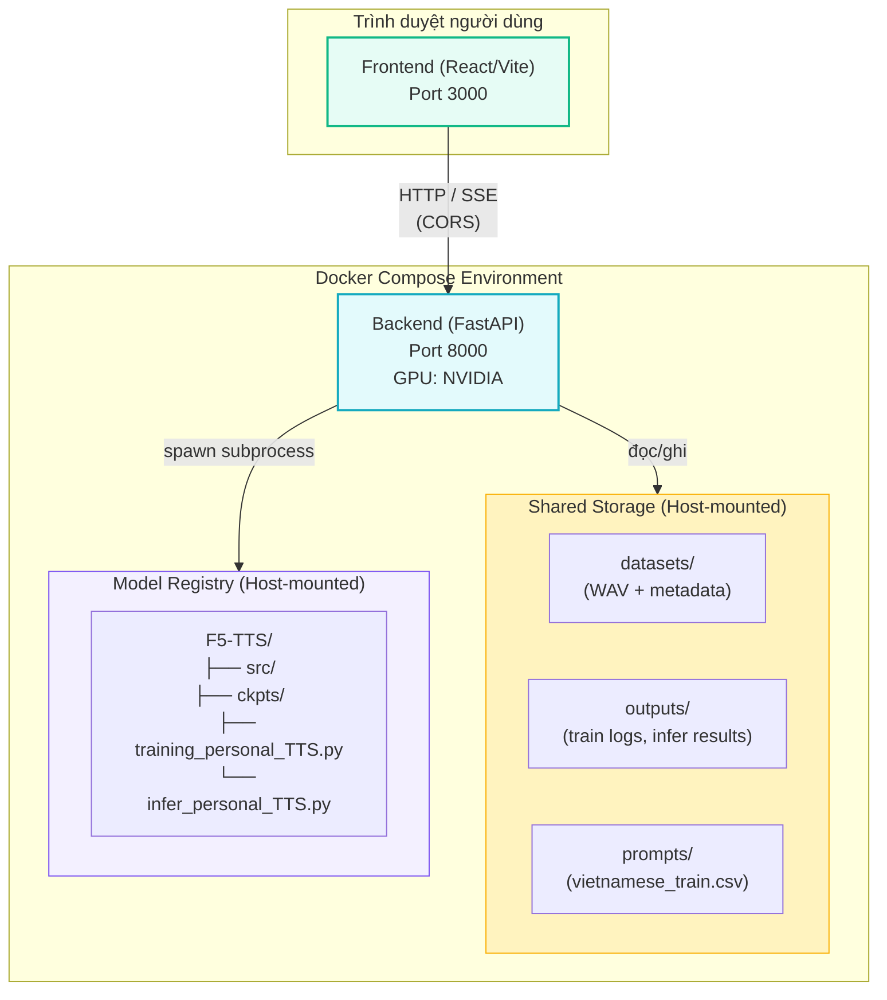
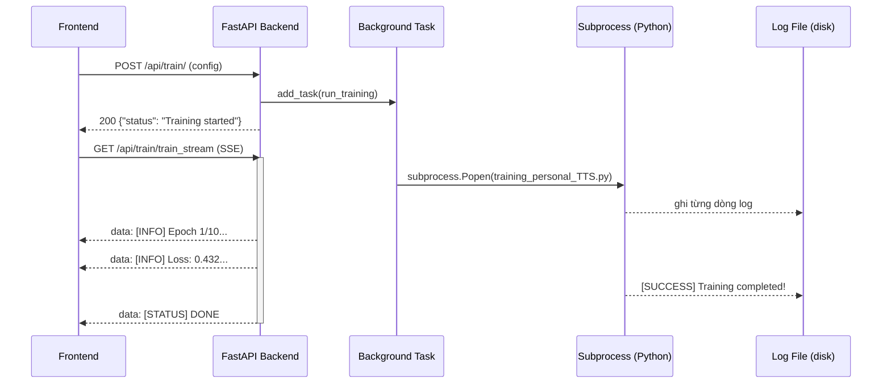
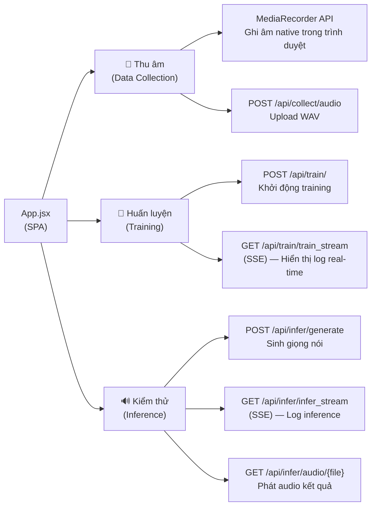
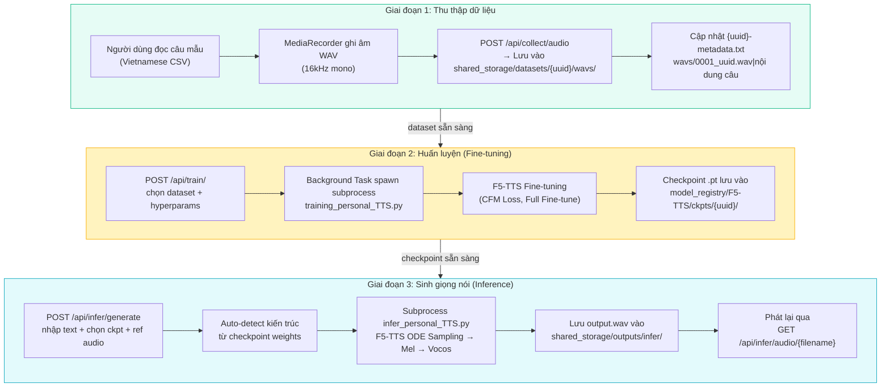

# 3.1 Tổng quan kiến trúc hệ thống

Chương 2 đã phân tích toàn diện mô hình F5-TTS từ góc độ lý thuyết. Chương 3 chuyển sang mô tả **cách hệ thống thực tế được thiết kế và triển khai** — tức là, F5-TTS được đặt vào một hệ thống end-to-end như thế nào để người dùng có thể thu âm giọng nói, huấn luyện mô hình cá nhân hóa và sinh giọng nói mà không cần thao tác dòng lệnh.

---

## Nguyên tắc thiết kế

Hệ thống được thiết kế theo ba nguyên tắc cốt lõi:

1. **Monorepo — Tập trung, không phân tán**: Toàn bộ backend, frontend, model và dữ liệu nằm trong cùng một repository, giảm thiểu overhead cấu hình và dễ dàng triển khai.
2. **Không Database — File-system as State**: Thay vì dùng cơ sở dữ liệu quan hệ, trạng thái hệ thống (metadata, checkpoints, logs) được lưu trực tiếp trên hệ thống file. Điều này tối ưu cho tính di động và phù hợp với môi trường nghiên cứu cá nhân.
3. **Containerized — Tái lập được**: Toàn bộ hệ thống được đóng gói bằng Docker Compose, bảo đảm môi trường nhất quán giữa máy phát triển và máy chạy thực nghiệm.

---

## Kiến trúc tổng quan

Hệ thống gồm **hai service** chạy song song qua Docker Compose:



| Service | Công nghệ | Port | Tài nguyên |
|---------|-----------|------|-----------|
| **Backend** | FastAPI + Uvicorn | 8000 | GPU (NVIDIA, yêu cầu driver) |
| **Frontend** | React + Vite | 3000 | CPU |

---

## 3.1.1 Backend (FastAPI)

Backend là trung tâm điều phối mọi tác vụ của hệ thống, bao gồm quản lý dữ liệu, khởi chạy huấn luyện và thực hiện inference. Nó được xây dựng bằng **FastAPI** \[[1]\] — framework Python hiện đại hỗ trợ bất đồng bộ (async), validation tự động qua Pydantic và tạo tài liệu API tự động.

### Cấu trúc module

Entry point là `main.py`, nơi khởi tạo ứng dụng và đăng ký ba router chức năng:

```
backend/
├── main.py               # FastAPI app, CORS, router registration
├── config.yaml           # Cấu hình paths, model, siêu tham số mặc định
├── config_loader.py      # Parse config.yaml → các hằng số Python
└── app/
    └── api/
        ├── collect.py    # Router: /api/collect — Thu thập dữ liệu
        ├── train.py      # Router: /api/train  — Huấn luyện mô hình
        └── infer.py      # Router: /api/infer  — Sinh giọng nói
```

### Bảng API Endpoints

| Router | Method | Endpoint | Chức năng |
|--------|--------|----------|-----------|
| **collect** | `GET` | `/api/collect/datasets` | Liệt kê các dataset đã thu âm |
| | `GET` | `/api/collect/prompt` | Lấy câu mẫu tiếp theo cần đọc |
| | `POST` | `/api/collect/audio` | Upload file WAV + cập nhật metadata |
| | `POST` | `/api/collect/undo` | Xoá bản ghi cuối |
| **train** | `POST` | `/api/train/` | Khởi động huấn luyện (background task) |
| | `GET` | `/api/train/train_status` | Trạng thái hiện tại (`running` / `done` / `failed`) |
| | `GET` | `/api/train/train_stream` | Stream log huấn luyện theo thời gian thực (SSE) |
| **infer** | `GET` | `/api/infer/checkpoints` | Liệt kê các checkpoint `.pt` / `.safetensors` |
| | `GET` | `/api/infer/datasets/{name}/ref_audios` | Liệt kê file WAV làm reference |
| | `POST` | `/api/infer/upload_ref` | Upload reference audio tạm thời |
| | `POST` | `/api/infer/generate` | Khởi động sinh giọng (background task) |
| | `GET` | `/api/infer/infer_status` | Trạng thái + đường dẫn file kết quả |
| | `GET` | `/api/infer/infer_stream` | Stream log inference theo thời gian thực (SSE) |
| | `GET` | `/api/infer/audio/{filename}` | Tải về / phát file âm thanh kết quả |

### Cơ chế xử lý bất đồng bộ

Hai tác vụ nặng tính toán là **huấn luyện** và **inference** không thể chạy trực tiếp trong request-response cycle của HTTP — chúng có thể kéo dài hàng giờ hoặc hàng chục giây. Hệ thống giải quyết bằng hai cơ chế:

1. **Background Tasks (FastAPI)**: Khi nhận `POST /api/train/` hoặc `POST /api/infer/generate`, API trả về `202 Processing` ngay lập tức, trong khi tác vụ nặng được đẩy vào `BackgroundTasks` để chạy song song với event loop.

2. **Subprocess Spawning**: Bên trong background task, backend dùng `subprocess.Popen()` để spawn một tiến trình Python con, thực thi trực tiếp script huấn luyện (`training_personal_TTS.py`) hoặc script inference (`infer_personal_TTS.py`) từ `model_registry`. Thiết kế này cô lập môi trường thực thi của model khỏi server API, tránh conflict dependency.

3. **Server-Sent Events (SSE)**: Các endpoint `train_stream` và `infer_stream` đọc file log theo thời gian thực và đẩy từng dòng về client qua giao thức SSE \[[2]\]. Frontend subscribe vào stream này để hiển thị log trực tiếp mà không cần polling.



### Cấu hình động qua config.yaml

Toàn bộ đường dẫn, siêu tham số mặc định và thông tin model được tập trung trong `config.yaml` và load qua `config_loader.py`. Thiết kế này cho phép thêm mô hình mới (ví dụ: VITS) mà không cần sửa code — chỉ cần bổ sung entry mới trong `models:` của config.

```yaml
# Ví dụ config.yaml (rút gọn)
models:
  F5TTS-Base:
    src: "/model_registry/F5-TTS/src"
    train_script: "/model_registry/F5-TTS/training_personal_TTS.py"
    infer_script: "/model_registry/F5-TTS/infer_personal_TTS.py"
    ckpt_parent: "/model_registry/F5-TTS/ckpts"
    type: "f5tts"

training_defaults:
  epoch: 10
  batch_size: 4
  learning_rate: 7.5e-5
```

---

## 3.1.2 Frontend — Giao diện người dùng

Frontend được xây dựng bằng **React** \[[3]\] với build tool **Vite** \[[4]\], chạy trên port 3000 trong container Docker riêng. Toàn bộ logic giao diện được tổ chức trong một file component lớn (`App.jsx`) theo kiến trúc **Single Page Application (SPA)** với ba tab chức năng chính:



**Tab Thu âm**: Sử dụng **MediaRecorder API** của trình duyệt \[[5]\] để ghi âm trực tiếp mà không cần cài đặt phần mềm bên ngoài. Hệ thống tự động lấy câu mẫu tiếp theo từ file CSV tiếng Việt, người dùng đọc và nhấn "Dừng ghi" để upload. File WAV và metadata được tạo tự động theo chuẩn F5-TTS.

**Tab Huấn luyện**: Cung cấp giao diện cấu hình các siêu tham số (epochs, learning rate, batch size), sau đó subscribe SSE stream để hiển thị log huấn luyện theo thời gian thực.

**Tab Kiểm thử**: Cho phép chọn checkpoint và reference audio, nhập văn bản cần tổng hợp và phát lại âm thanh kết quả ngay trong trình duyệt.

---

## 3.1.3 Pipeline xử lý tổng thể

Ba tác vụ chính của hệ thống — thu thập dữ liệu, huấn luyện và sinh giọng — được tổ chức thành một pipeline tuần tự khép kín:



### Chiến lược lưu trữ

Toàn bộ dữ liệu được phân tách rõ ràng qua ba thư mục gắn trực tiếp vào host (bind mount), không đi qua lớp container:

| Thư mục | Nội dung | Truy cập bởi |
|---------|---------|-------------|
| `shared_storage/datasets/` | WAV files + metadata từng người dùng | collect API, train API |
| `shared_storage/outputs/` | Training logs, inference results | train API, infer API, Frontend |
| `shared_storage/prompts/` | Danh sách câu mẫu tiếng Việt (CSV) | collect API |
| `model_registry/F5-TTS/` | Source code model + checkpoints | train API (spawn), infer API (spawn) |

Thiết kế bind-mount này đảm bảo dữ liệu tồn tại độc lập với vòng đời container — khi rebuild image hay restart Docker, toàn bộ dataset và checkpoint được bảo toàn.

---

## Tài Liệu Tham Khảo

| # | Tác giả / Tổ chức | Năm | Tiêu đề | Link |
|---|-------------------|-----|---------|------|
| [1] | Ramírez, S. | 2018 | *FastAPI — Modern, fast web framework for building APIs with Python* | fastapi.tiangolo.com |
| [2] | W3C | 2021 | *Server-Sent Events — HTML Living Standard* | html.spec.whatwg.org |
| [3] | Meta Open Source | 2013 | *React — A JavaScript library for building user interfaces* | react.dev |
| [4] | Evan You | 2020 | *Vite — Next Generation Frontend Tooling* | vitejs.dev |
| [5] | W3C / WHATWG | 2013 | *MediaStream Recording API (MediaRecorder)* | w3.org/TR/mediastream-recording |

---

## 📎 Phụ Lục — Giải Thích Thuật Ngữ Cho Người Mới Bắt Đầu

### 🐳 A. Docker và Docker Compose là gì?

**Docker** là công nghệ đóng gói ứng dụng vào một "hộp" khép kín gọi là **container**. Bên trong hộp đó có đầy đủ: Python, thư viện, biến môi trường — đúng phiên bản, không ảnh hưởng đến hệ thống bên ngoài. Điều này đảm bảo code chạy đúng ở mọi máy.

**Docker Compose** là công cụ quản lý nhiều container cùng lúc. Thay vì khởi động từng container bằng lệnh dài, bạn viết một file `docker-compose.yml` mô tả tất cả service, rồi chỉ cần `docker compose up` — mọi thứ tự động khởi động theo đúng thứ tự.

---

### ⚡ B. FastAPI là gì? Tại sao không dùng Flask?

**FastAPI** là web framework Python hiện đại, được xây dựng trên nền **ASGI** (Asynchronous Server Gateway Interface), khác với **Flask** dùng WSGI đồng bộ truyền thống.

Lý do chọn FastAPI trong dự án này:
- **Async native**: Hỗ trợ `async/await` tự nhiên, cho phép xử lý đồng thời nhiều request mà không bị block — đặc biệt quan trọng khi streaming SSE.
- **BackgroundTasks**: Tích hợp sẵn cơ chế chạy tác vụ nền mà không cần thêm Celery hay Redis.
- **Tự động sinh docs**: Truy cập `http://localhost:8000/docs` để thấy giao diện Swagger UI đầy đủ mà không cần viết thêm một dòng code nào.

---

### 📡 C. Server-Sent Events (SSE) là gì?

Thông thường, giao tiếp HTTP là một chiều: client hỏi → server trả lời → kết thúc. Nếu muốn nhận cập nhật liên tục (như log huấn luyện), bạn phải **polling** — tức là cứ mỗi 1 giây lại gửi request hỏi "có gì mới không?" — rất lãng phí.

**SSE** giải quyết điều này bằng cách giữ kết nối HTTP mở lâu dài, và server **chủ động đẩy** (push) dữ liệu mới về client bất cứ khi nào có. Giống như bạn đặt đường dây điện thoại thường trực — server gọi cho bạn khi có tin mới, thay vì bạn phải gọi đi hỏi liên tục.

---

### 🔄 D. SPA (Single Page Application) là gì?

Trong website truyền thống, mỗi lần bạn click sang tab mới, trình duyệt phải tải lại toàn bộ trang HTML từ server. **SPA** làm khác: toàn bộ giao diện được tải một lần duy nhất, sau đó React tự render lại các phần thay đổi mà không reload trang. Kết quả là giao diện phản hồi nhanh, mượt mà như ứng dụng desktop.
