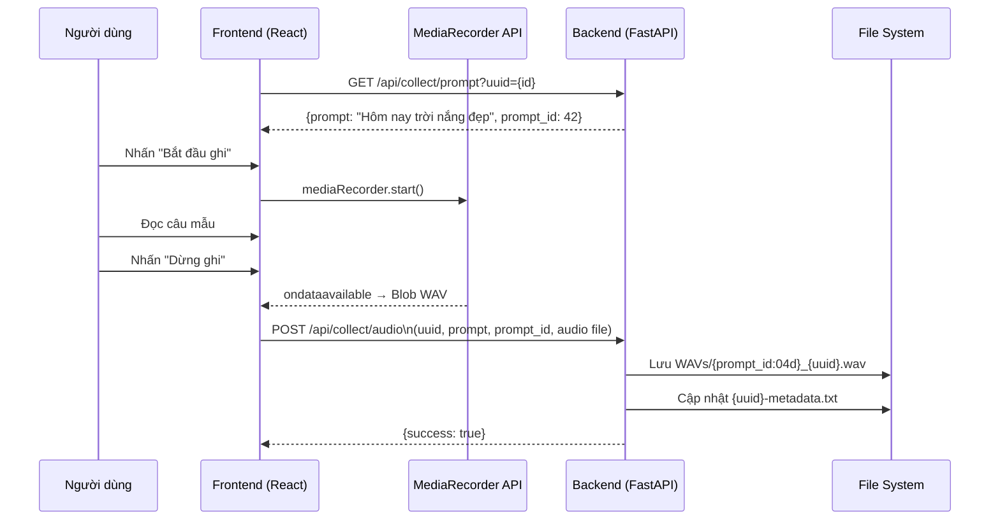
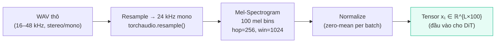
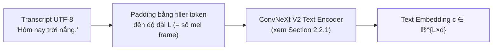
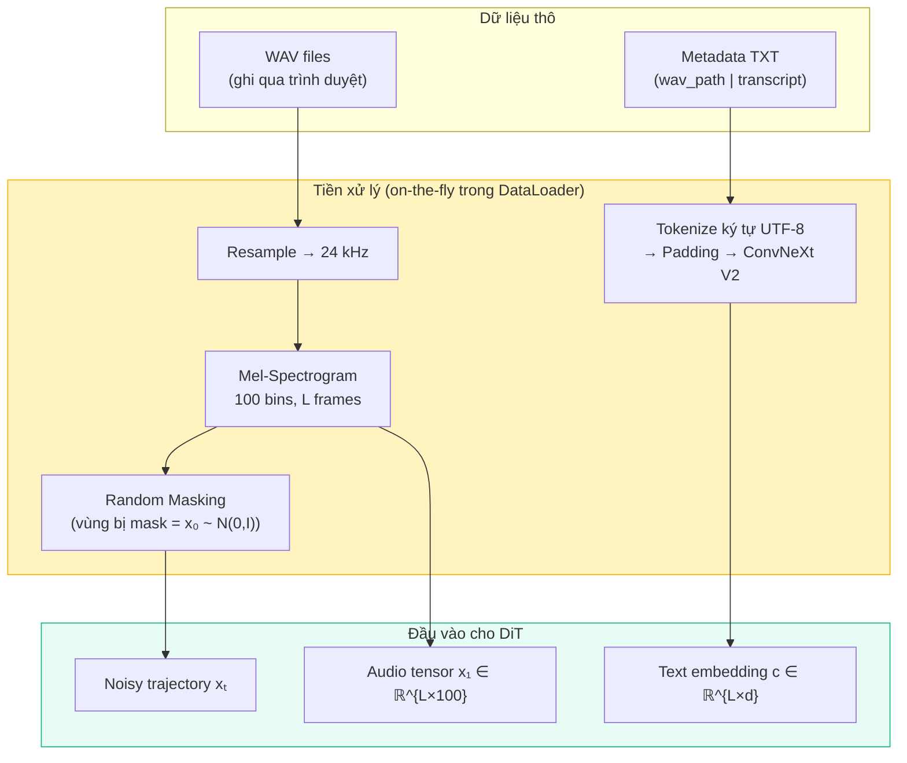

# 3.2 Thu thập và tiền xử lý dữ liệu

Section 3.1 đã mô tả kiến trúc tổng thể của hệ thống: backend FastAPI điều phối ba giai đoạn thu thập, huấn luyện và inference. Section này đi sâu vào **giai đoạn đầu tiên** — cách dữ liệu giọng nói cá nhân được thu thập, gán nhãn và tổ chức thành định dạng sẵn sàng cho fine-tuning.

Chất lượng dữ liệu quyết định trực tiếp chất lượng giọng nói sinh ra: một mô hình huấn luyện trên dữ liệu nhiễu sẽ tạo ra giọng nói nhiễu, bất kể kiến trúc có tinh vi đến đâu. Vì vậy, giai đoạn này không chỉ là "thu âm" đơn thuần mà là một pipeline kỹ thuật được thiết kế cẩn thận.

---

## 3.2.1 Thu thập dữ liệu giọng nói

### Thiết kế pipeline thu âm

Hệ thống cho phép người dùng thu âm trực tiếp trong trình duyệt mà không cần cài đặt phần mềm bên ngoài. Toàn bộ luồng từ câu mẫu đến file WAV được tổ chức tự động:



### Giao diện thu âm

Frontend Tab **"Thu âm"** hiển thị tuần tự từng câu từ file `vietnamese_train.csv`. Hệ thống tự động tính prompt tiếp theo dựa trên số file WAV đã có:

```python
# collect.py — logic xác định câu tiếp theo
completed_count = len([f for f in os.listdir(wav_dir) if f.endswith(".wav")])
target_id = id if id is not None else (completed_count + 1)
```

Người dùng thấy câu hiện tại, tiến độ (ví dụ: *42 / 697 câu*), và có thể phát lại file vừa ghi hoặc dùng **Undo** để xóa bản ghi lỗi. Điều này cho phép kiểm soát chất lượng ngay trong quá trình thu âm — không cần post-processing thủ công sau đó.

### Cơ chế ghi âm — MediaRecorder API

Trình duyệt hiện đại hỗ trợ **MediaRecorder API** \\[[1]\\], cho phép ghi âm từ microphone và xuất trực tiếp ra `Blob` dữ liệu nhị phân mà không cần plugin:

```javascript
// App.jsx — khởi tạo ghi âm
const stream = await navigator.mediaDevices.getUserMedia({ audio: true });
const recorder = new MediaRecorder(stream);
recorder.ondataavailable = (e) => chunks.push(e.data);
recorder.onstop = () => {
    const blob = new Blob(chunks, { type: "audio/wav" });
    uploadAudio(blob); // POST /api/collect/audio
};
```

> **Lưu ý thực tiễn**: MediaRecorder mặc định xuất định dạng `webm/opus` trên nhiều trình duyệt. Backend nhận Blob này và lưu với phần mở rộng `.wav`. Trong pipeline huấn luyện, `torchaudio.load()` xử lý được cả hai định dạng, nhưng để đảm bảo nhất quán, trình duyệt được cấu hình ưu tiên codec `audio/webm` → F5-TTS tự động resample về 24 kHz khi load.

### Yêu cầu về lượng dữ liệu

F5-TTS hỗ trợ zero-shot cloning từ chỉ 3–10 giây audio. Tuy nhiên, với mục tiêu **fine-tuning cá nhân hóa**, chất lượng tốt hơn đòi hỏi nhiều dữ liệu hơn:

| Số câu thu âm | Thời lượng ước tính | Kỳ vọng chất lượng |
|:---:|:---:|:---|
| 50–100 câu | ~5 phút | Đủ để fine-tune cơ bản, có thể có lỗi phát âm |
| 200–400 câu | ~15–30 phút | Ổn định, giọng nhận dạng rõ ràng |
| 500–700 câu | ~40–60 phút | Chất lượng cao, ngữ điệu tự nhiên |

Trong dự án này, file `vietnamese_train.csv` chứa **697 câu** được thiết kế để bao phủ đa dạng độ dài câu, loại câu (trần thuật, hỏi, cảm thán), ngữ cảnh (hội thoại, kể chuyện, mô tả), và các ký tự đặc biệt (số, ngày tháng, địa chỉ).

---

## 3.2.2 Gán nhãn (Labeling)

### Chuẩn định dạng metadata

F5-TTS yêu cầu mỗi dataset phải có một file metadata ánh xạ từng file WAV tới transcript tương ứng. Hệ thống áp dụng chuẩn **LJSpeech-style** — định dạng đơn giản được sử dụng rộng rãi trong các framework TTS \\[[2]\\]:

```
wavs/0001_thien_dataset.wav|Hôm nay tôi bắt đầu ghi âm cho dự án tốt nghiệp của mình.
wavs/0002_thien_dataset.wav|Bạn có thể nghe rõ giọng nói của tôi không?
```

**Quy ước đặt tên file**: `{prompt_id:04d}_{uuid}.wav`
- `0001` → ID 4 chữ số, đảm bảo thứ tự sort đúng
- `thien_dataset` → UUID của người dùng, tránh conflict khi nhiều người dùng cùng chạy

### Gán nhãn tự động

Không giống các pipeline truyền thống yêu cầu gán nhãn thủ công sau khi thu âm, hệ thống này **gán nhãn tức thì** tại thời điểm upload: transcript chính là câu mẫu mà người dùng vừa đọc — đã được đồng bộ chính xác vì người dùng đọc đúng câu hiện tại trên màn hình.

```python
# collect.py — ghi nhãn ngay khi upload
new_entry = f"wavs/{wav_filename}|{prompt}\n"
# Xử lý idempotent: xóa dòng cũ nếu đã tồn tại, sau đó append
lines = [l for l in lines if not l.startswith(f"wavs/{wav_filename}|")]
lines.append(new_entry)
```

Thiết kế **idempotent** (ghi đè dòng cũ thay vì duplicate) cho phép người dùng ghi âm lại bất kỳ câu nào mà không làm hỏng metadata.

### Cấu trúc thư mục dataset

Sau khi thu âm, thư mục dataset của mỗi người dùng có cấu trúc hoàn chỉnh, sẵn sàng cho bước fine-tuning mà không cần thêm thao tác nào:

```
shared_storage/datasets/
└── thien_dataset/              ← UUID của người dùng
    ├── wavs/
    │   ├── 0001_thien_dataset.wav
    │   ├── 0002_thien_dataset.wav
    │   └── ...
    └── thien_dataset-metadata.txt   ← ánh xạ WAV → transcript
```

Script huấn luyện (`training_personal_TTS.py`) nhận đúng cấu trúc này qua argument `--data_dir` và `--metadata_file`, không cần bước chuyển đổi trung gian.

---

## 3.2.3 Tiền xử lý âm thanh và văn bản

Dữ liệu thô từ microphone chưa thể đưa vào mô hình trực tiếp. F5-TTS yêu cầu một định dạng cụ thể về tần số lấy mẫu, biểu diễn mel-spectrogram và mã hóa văn bản. Các bước tiền xử lý này được thực hiện **on-the-fly trong DataLoader** của script huấn luyện, không lưu file trung gian.

### Tiền xử lý âm thanh



**Resample về 24 kHz**: F5-TTS được pretrain với audio 24 kHz. Bất kỳ tần số lấy mẫu nào khác (MediaRecorder mặc định thường là 44.1 kHz hoặc 48 kHz) đều được resample trước khi tính mel-spectrogram \\[[3]\\].

**Mel-Spectrogram với 100 mel bins**: Thay vì làm việc trực tiếp với waveform, mô hình học trên biểu diễn mel-spectrogram — một dạng biểu diễn tần số phù hợp với thính giác con người \\[[4]\\]. Mỗi frame mel có 100 chiều, và $L$ frame tương ứng với toàn bộ đoạn audio.

### Tiền xử lý văn bản



Văn bản tiếng Việt được xử lý **ở cấp độ ký tự UTF-8** — không qua bước tokenize phức tạp. Chuỗi ký tự được đệm bằng *filler token* đến đúng độ dài $L$ (số frame mel), sau đó qua ConvNeXt V2 để sinh text embedding. Thiết kế này đặc biệt phù hợp với tiếng Việt vì tránh được vấn đề từ ngoài từ điển (OOV) khi chuyển sang ngôn ngữ mới \\[[3]\\].

> **Tại sao không dùng phoneme?** Nhiều hệ thống TTS cũ dùng phoneme (âm vị học) để chuẩn hóa phát âm. F5-TTS bỏ qua bước này và học trực tiếp từ ký tự — đơn giản hóa pipeline và tránh phụ thuộc vào bộ từ điển phoneme tiếng Việt vốn không hoàn chỉnh.

### Cơ chế Masking trong huấn luyện

Trong quá trình huấn luyện fine-tuning, mỗi sample được xử lý theo cơ chế **Infilling** đã trình bày ở Section 2.3.1: một vùng ngẫu nhiên của mel-spectrogram bị mask và thay bằng nhiễu Gaussian, mô hình học cách "điền vào" vùng đó dựa trên context văn bản và phần audio không bị mask.

Điểm khác biệt trong fine-tuning so với pretraining: do dataset nhỏ (vài trăm câu thay vì hàng nghìn giờ), hệ thống **không áp dụng augmentation mạnh** (như pitch shift hay time stretch) để tránh mô hình học giọng đã biến đổi thay vì giọng thật của người dùng.

### Tóm tắt pipeline tiền xử lý



---

## Tài Liệu Tham Khảo

| # | Tác giả / Tổ chức | Năm | Tiêu đề | Link |
|---|-------------------|-----|---------|------|
| [1] | W3C / WHATWG | 2013 | *MediaStream Recording API (MediaRecorder)* | w3.org/TR/mediastream-recording |
| [2] | Ito, K. | 2017 | *The LJ Speech Dataset* | keithito.com/LJ-Speech-Dataset |
| [3] | Chen, Y., et al. | 2024 | *F5-TTS: A Fairytaler that Fakes Fluent and Faithful Speech with Flow Matching* | arXiv:2410.06885 |
| [4] | Stevens, S. S., Volkmann, J., Newman, E. B. | 1937 | *A Scale for the Measurement of the Psychological Magnitude Pitch* | JASA, 8(3) |

---

## 📎 Phụ Lục — Giải Thích Thuật Ngữ Cho Người Mới Bắt Đầu

### 🎵 A. Mel-Spectrogram là gì?

Âm thanh thô (waveform) là một chuỗi hàng triệu con số đại diện cho dao động không khí theo thời gian. Dạng biểu diễn này rất khó để mô hình học vì nó quá chi tiết và dư thừa.

**Mel-Spectrogram** là cách biểu diễn âm thanh gần hơn với cách tai người cảm nhận: thay vì lưu từng dao động, ta chia âm thanh thành các khung thời gian ngắn (khoảng 10ms/frame), rồi phân tích **năng lượng theo tần số** trong mỗi khung đó — nhưng theo thang đo **mel** (phi tuyến, giống thính giác người, nhạy hơn ở tần số thấp).

Kết quả là một ma trận 2D: trục ngang là thời gian (frame), trục dọc là tần số mel (100 chiều trong F5-TTS). Mô hình học cách "vẽ" ma trận này thay vì học waveform trực tiếp.

---

### 🔊 B. Tại sao cần 24 kHz?

**Tần số lấy mẫu** (sample rate) cho biết âm thanh được "chụp" bao nhiêu lần mỗi giây. CD âm nhạc dùng 44.1 kHz, điện thoại thường dùng 8 kHz, và F5-TTS dùng 24 kHz — đủ để tái tạo giọng nói rõ ràng (theo định lý Nyquist \\[[4]\\], ta cần ít nhất gấp đôi tần số cao nhất cần tái tạo, và giọng người hiếm khi vượt quá 8–10 kHz).

Nếu bạn gửi file 48 kHz vào mô hình pretrain với 24 kHz, biểu diễn mel sẽ bị lệch — giống như chiếu phim ở tốc độ sai. Vì vậy, bước **resample** là bắt buộc trước khi tính mel.

---

### 📝 C. LJSpeech format là gì?

**LJSpeech** là một trong những dataset TTS tiếng Anh phổ biến nhất, do Keith Ito thu thập năm 2017. Định dạng metadata của nó — `wav_path|transcript` — đã trở thành chuẩn thực tế (de facto standard) mà hầu hết framework TTS hiện đại đều hỗ trợ, bao gồm F5-TTS, Coqui TTS, và VITS.

Dùng định dạng này giúp dataset tương thích với nhiều framework khác nhau mà không cần chuyển đổi.

---

### 🎭 D. OOV (Out-of-Vocabulary) là gì?

Trong các hệ thống TTS cũ dùng phoneme, mô hình học từ một bộ từ điển cố định ánh xạ từ → âm vị. Nếu gặp từ mới không có trong từ điển (ví dụ: tên riêng "Nguyễn Ngọc Thiện"), hệ thống không biết cách phát âm — đây là vấn đề **OOV**.

F5-TTS xử lý ở cấp **ký tự UTF-8**: mọi ký tự đều có thể đưa vào mô hình vì bảng mã Unicode bao phủ toàn bộ chữ cái, số và ký hiệu của mọi ngôn ngữ. Điều này giải quyết triệt để vấn đề OOV và là lý do quan trọng F5-TTS chuyển sang tiếng Việt mà không cần xây dựng từ điển phoneme mới.
