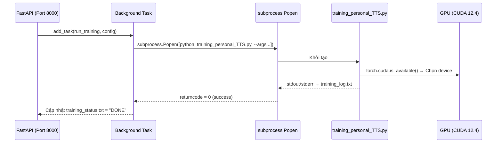
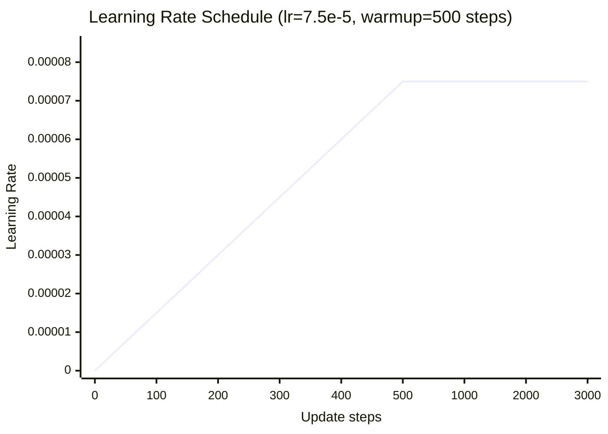
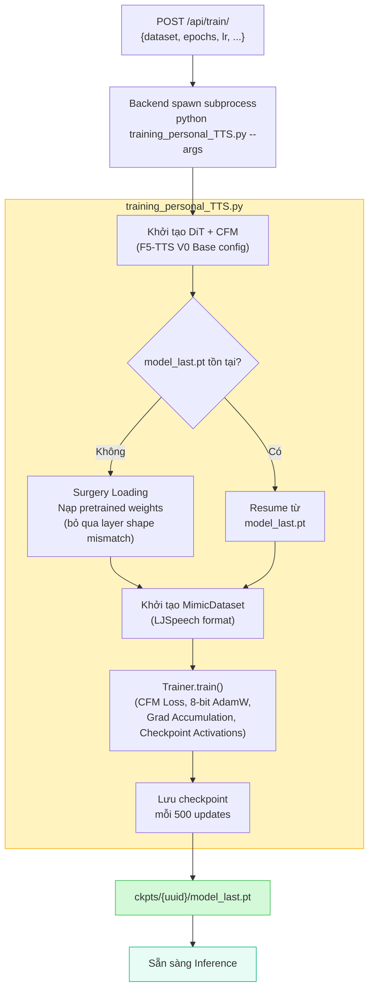

# 3.3 Huấn luyện mô hình

Section 3.2 đã mô tả cách dữ liệu giọng nói được thu thập, gán nhãn và tiền xử lý thành định dạng sẵn sàng cho fine-tuning. Section này đi sâu vào **giai đoạn huấn luyện thực tế** — cụ thể là: môi trường phần cứng và container được cấu hình như thế nào, các siêu tham số nào được lựa chọn và tại sao, và checkpoint được quản lý ra sao để đảm bảo an toàn và khả năng tiếp tục huấn luyện.

---

## 3.3.1 Cấu hình môi trường (GPU, Docker)

### Tổng quan môi trường huấn luyện

Toàn bộ quá trình fine-tuning được thực hiện trong môi trường **Docker container** truy cập GPU, đảm bảo tính tái lập và cô lập dependency. Container được xây dựng từ image chính thức của PyTorch với CUDA 12.4:

```dockerfile
FROM pytorch/pytorch:2.4.0-cuda12.4-cudnn9-devel
```

F5-TTS và các dependency được cài đặt qua `pip install -e .` (chế độ editable install), cho phép truy cập trực tiếp vào source code trong `/model_registry/F5-TTS/src` mà không cần rebuild image khi chỉnh sửa.

### Giao tiếp GPU qua Docker Compose

Docker Compose cấu hình backend container yêu cầu NVIDIA GPU qua `deploy.resources.reservations`:

```yaml
# docker-compose.yml (trích)
services:
  backend:
    image: tts-backend:latest
    volumes:
      - ./model_registry:/model_registry   # source F5-TTS + checkpoints
      - ./shared_storage:/shared_storage   # datasets + logs + inference output
    deploy:
      resources:
        reservations:
          devices:
            - driver: nvidia
              count: 1
              capabilities: [ gpu ]
```

Cấu hình này yêu cầu NVIDIA Container Toolkit \[[1]\] được cài đặt trên máy host. Khi `count: 1`, Docker cấp quyền truy cập vào một GPU vật lý duy nhất — đủ cho single-GPU fine-tuning với các kỹ thuật tối ưu VRAM đã trình bày ở Section 2.3.3.

### Tách biệt môi trường Model và API

Khi backend nhận request `POST /api/train/`, nó **không** chạy training trong tiến trình FastAPI. Thay vào đó, một subprocess độc lập được spawn:



Thiết kế subprocess tách biệt hoàn toàn PyTorch CUDA context khỏi FastAPI event loop — tránh xung đột giữa các thư viện asyncio và CUDA, đồng thời cho phép kill tiến trình huấn luyện mà không ảnh hưởng đến server API.

### Yêu cầu phần cứng thực tế

| Thành phần | Yêu cầu tối thiểu | Môi trường thực nghiệm |
|:---|:---:|:---:|
| GPU VRAM | 4 GB | NVIDIA (≥ 4 GB VRAM) |
| RAM hệ thống | 8 GB | 16 GB |
| CUDA version | ≥ 11.8 | 12.4 |
| Python | 3.10+ | 3.10 (trong container) |
| PyTorch | 2.0+ | 2.4.0 |

Với các kỹ thuật tối ưu VRAM (8-bit AdamW, Gradient Accumulation, Checkpoint Activations — xem Section 2.3.3), hệ thống có thể fine-tune mô hình F5-TTS-Base (khoảng 335M parameters) trên GPU 4–8 GB VRAM thông dụng.

---

## 3.3.2 Các siêu tham số (Hyperparameters)

### Kiến trúc mô hình — cố định theo pretrained checkpoint

Để tải đúng trọng số pretrained, kiến trúc DiT phải khớp chính xác với cấu hình **F5-TTS V0 Base** gốc \[[2]\]. Các tham số kiến trúc này được cố định trong script và **không thay đổi** khi fine-tuning:

```python
# training_personal_TTS.py — cấu hình DiT (không thể thay đổi tùy tiện)
model_cfg = {
    "dim": 1024,         # Chiều hidden của DiT
    "depth": 22,         # Số lượng khối Transformer
    "heads": 16,         # Số attention heads
    "ff_mult": 2,        # Feed-forward expansion ratio
    "text_dim": 512,     # Chiều của text embedding (ConvNeXt V2)
    "conv_layers": 4,    # Số lớp ConvNeXt trong Text Encoder
    "text_mask_padding": False,  # ⚠️ Bắt buộc False cho V0 Base
    "pe_attn_head": 1,           # ⚠️ Bắt buộc cho V0 Base
    "checkpoint_activations": True  # Tiết kiệm VRAM, tăng ~20% thời gian tính toán
}
```

> **Tại sao `text_mask_padding: False` và `pe_attn_head: 1` là bắt buộc?** F5-TTS V0 Base được pretrain với các flag này. Nếu thay đổi, hình dạng tensor trong attention layer sẽ không khớp với trọng số đã lưu, khiến việc nạp checkpoint thất bại hoàn toàn. Đây là điều kiện backward-compatibility bắt buộc khi fine-tune từ checkpoint gốc.

### Siêu tham số huấn luyện — có thể điều chỉnh

Khác với cấu hình kiến trúc, các siêu tham số dưới đây được thiết kế **điều chỉnh được** qua giao diện frontend hoặc `config.yaml`:

```python
# Giá trị mặc định trong config.yaml và training_personal_TTS.py
trainer = Trainer(
    model,
    epochs            = 10,          # Số epoch huấn luyện
    learning_rate     = 7.5e-5,      # Learning rate (AdamW)
    num_warmup_updates= 500,         # Bước warm-up tuyến tính
    save_per_updates  = 500,         # Lưu checkpoint mỗi 500 update
    batch_size_per_gpu= 1,           # ⚠️ Giữ = 1 để không tràn VRAM
    grad_accumulation_steps = 8,     # Effective batch size = 8
    max_grad_norm     = 1.0,         # Gradient clipping
    bnb_optimizer     = True,        # Dùng 8-bit AdamW (bitsandbytes)
)
```

#### Bảng tổng hợp siêu tham số và lý do lựa chọn

| Siêu tham số | Giá trị | Lý do lựa chọn |
|:---|:---:|:---|
| `learning_rate` | `7.5e-5` | Giá trị khuyến nghị từ paper F5-TTS \[[2]\]; đủ lớn để hội tụ nhanh, đủ nhỏ để không phá vỡ pretrained knowledge |
| `num_warmup_updates` | `500` | Ramp-up tuyến tính tránh gradient spike ở đầu huấn luyện khi LR còn nhỏ |
| `batch_size_per_gpu` | `1` | Giới hạn VRAM — giữ cố định để tránh OOM trên GPU 4–8 GB |
| `grad_accumulation_steps` | `8` | Effective batch size = 8; cân bằng giữa ổn định gradient và tốc độ |
| `max_grad_norm` | `1.0` | Gradient clipping chuẩn — ngăn gradient explosion khi learning rate cao |
| `epochs` | `10` | Đủ để fine-tune hội tụ trên dataset nhỏ (~500 câu); có thể tăng nếu cần |
| `save_per_updates` | `500` | Checkpoint thường xuyên để khôi phục khi gián đoạn |

#### Learning Rate Schedule — Warm-up tuyến tính

F5-TTS Trainer dùng **linear warm-up** trong `num_warmup_updates` bước đầu, sau đó giữ LR cố định:



Warm-up quan trọng đặc biệt trong fine-tuning vì trọng số pretrained đã ổn định — việc áp dụng LR lớn ngay từ đầu sẽ làm mô hình "quên" kiến thức đã học (catastrophic forgetting) \[[3]\].

### Chiến lược nạp trọng số pretrained — Surgery Loading

Một vấn đề quan trọng khi chuyển từ pretrained tiếng Anh sang fine-tune tiếng Việt: **kích thước embedding layer không khớp** do bộ từ điển thay đổi.

F5-TTS gốc dùng Pinyin vocabulary (tiếng Trung) hoặc byte vocabulary. Dự án này hỗ trợ cả hai chế độ:
- **Custom vocab** (`vocab.txt`): Từ điển tiếng Việt (~2000 ký tự, `13.9 KB`) — được sao chép vào checkpoint directory để đảm bảo tính di động.
- **Byte tokenizer**: Mặc định — tokenize ở mức byte UTF-8, không cần vocab file riêng.

Để tránh lỗi khi load checkpoint có kích thước embedding khác nhau, script thực hiện **Surgery Loading** — chỉ nạp các layer có hình dạng tensor khớp, bỏ qua phần còn lại:

```python
# training_personal_TTS.py — Surgery Loading
checkpoint = torch.load(base_weight_path, map_location="cpu", weights_only=True)
state_dict = checkpoint.get("model_state_dict", checkpoint.get("ema_model_state_dict", checkpoint))

filtered_state_dict = {}
skipped_layers = []

for k, v in state_dict.items():
    if k in model_state_dict and v.shape == model_state_dict[k].shape:
        filtered_state_dict[k] = v  # Nạp layer hợp lệ
    else:
        skipped_layers.append(k)    # Bỏ qua layer không khớp kích thước

model.load_state_dict(filtered_state_dict, strict=False)
# → Toàn bộ DiT được nạp, chỉ embedding layer được khởi tạo ngẫu nhiên
```

Kết quả: **toàn bộ DiT backbone** (22 lớp Transformer, ~335M params) được kế thừa từ pretrained. Chỉ phần text embedding (vài triệu params) cần học lại từ đầu — đây là cách hệ thống chuyển sang tiếng Việt với chi phí dữ liệu tối thiểu.

---

## 3.3.3 Quản lý checkpoint

### Cấu trúc thư mục checkpoint

Mỗi lần huấn luyện được gắn với một **UUID của người dùng** (dataset owner), checkpoint được lưu tại:

```
model_registry/F5-TTS/ckpts/
└── {uuid}/                         ← Thư mục riêng cho từng người dùng
    ├── model_last.pt               ← Checkpoint mới nhất (ghi đè mỗi save)
    ├── model_{update_step}.pt      ← Checkpoint theo từng mốc (500, 1000, ...)
    └── vocab.txt                   ← Bản sao từ điển (đảm bảo tính di động)
```

Trong thực nghiệm, sau khi fine-tune tiếng Việt, checkpoint pretrained (`vietnamese/model_last.pt`) có kích thước **~5.1 GB** — phản ánh toàn bộ tham số của DiT-22-lớp ở độ chính xác float32:

```
ckpts/
├── vietnamese/
│   ├── model_last.pt   (5.1 GB — checkpoint Vietnamese pretrained)
│   └── vocab.txt       (13.9 KB — từ điển tiếng Việt)
└── thien_dataset/      (trống — chưa fine-tune cá nhân)
```

### Cơ chế lưu và khôi phục checkpoint

F5-TTS Trainer lưu checkpoint theo hai loại:

1. **`model_last.pt`**: Checkpoint của update cuối cùng. File này bị **ghi đè** mỗi `save_per_updates` bước — luôn phản ánh trạng thái mới nhất.
2. **`model_{step}.pt`**: Checkpoint theo mốc cụ thể (ví dụ: `model_500.pt`, `model_1000.pt`). Các file này được **giữ nguyên**, cho phép rollback về trạng thái tốt hơn nếu mô hình bị overfitting.

Khi khởi động lại huấn luyện, script kiểm tra sự tồn tại của `model_last.pt`:

```python
# Quyết định: tiếp tục hay fine-tune từ pretrained?
if not os.path.exists(os.path.join(CHECKPOINT_DIR, "model_last.pt")):
    # Lần đầu huấn luyện -> Tìm model tiếng Việt (ckpts/vietnamese/model_last.pt)
    # Nếu không thấy cục bộ, tự động tải từ Hugging Face:
    # hynt/F5-TTS-Vietnamese-ViVoice
    load_pretrained_weights(base_weight_path)
else:
    # Đã có checkpoint trước -> Trainer tự động resume từ model_last.pt
    pass 
```

Cơ chế này đảm bảo **tính idempotent**: người dùng có thể dừng và khởi động lại quá trình huấn luyện bất kỳ lúc nào mà không mất tiến độ. Nếu máy chưa có model gốc, hệ thống sẽ tự động chuẩn bị môi trường tiếng Việt sẵn sàng.

### Pipeline huấn luyện end-to-end

Kết hợp tất cả các thành phần, quy trình huấn luyện đầy đủ từ lệnh API đến checkpoint cuối cùng:



### Monitoring huấn luyện qua SSE

Trong suốt quá trình huấn luyện, log được ghi vào `shared_storage/outputs/train/training_log.txt`. Frontend subscribe SSE endpoint `/api/train/train_stream` để hiển thị real-time:

```
[INFO] Dataset loaded with 697 samples.
[INFO] Starting fine-tuning...
[INFO] Epoch 1/10 | Step   500 | Loss: 0.4231 | LR: 7.50e-05
[INFO] Checkpoint saved: ckpts/thien_dataset/model_500.pt
[INFO] Epoch 2/10 | Step  1000 | Loss: 0.3187 | LR: 7.50e-05
[INFO] Checkpoint saved: ckpts/thien_dataset/model_1000.pt
...
[STATUS] DONE
```

Khi nhận `[STATUS] DONE`, frontend tự động cập nhật trạng thái và mở khóa tab **Kiểm thử** để người dùng có thể chọn checkpoint vừa huấn luyện cho inference.

---

## Tài Liệu Tham Khảo

| # | Tác giả / Tổ chức | Năm | Tiêu đề | Link |
|---|-------------------|-----|---------|------|
| [1] | NVIDIA Corporation | 2020 | *NVIDIA Container Toolkit — GPU access in Docker containers* | docs.nvidia.com/datacenter/cloud-native/container-toolkit |
| [2] | Chen, Y., et al. | 2024 | *F5-TTS: A Fairytaler that Fakes Fluent and Faithful Speech with Flow Matching* | arXiv:2410.06885 |
| [3] | Howard, J., Ruder, S. | 2018 | *Universal Language Model Fine-tuning for Text Classification (ULMFiT)* | ACL 2018 |
| [4] | Dettmers, T., et al. | 2022 | *8-bit Optimizers via Block-wise Quantization* | ICLR 2022 |
| [5] | Chen, T., et al. | 2016 | *Training Deep Nets with Sublinear Memory Cost (Gradient Checkpointing)* | arXiv:1604.06174 |

---

## 📎 Phụ Lục — Giải Thích Thuật Ngữ Cho Người Mới Bắt Đầu

### ⚙️ A. Hyperparameter (Siêu tham số) là gì?

Khi huấn luyện mô hình, có hai loại tham số:

- **Tham số mô hình** (model parameters): Các trọng số `W` trong mạng neural — được **tự động học** từ dữ liệu qua gradient descent.
- **Siêu tham số** (hyperparameters): Các thiết lập **do người thiết kế chọn trước** khi huấn luyện — như learning rate, số epoch, batch size. Chúng không được học từ dữ liệu mà phải được điều chỉnh thủ công (hoặc qua AutoML).

Siêu tham số ảnh hưởng lớn đến kết quả: learning rate quá cao → mô hình không hội tụ; quá thấp → huấn luyện mãi không xong.

---

### 📈 B. Learning Rate Warm-up là gì?

Trong fine-tuning, trọng số của mô hình đã ổn định sau khi pretrain. Nếu ngay từ đầu dùng learning rate lớn, các bước cập nhật đầu tiên sẽ phá vỡ đột ngột cấu trúc trọng số này — giống như chỉnh ngay tốc độ cao khi vừa bắt đầu chạy.

**Warm-up** giải quyết điều này bằng cách bắt đầu với LR = 0, tăng dần tuyến tính đến giá trị mục tiêu trong N bước đầu. Điều này cho phép mô hình "khởi động" nhẹ nhàng, tránh gradient spike và catastrophic forgetting — mất đi kiến thức đã học từ pretrained.

---

### 💾 C. Checkpoint là gì? Tại sao cần lưu nhiều lần?

**Checkpoint** là một bản chụp toàn bộ trạng thái mô hình tại một thời điểm — bao gồm trọng số, trạng thái optimizer và bước hiện tại. Nó giống như file autosave trong game.

Tại sao cần lưu nhiều checkpoint thay vì chỉ lưu cuối cùng?
- **Phục hồi khi gián đoạn**: GPU có thể hết điện, Docker bị kill — checkpoint cho phép tiếp tục từ điểm dừng.
- **Chọn model tốt nhất**: Epoch cuối không phải lúc nào cũng tốt nhất. Đôi khi mô hình ở bước 1000 cho chất lượng giọng tốt hơn bước 2000 (do overfitting). Giữ nhiều checkpoint cho phép so sánh và chọn.

---

### 🔬 D. Surgery Loading là gì?

Khi transfer learning giữa hai ngôn ngữ, bộ từ điển thường khác nhau, dẫn đến lớp embedding có **kích thước tensor khác nhau**. Không thể copy trực tiếp toàn bộ checkpoint vì PyTorch sẽ báo lỗi shape mismatch.

**Surgery Loading** (nạp trọng số phẫu thuật) giải quyết bằng cách:
1. Load toàn bộ checkpoint vào bộ nhớ
2. Với từng layer: **kiểm tra hình dạng tensor** — nếu khớp thì nạp, nếu không khớp thì bỏ qua
3. Khởi tạo `strict=False` trong `load_state_dict` để cho phép load một phần

Kết quả: ~99% trọng số (toàn bộ DiT backbone) được kế thừa. Chỉ lớp embedding nhỏ được khởi tạo lại ngẫu nhiên và học từ dữ liệu tiếng Việt. Đây là lý do tại sao chỉ cần vài trăm câu thu âm là đủ để fine-tune hiệu quả.
