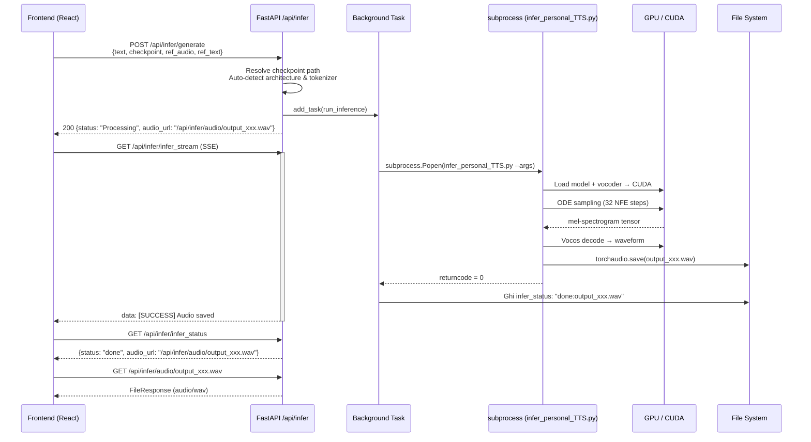
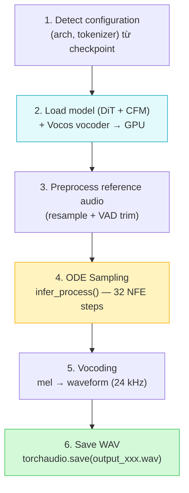
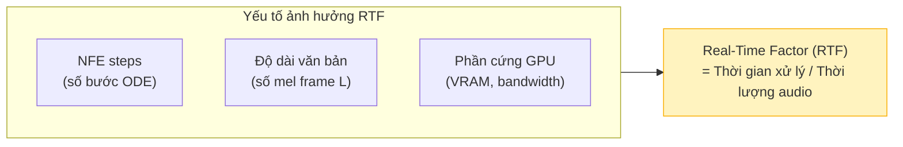

# 3.4 Triển khai suy diễn (Inference Deployment)

Section 3.3 đã mô tả quá trình huấn luyện và tạo ra checkpoint mô hình. Section này chuyển sang giai đoạn cuối của pipeline: **cách checkpoint đó được tải lên và dùng để sinh giọng nói theo yêu cầu thời gian thực**. Đây là giai đoạn người dùng thực sự tương tác với mô hình.

---

## 3.4.1 Xây dựng API sinh giọng nói

### Tổng quan luồng inference

Khi người dùng nhập văn bản và nhấn "Sinh giọng", toàn bộ luồng từ HTTP request đến file audio được xử lý theo cơ chế **bất đồng bộ qua subprocess**:



### Endpoint `POST /api/infer/generate` — Khởi động inference

Frontend gửi một JSON payload với các trường:

```python
class GenerateConfig(BaseModel):
    text: str                          # Văn bản cần tổng hợp
    checkpoint: Optional[str] = None   # Tên checkpoint (ví dụ: "vietnamese/model_last.pt")
    ref_audio: Optional[str] = None    # Đường dẫn reference audio
    ref_text: Optional[str] = None     # Transcript của ref audio (để tăng độ chính xác)
    model: Optional[str] = "F5TTS-Base"
    dataset: Optional[str] = None      # UUID dataset chứa ref audio
```

API thực hiện ba bước trước khi spawn subprocess:

#### Bước 1 — Resolve checkpoint path

```python
# Ưu tiên checkpoint được chỉ định; nếu không, lấy file mới nhất theo mtime
if config.checkpoint:
    ckpt_path = os.path.join(ckpt_parent, config.checkpoint)
else:
    ckpt_path = _find_latest_checkpoint(ckpt_parent)
    # → Quét đệ quy toàn bộ ckpts/, lấy file .pt/.safetensors có mtime mới nhất
```

#### Bước 2 — Auto-detect kiến trúc và tokenizer

Thay vì yêu cầu người dùng khai báo model type, API tự động phân tích tensor weights của checkpoint:

```python
def detect_architecture_from_ckpt(ckpt_path):
    state_dict = torch.load(ckpt_path, map_location="cpu", weights_only=True)
    
    # Detect model dim (768 = Lite, 1024 = Base)
    for key in state_dict:
        if "transformer_blocks.0.attn_norm.linear.weight" in key:
            dim = state_dict[key].shape[0] // 6   # → 1024 = F5TTS_Base
    
    # Detect tokenizer từ vocab size của embedding layer
    for key in state_dict:
        if "text_embed.text_embed.weight" in key:
            vocab_size = state_dict[key].shape[0]
            # 2546 → pinyin, 257 → byte, else → custom (tiếng Việt)
```

Thiết kế này giúp hệ thống hoạt động đúng **không phụ thuộc vào loại checkpoint** — dù là model gốc tiếng Trung (pinyin), model pretrained tiếng Việt (custom vocab), hay model sau khi fine-tune cá nhân.

#### Bước 3 — Spawn subprocess inference

Sau khi resolve đủ thông tin, backend tổng hợp CLI command và spawn:

```python
cli_cmd = [
    sys.executable, personal_infer_script,
    "--gen_text",   config.text,
    "--ckpt_file",  ckpt_path,
    "--tokenizer",  detected_tokenizer,   # auto-detected
    "--ref_audio",  ref_audio_path,
    "--ref_text",   config.ref_text,
    "--output_dir", INFER_DIR,
    "--output_file", out_filename,        # output_<uuid8>.wav
]
```

### Script `infer_personal_TTS.py` — Logic sinh giọng

Script inference thực hiện 6 bước tuần tự:



#### Bước 2 — Load model

Hàm `load_custom_model()` khởi tạo DiT với cùng cấu hình F5-TTS V0 Base (dim=1024, depth=22, heads=16) và tải trọng số từ checkpoint qua `load_checkpoint()` với `use_ema=True` — tức là sử dụng Exponential Moving Average weights thay vì trọng số raw, vốn cho chất lượng inference tốt hơn \[[1]\]:

```python
model = load_checkpoint(model, ckpt_path, device, use_ema=True)
vocoder = load_vocoder(vocoder_name="vocos", device=device)
```

#### Bước 3 — Preprocess reference audio

Reference audio được tiền xử lý qua `preprocess_ref_audio_text()`:
- **Resample** về 24 kHz nếu cần
- **VAD trim**: Cắt bỏ khoảng lặng ở đầu và cuối bằng Voice Activity Detection \[[2]\] để tránh mô hình học từ khoảng im lặng không chủ đích

Nếu `ref_text` không được cung cấp, hệ thống sẽ dùng Whisper để tự động nhận dạng transcript từ file reference \[[3]\].

#### Bước 4 — ODE Sampling (core inference)

Hàm `infer_process()` thực hiện sampling theo Flow Matching ODE \[[4]\] với `nfe_step=32` bước (mặc định):

$$\mathbf{x}_1 = \mathbf{x}_0 + \int_0^1 v_\theta(\mathbf{x}_t, t, \mathbf{c}) \, dt \approx \text{Euler}_{32\text{ steps}}(\mathbf{x}_0 \sim \mathcal{N}(0,\mathbf{I}))$$

Cụ thể, solver Euler tích phân từ nhiễu thuần túy $\mathbf{x}_0$ đến mel-spectrogram $\mathbf{x}_1$ qua 32 bước đều. Conditioning $\mathbf{c}$ gồm text embedding và giọng reference được ghép lại theo cơ chế Infilling đã mô tả ở Section 2.3.1.

Đầu ra của bước này là một tensor mel-spectrogram $\hat{\mathbf{x}}_1 \in \mathbb{R}^{L \times 100}$.

#### Bước 5 — Vocoding (Vocos)

Mel-spectrogram được chuyển thành waveform bằng **Vocos** \[[5]\] — một neural vocoder nhẹ dựa trên ConvNeXt, chuyên được tối ưu để decode từ mel 24 kHz sang audio nghe được:

$$\text{waveform} \in \mathbb{R}^{1 \times (L \times 256)} \leftarrow \text{Vocos.decode}(\hat{\mathbf{x}}_1)$$

Với hop_length = 256, mỗi mel frame tương ứng với 256 samples. File output có sample rate 24 kHz, đủ để tái tạo giọng người rõ nét.

### Tổng hợp các API Endpoint inference

| Method | Endpoint | Chức năng |
|--------|----------|-----------|
| `GET` | `/api/infer/checkpoints` | Liệt kê tất cả file `.pt`/`.safetensors` trong `ckpts/` |
| `GET` | `/api/infer/datasets` | Liệt kê dataset (để chọn ref audio) |
| `GET` | `/api/infer/datasets/{name}/ref_audios` | Liệt kê file WAV trong dataset |
| `POST` | `/api/infer/upload_ref` | Upload reference audio tạm thời (tự xóa sau 5 phút) |
| `POST` | `/api/infer/generate` | Khởi động sinh giọng (background) |
| `GET` | `/api/infer/infer_status` | Trả về `idle` / `running` / `done:{filename}` / `failed` |
| `GET` | `/api/infer/infer_stream` | SSE stream log inference real-time |
| `GET` | `/api/infer/audio/{filename}` | Tải về / phát file WAV kết quả |

---

## 3.4.2 Tối ưu tốc độ suy diễn

### Các yếu tố ảnh hưởng đến tốc độ inference

Tốc độ inference của F5-TTS phụ thuộc vào ba yếu tố chính:



**Real-Time Factor (RTF)** là chỉ số chuẩn đo tốc độ TTS \[[6]\]: RTF < 1 nghĩa là hệ thống sinh audio nhanh hơn thời gian thực (ví dụ RTF = 0.3 nghĩa là tạo 10 giây audio trong 3 giây).

### Tối ưu 1 — NFE steps (trade-off chất lượng vs. tốc độ)

Số bước ODE (`nfe_step`) là đòn bẩy trực tiếp nhất điều chỉnh tốc độ:

| NFE steps | RTF ước tính | Chất lượng audio |
|:---------:|:------------:|:-----------------|
| 8 | ~0.10 | Chấp nhận được, đôi khi nghe không tự nhiên |
| 16 | ~0.20 | Tốt — phù hợp cho production |
| **32** | **~0.35** | **Tốt nhất — giá trị mặc định** |
| 64 | ~0.65 | Gần như không khác biệt so với 32 |

Dự án chọn mặc định `nfe_step=32` — điểm cân bằng tối ưu theo khuyến nghị của paper F5-TTS \[[1]\]. Người dùng có thể override qua CLI argument `--nfe_step` nếu cần tăng tốc.

### Tối ưu 2 — EMA weights cho inference

Script tải checkpoint với `use_ema=True`:

```python
model = load_checkpoint(model, ckpt_path, device, use_ema=True)
```

**EMA (Exponential Moving Average)** weights là phiên bản "trung bình hóa" của trọng số qua nhiều bước training, cho phép mô hình ổn định hơn và tổng quát hóa tốt hơn khi inference \[[7]\]. Đây là kỹ thuật chuẩn trong các mô hình diffusion/flow-matching hiện đại.

### Tối ưu 3 — Subprocess isolation và model caching

Mỗi request inference spawn một subprocess mới — đây là lựa chọn thiết kế đánh đổi giữa **tính an toàn và tốc độ khởi động**:

| Chiến lược | Ưu điểm | Nhược điểm |
|:---|:---|:---|
| **Subprocess (hiện tại)** | Cô lập CUDA context, không leak memory, không conflict | Tốn ~3–5s để load model mỗi request |
| Model server thường trú | Không tốn thời gian load | Chiếm VRAM liên tục, phức tạp hơn |

Trong phạm vi đề tài này, chiến lược subprocess phù hợp vì: (1) tần suất sử dụng không cao (không phải production real-time), (2) đơn giản hóa kiến trúc, (3) không gây conflict khi chạy song song training và inference trên cùng một máy.

### Tối ưu 4 — Tự động xóa reference audio tạm

Khi người dùng upload reference audio qua `/api/infer/upload_ref`, file được lưu vào thư mục `tmp_ref/` với tên ngẫu nhiên. Để tránh tích lũy file dư thừa, API tự động dọn dẹp các file cũ hơn 5 phút mỗi khi có request upload mới:

```python
# infer.py — cleanup logic
now = time.time()
for f in os.listdir(TMP_REF_DIR):
    fpath = os.path.join(TMP_REF_DIR, f)
    if os.path.isfile(fpath) and (now - os.path.getmtime(fpath)) > 300:  # 5 phút
        os.remove(fpath)
```

---

## Tài Liệu Tham Khảo

| # | Tác giả | Năm | Tiêu đề | Venue |
|---|---------|-----|---------|-------|
| [1] | Chen, Y., et al. | 2024 | *F5-TTS: A Fairytaler that Fakes Fluent and Faithful Speech with Flow Matching* | arXiv:2410.06885 |
| [2] | Silero Team | 2021 | *Silero VAD: pre-trained enterprise-grade Voice Activity Detector* | GitHub |
| [3] | Radford, A., et al. | 2022 | *Robust Speech Recognition via Large-Scale Weak Supervision (Whisper)* | ICML 2023 |
| [4] | Lipman, Y., et al. | 2023 | *Flow Matching for Generative Modeling* | ICLR 2023 |
| [5] | Siuzdak, H. | 2023 | *Vocos: Closing the gap between time-domain and Fourier-based neural vocoders* | arXiv:2306.00814 |
| [6] | Zen, H., et al. | 2019 | *LibriTTS: A Corpus Derived from LibriSpeech for Text-to-Speech* | Interspeech 2019 |
| [7] | Polyak, B. T., Juditsky, A. B. | 1992 | *Acceleration of Stochastic Approximation by Averaging* | SIAM J. Control Optim. |

---

## 📎 Phụ Lục — Giải Thích Thuật Ngữ Cho Người Mới Bắt Đầu

### 🎙️ A. Reference Audio là gì? Tại sao cần nó?

**Reference audio** (giọng mẫu) là đoạn audio ngắn (3–10 giây) của người mà bạn muốn mô hình "bắt chước" giọng. F5-TTS không học giọng từ ID hay embedding cố định — thay vào đó, nó đọc trực tiếp mel-spectrogram của đoạn audio này trong lúc inference để điều hướng quá trình sinh.

Điều này có nghĩa là bạn có thể dùng F5-TTS để clone giọng bất kỳ ai **mà không cần train lại** — chỉ cần cung cấp vài giây audio mẫu. Đây là cơ chế **zero-shot voice cloning** (xem thêm Section 2.5).

---

### 🔢 B. NFE steps là gì?

**NFE** = Number of Function Evaluations — số lần mô hình DiT được gọi để tính vector field trong quá trình ODE solving.

Hãy tưởng tượng bạn cần vẽ một đường cong từ điểm A (nhiễu) đến điểm B (audio). Nếu bạn chia đường đó thành 8 đoạn thẳng, kết quả sẽ thô hơn nhưng nhanh hơn. Nếu chia thành 32 đoạn, đường cong mượt hơn và chính xác hơn. NFE = số lần "bước" trên đường đó.

---

### 📊 C. RTF (Real-Time Factor) là gì?

$$\text{RTF} = \frac{\text{Thời gian xử lý}}{\text{Thời lượng audio đầu ra}}$$

- RTF = 1.0: Hệ thống tạo audio chậm bằng tốc độ phát (không dùng được thực tế)
- RTF = 0.3: Tạo 10 giây audio trong 3 giây (rất tốt)
- RTF < 0.5: Ngưỡng thường chấp nhận cho ứng dụng TTS thực tế

F5-TTS với 32 NFE steps trên GPU thường đạt RTF khoảng 0.3–0.5, tùy phần cứng.

---

### 🔁 D. EMA (Exponential Moving Average) Weights là gì?

Trong huấn luyện, trọng số mô hình thay đổi liên tục sau mỗi batch — đôi khi dao động lớn do gradient noisy. EMA giữ một bản "trung bình trượt" của trọng số theo thời gian:

$$\theta_{\text{EMA}} \leftarrow \alpha \cdot \theta_{\text{EMA}} + (1 - \alpha) \cdot \theta_{\text{current}}$$

Với $\alpha$ thường là 0.9999. Kết quả là EMA weights mượt mà hơn, ít bị ảnh hưởng bởi những bước training "xui xẻo". Đây là lý do tại sao khi inference, ta luôn dùng EMA weights thay vì trọng số của bước training cuối cùng.

---

### 🗣️ E. VAD (Voice Activity Detection) là gì?

**VAD** là kỹ thuật phát hiện xem một đoạn audio có chứa tiếng nói hay không. Trong preprocessing của F5-TTS, VAD được dùng để cắt bỏ khoảng im lặng ở đầu và cuối reference audio.

Tại sao quan trọng? Nếu reference audio có 2 giây im lặng ở đầu, mô hình sẽ học rằng giọng người đó có xu hướng bắt đầu bằng im lặng — gây ra audio sinh ra cũng có độ trễ không mong muốn ở đầu câu.
