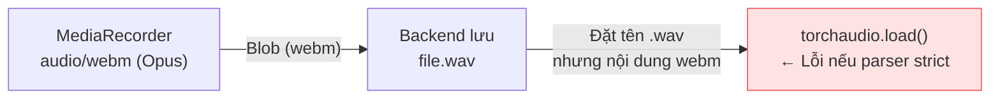
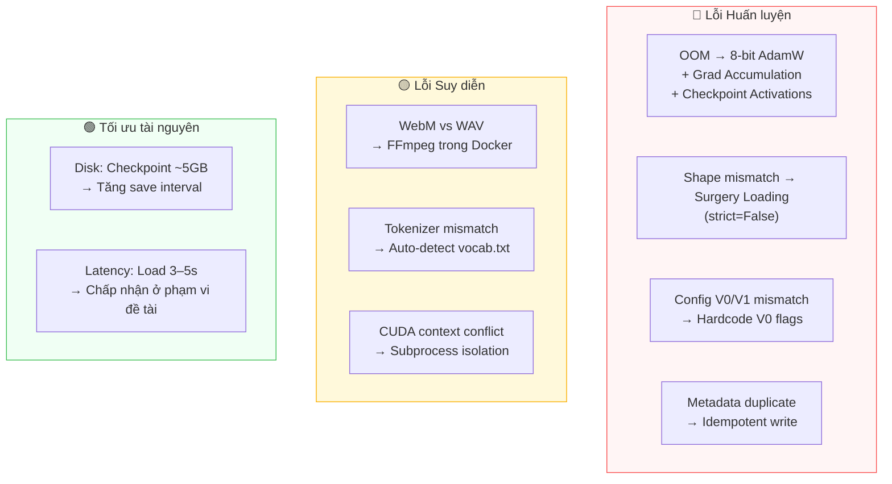

# 3.5 Các vấn đề gặp phải và hướng xử lý

Section 3.1 đến 3.4 đã trình bày hệ thống theo hướng "thiết kế lý tưởng". Trên thực tế, quá trình triển khai gặp nhiều vấn đề kỹ thuật không tầm thường — từ lỗi tương thích checkpoint, tràn VRAM, đến xung đột giữa MediaRecorder API và pipeline xử lý âm thanh. Section này ghi lại các vấn đề chính và giải pháp được áp dụng, với mục đích giúp người tái hiện hoặc mở rộng hệ thống tránh gặp phải những khó khăn tương tự.

---

## 3.5.1 Lỗi trong quá trình huấn luyện

### Vấn đề 1 — CUDA Out of Memory (OOM)

**Triệu chứng**: Huấn luyện crash với lỗi `CUDA out of memory` ngay từ batch đầu tiên, ngay cả khi `batch_size=1`.

**Nguyên nhân**: Mô hình F5-TTS Base có 335M parameters. Với float32, chỉ riêng trọng số đã chiếm ~1.3 GB VRAM. Trong quá trình backward, PyTorch cần lưu thêm activations của toàn bộ 22 lớp Transformer — đẩy tổng mức dùng lên 6–8 GB, vượt ngưỡng GPU 4–6 GB.

**Giải pháp**: Tổ hợp ba kỹ thuật tối ưu VRAM (đã trình bày chi tiết ở Section 2.3.3):

```python
trainer = Trainer(
    model,
    batch_size_per_gpu=1,           # Không được tăng
    grad_accumulation_steps=8,      # Giả lập batch_size=8 mà không tốn VRAM
    bnb_optimizer=True,             # 8-bit AdamW → giảm ~50% VRAM cho optimizer states
    # checkpoint_activations=True   # Trong model_cfg → giảm ~30% VRAM activation
)
```

Sau khi áp dụng tổ hợp này, tổng VRAM tiêu thụ giảm xuống ~3.5–4 GB — đủ để huấn luyện trên GPU 4 GB.

> **Lưu ý thực tiễn**: `bnb_optimizer=True` yêu cầu thư viện `bitsandbytes` \[[1]\] được cài đặt với CUDA backend tương thích. Trên một số cấu hình, `bitsandbytes` báo lỗi `CUDA Setup failed` — trong trường hợp đó, cần cài lại bản phù hợp với CUDA version của driver (`bitsandbytes-cuda124` cho CUDA 12.4).

---

### Vấn đề 2 — Shape Mismatch khi nạp pretrained checkpoint

**Triệu chứng**: `load_state_dict()` raise `RuntimeError: size mismatch for transformer.text_embed.text_embed.weight: copying a param with shape torch.Size([2546, 512]) from checkpoint, the shape in current model is torch.Size([N, 512]).`

**Nguyên nhân**: Model pretrained tiếng Việt dùng bộ từ điển **custom** với `vocab_size ≈ 2000+ ký tự`, khác với từ điển pinyin gốc (2546 tokens) hoặc byte tokenizer (257 tokens). Hình dạng tensor của lớp `text_embed.weight` không khớp giữa checkpoint và model được khởi tạo.

**Giải pháp — Surgery Loading**: Thay vì dùng `load_state_dict(strict=True)` (mặc định), script lọc từng layer theo hình dạng tensor và chỉ nạp những layer hợp lệ:

```python
filtered_state_dict = {
    k: v for k, v in state_dict.items()
    if k in model_state_dict and v.shape == model_state_dict[k].shape
}
model.load_state_dict(filtered_state_dict, strict=False)
# Kết quả: ~99% DiT backbone được nạp, chỉ embedding layer học lại
```

Đây là giải pháp **cross-lingual transfer learning** tiêu chuẩn: kế thừa toàn bộ khả năng sinh âm thanh của DiT, chỉ điều chỉnh lớp embedding để hiểu ký tự tiếng Việt \[[2]\].

---

### Vấn đề 3 — Backward-compatibility: `text_mask_padding` và `pe_attn_head`

**Triệu chứng**: Nạp checkpoint thành công về mặt tensor shape, nhưng inference cho kết quả ngẫu nhiên, không liên quan đến input — hay còn gọi là "babbling output".

**Nguyên nhân**: F5-TTS có hai phiên bản kiến trúc:
- **V0 Base** (checkpoint tiếng Việt đang dùng): `text_mask_padding=False`, `pe_attn_head=1`
- **V1+ Base**: `text_mask_padding=True`, `pe_attn_head=None` (mặc định mới)

Nếu khởi tạo model với config V1 nhưng load trọng số V0, các lớp attention tính toán đúng nhưng theo một cách khác — kết quả là model "chạy" mà không báo lỗi, nhưng sinh ra âm thanh vô nghĩa.

**Giải pháp**: Hardcode các flag V0 trong cả hai script training và inference, kèm comment cảnh báo rõ ràng:

```python
model_cfg = {
    "dim": 1024, "depth": 22, "heads": 16,
    "text_mask_padding": False,  # ⚠️ CRITICAL: V0 Base backward-compat
    "pe_attn_head": 1,           # ⚠️ CRITICAL: V0 Base backward-compat
}
```

---

### Vấn đề 4 — Metadata file không đồng bộ khi ghi âm lại

**Triệu chứng**: Sau khi người dùng dùng chức năng **Undo** và ghi âm lại một câu, file metadata có hai dòng trùng nhau cho cùng một WAV, dẫn đến dataset bị nhiễu nhân đôi.

**Nguyên nhân**: Logic append đơn giản không kiểm tra xem dòng đó đã tồn tại chưa.

**Giải pháp — Idempotent write**: Trước khi append, lọc ra tất cả dòng cũ có cùng tên file, sau đó mới thêm dòng mới:

```python
# collect.py
lines = [l for l in lines if not l.startswith(f"wavs/{wav_filename}|")]
lines.append(f"wavs/{wav_filename}|{prompt}\n")
```

Thiết kế này đảm bảo metadata luôn **idempotent** — ghi âm lại bất kỳ câu nào bao nhiêu lần cũng chỉ có một dòng duy nhất trong metadata.

---

## 3.5.2 Lỗi trong suy diễn

### Vấn đề 5 — MediaRecorder xuất WebM thay vì WAV

**Triệu chứng**: `torchaudio.load()` trong pipeline inference raise lỗi `RuntimeError: Couldn't open file` hoặc cho output âm thanh méo khi load file ghi từ trình duyệt.

**Nguyên nhân**: `MediaRecorder API` của trình duyệt **mặc định xuất định dạng `audio/webm;codecs=opus`** trên Chrome/Edge, không phải WAV thuần túy — ngay cả khi backend lưu với phần mở rộng `.wav`. File nhị phân thực tế là WebM container với codec Opus, không tương thích với một số parser WAV.



**Giải pháp**: `torchaudio` với backend `soundfile` hoặc `ffmpeg` thực tế xử lý được WebM nếu hệ thống có FFmpeg. Dockerfile đã cài sẵn `ffmpeg` trong image, nên vấn đề tự giải quyết trong môi trường container:

```dockerfile
# Dockerfile (đã có sẵn)
RUN apt-get install -y ffmpeg libsndfile1-dev sox libsox-fmt-all
```

Tuy nhiên, để phòng ngừa trên môi trường không có FFmpeg, `MimicDataset` xử lý mono conversion và resample luôn sau khi load — nếu load thất bại sẽ raise lỗi rõ ràng thay vì sinh audio méo.

---

### Vấn đề 6 — Tokenizer mismatch giữa training và inference

**Triệu chứng**: Inference với checkpoint đã fine-tune cho ra âm thanh lộn xộn — phát âm đúng nhịp điệu nhưng sai hoàn toàn về từ ngữ.

**Nguyên nhân**: Training dùng custom vocab tiếng Việt (`vocab.txt`), nhưng script inference mặc định dùng `pinyin` tokenizer. Kết quả là văn bản đầu vào được mã hóa thành token hoàn toàn khác — mô hình "hiểu nhầm" ngôn ngữ.

**Giải pháp — Auto-detect vocab từ checkpoint directory**:

```python
# infer_personal_TTS.py
vocab_file = args.vocab_file
if not vocab_file:
    # Tìm vocab.txt cùng thư mục với checkpoint (được copy khi training)
    candidate_vocab = os.path.join(os.path.dirname(ckpt_path), "vocab.txt")
    if os.path.exists(candidate_vocab):
        vocab_file = candidate_vocab
        print(f"Auto-detected vocab file at: {vocab_file}")
```

Đây là lý do training script **luôn copy `vocab.txt` vào checkpoint directory**: đảm bảo tokenizer đi kèm với model, tránh mismatch khi inference sau này.

---

### Vấn đề 7 — CUDA context conflict giữa FastAPI và PyTorch subprocess

**Triệu chứng**: Khi chạy inference lần thứ hai liên tiếp mà không restart server, process thứ hai crash với `RuntimeError: CUDA error: an illegal memory access was encountered`.

**Nguyên nhân**: FastAPI event loop và PyTorch đều cố gắng khởi tạo CUDA context trong cùng một tiến trình Python. Khi inference kết thúc và process dọn dẹp CUDA memory, một số state CUDA bị "ô nhiễm", gây crash cho lần tiếp theo.

**Giải pháp — Subprocess isolation**: Mỗi request inference spawn một subprocess Python độc lập (`subprocess.Popen`), có CUDA context riêng biệt. Khi subprocess kết thúc, toàn bộ CUDA context được dọn dẹp sạch bởi OS — không ảnh hưởng đến process FastAPI:

```python
# infer.py
process = subprocess.Popen(
    [sys.executable, infer_script, "--gen_text", ...],
    stdout=subprocess.PIPE,
    stderr=subprocess.STDOUT,
    env=env  # PYTHONPATH riêng cho F5-TTS source
)
```

Đây là lý do cốt lõi tại sao hệ thống chọn kiến trúc subprocess thay vì giữ model thường trú trong FastAPI process (đã phân tích ở Section 3.4.2).

---

## 3.5.3 Tối ưu tài nguyên hệ thống

### Vấn đề 8 — Checkpoint ~5 GB chiếm nhiều dung lượng

**Triệu chứng**: Mỗi checkpoint lưu định kỳ (`model_500.pt`, `model_1000.pt`, ...) chiếm ~5.1 GB. Sau 10 epoch với `save_per_updates=500`, thư mục checkpoint có thể tích lũy 20–30 GB.

**Nguyên nhân**: Trainer mặc định của F5-TTS lưu cả `model_state_dict`, `ema_model_state_dict`, và `optimizer_state_dict` trong một file — optimizer state với 8-bit AdamW vẫn chiếm vài trăm MB, cộng với EMA weights bằng kích thước model.

**Giải pháp hiện tại**: Hệ thống tăng `save_per_updates=500` (thay vì giá trị mặc định thấp hơn) để giảm tần suất lưu. Về lâu dài, có thể thêm logic dọn dẹp checkpoint cũ — chỉ giữ lại N checkpoint gần nhất:

```python
# Hướng xử lý đề xuất (chưa implement)
def cleanup_old_checkpoints(ckpt_dir, keep_last_n=3):
    checkpoints = sorted(
        [f for f in os.listdir(ckpt_dir) if f.startswith("model_") and f.endswith(".pt")],
        key=lambda x: os.path.getmtime(os.path.join(ckpt_dir, x))
    )
    for old_ckpt in checkpoints[:-keep_last_n]:
        os.remove(os.path.join(ckpt_dir, old_ckpt))
```

---

### Vấn đề 9 — Model load chậm mỗi request (~3–5 giây)

**Triệu chứng**: Mỗi request inference mất 3–5 giây chỉ để load model vào VRAM trước khi bắt đầu tính toán thực sự.

**Nguyên nhân**: Với kiến trúc subprocess, mỗi lần inference phải:
1. Khởi động Python interpreter mới
2. Import toàn bộ F5-TTS source (~1 giây)
3. `torch.load()` file checkpoint 5 GB từ disk (~2–3 giây)
4. Chuyển tensor lên GPU (~0.5 giây)

**Tổng hợp và phân loại vấn đề**:



**Giải pháp dài hạn**: Kiến trúc **model server thường trú** (giữ model trong RAM/VRAM giữa các request) sẽ giải quyết hoàn toàn vấn đề này, nhưng đòi hỏi quản lý CUDA context cẩn thận và cơ chế concurrency phức tạp hơn. Trong phạm vi đề tài này, độ trễ 3–5 giây là chấp nhận được vì hệ thống không yêu cầu real-time interactive.

---

## Tài Liệu Tham Khảo

| # | Tác giả | Năm | Tiêu đề | Venue |
|---|---------|-----|---------|-------|
| [1] | Dettmers, T., et al. | 2022 | *8-bit Optimizers via Block-wise Quantization* | ICLR 2022 |
| [2] | Conneau, A., et al. | 2020 | *Unsupervised Cross-lingual Representation Learning at Scale (XLM-R)* | ACL 2020 |
| [3] | Chen, Y., et al. | 2024 | *F5-TTS: A Fairytaler that Fakes Fluent and Faithful Speech with Flow Matching* | arXiv:2410.06885 |

---

## 📎 Phụ Lục — Giải Thích Thuật Ngữ Cho Người Mới Bắt Đầu

### 💥 A. CUDA Out of Memory là gì?

GPU có một vùng nhớ riêng gọi là **VRAM** (Video RAM). Khi PyTorch huấn luyện mô hình, nó cần lưu vào VRAM:
- **Trọng số mô hình** (~1.3 GB với F5-TTS Base)
- **Activations** — giá trị trung gian của từng lớp để tính đạo hàm (~2–4 GB)
- **Optimizer states** — AdamW lưu thêm 2 ma trận momentum cho mỗi tham số (~2.6 GB)

Tổng cộng có thể lên đến 6–8 GB. Nếu GPU chỉ có 4 GB VRAM, PyTorch sẽ raise `CUDA Out of Memory` và huấn luyện dừng đột ngột.

---

### 🔀 B. Cross-lingual Transfer Learning là gì?

Đây là kỹ thuật tận dụng một mô hình đã học "kiến thức chung" từ ngôn ngữ này để nhanh chóng thích nghi với ngôn ngữ mới. Ví dụ: mô hình F5-TTS đã học cách "vẽ" mel-spectrogram từ hàng nghìn giờ audio tiếng Trung — kiến thức về cấu trúc âm thanh, nhịp điệu, intonation này là **phổ quát**, không phụ thuộc ngôn ngữ.

Khi chuyển sang tiếng Việt, ta chỉ cần "dạy" model bộ ký tự mới (embedding layer) trong khi giữ nguyên toàn bộ khả năng sinh âm thanh đã có. Điều này giải thích tại sao chỉ cần vài trăm câu tiếng Việt là đủ để fine-tune hiệu quả.

---

### 🔁 C. Idempotent là gì?

Một thao tác được gọi là **idempotent** nếu thực hiện nó nhiều lần cho kết quả giống như thực hiện một lần duy nhất. Ví dụ:
- **Không idempotent**: `append("dòng mới")` — gọi 3 lần → 3 dòng trùng
- **Idempotent**: `set key = value` — gọi 3 lần → chỉ có 1 giá trị

Trong hệ thống này, việc ghi metadata được thiết kế idempotent: "xóa dòng cũ rồi thêm dòng mới" thay vì chỉ "thêm dòng mới". Điều này cho phép người dùng ghi âm lại bất kỳ lúc nào mà không làm hỏng dataset.

---

### 🔌 D. CUDA Context là gì?

Khi PyTorch khởi động trên GPU, nó tạo ra một **CUDA context** — một "phiên làm việc" với GPU bao gồm: bộ nhớ đã cấp phát, các CUDA stream, và trạng thái driver. Mỗi tiến trình Python có một CUDA context riêng.

Vấn đề xảy ra khi hai đoạn code trong cùng một tiến trình cùng quản lý CUDA context theo cách xung đột — giống như hai người cùng cố điều khiển một chiếc chuột máy tính. Giải pháp subprocess đảm bảo mỗi lần inference là một "phiên làm việc" GPU độc lập, hoàn toàn sạch sẽ.
