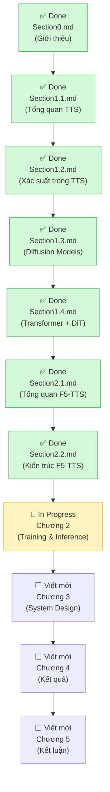

# Text to Speech Personal - Mục Lục

> **Cập nhật lần cuối**: 2026-05-06
> **Tổng tiến độ**: 36 / 73 sections hoàn thành *(~49%)*

---

## Bảng Nội Dung Chính

| Chương | Tiêu Đề | Tài Liệu | Trạng Thái |
|--------|---------|----------|-----------|
| **0** | **GIỚI THIỆU** | [Section0.md](Section0.md) | ✅ Done |
| 0.1 | Đặt vấn đề | [Section0.md](Section0.md#01-đặt-vấn-đề) | ✅ Done |
| 0.2 | Mục tiêu nghiên cứu | [Section0.md](Section0.md#02-mục-tiêu-nghiên-cứu) | ✅ Done |
| 0.3 | Phạm vi và đối tượng nghiên cứu | [Section0.md](Section0.md#03-phạm-vi-và-đối-tượng-nghiên-cứu) | ✅ Done |
| 0.4 | Phương pháp tiếp cận | [Section0.md](Section0.md#04-phương-pháp-tiếp-cận) | ✅ Done |
| 0.5 | Cấu trúc luận văn | [Section0.md](Section0.md#05-cấu-trúc-luận-văn) | ✅ Done |
| **1** | **CƠ SỞ LÝ THUYẾT** | — | ✅ Done |
| 1.1 | Tổng Quan về Bài Toán Text-to-Speech | [Section1.1.md](Section1.1.md) | ✅ Done |
| 1.1.1 | Khái Niệm và Các Thành Phần Của Hệ Thống TTS | [Section1.1.md](Section1.1.md#111-khái-niệm-và-các-thành-phần-của-hệ-thống-tts) | ✅ Done |
| 1.1.2 | Tiến Trình Phát Triển Các Mô Hình TTS | [Section1.1.md](Section1.1.md#112-tiến-trình-phát-triển-các-mô-hình-tts) | ✅ Done |
| 1.1.3 | Vị Trí Của F5-TTS Trong Bức Tranh Tổng Thể | [Section1.1.md](Section1.1.md#113-vị-trí-của-f5-tts-trong-bức-tranh-tổng-thể) | ✅ Done |
| 1.2 | Mô Hình Xác Suất Trong TTS | [Section1.2.md](Section1.2.md) | ✅ Done |
| 1.2.1 | Bài Toán TTS Dưới Góc Nhìn Xác Suất | [Section1.2.md](Section1.2.md#121-bài-toán-tts-dưới-góc-nhìn-xác-suất) | ✅ Done |
| 1.2.2 | Phân Phối Dữ Liệu Âm Thanh | [Section1.2.md](Section1.2.md#122-phân-phối-dữ-liệu-âm-thanh) | ✅ Done |
| 1.2.3 | Hàm Mục Tiêu — Học Phân Phối Nào Tốt Nhất? | [Section1.2.md](Section1.2.md#123-hàm-mục-tiêu--học-phân-phối-nào-tốt-nhất) | ✅ Done |
| 1.3 | Diffusion Models và Flow Matching | [Section1.3.md](Section1.3.md) | ✅ Done |
| 1.3.1 | Diffusion Models — Ý Tưởng Và Cơ Chế | [Section1.3.md](Section1.3.md#131-diffusion-models--ý-tưởng-và-cơ-chế) | ✅ Done |
| 1.3.2 | Flow Matching — Cải Tiến Cho F5-TTS | [Section1.3.md](Section1.3.md#132-flow-matching--cải-tiến-cho-f5-tts) | ✅ Done |
| 1.4 | Transformer và Diffusion Transformer (DiT) | [Section1.4.md](Section1.4.md) | ✅ Done |
| 1.4.1 | Transformer — Backbone Của DiT | [Section1.4.md](Section1.4.md#141-transformer--backbone-của-dit) | ✅ Done |
| 1.4.2 | Diffusion Transformer (DiT) — Tích Hợp Timestep Và Ngữ Cảnh | [Section1.4.md](Section1.4.md#142-diffusion-transformer-dit--tích-hợp-timestep-và-ngữ-cảnh) | ✅ Done |
| 1.4.3 | Lý Do Chọn Transformer Cho TTS | [Section1.4.md](Section1.4.md#143-lý-do-chọn-transformer-cho-tts) | ✅ Done |
| **2** | **MÔ HÌNH F5-TTS VÀ PHƯƠNG PHÁP TIẾP CẬN** | — | 🔄 In Progress |
| 2.1 | Tổng quan về mô hình F5-TTS | [Section2.1.md](Section2.1.md) | ✅ Done |
| 2.1.1 | Động lực và ý tưởng thiết kế | [Section2.1.md](Section2.1.md#211-động-lực-và-ý-tưởng-thiết-kế) | ✅ Done |
| 2.1.2 | So sánh với các mô hình TTS khác | [Section2.1.md](Section2.1.md#212-so-sánh-với-các-mô-hình-tts-khác) | ✅ Done |
| 2.2 | Kiến trúc mô hình | [Section2.2.md](Section2.2.md) | ✅ Done |
| 2.2.1 | Text Encoder | [Section2.2.md](Section2.2.md#221-text-encoder-bộ-mã-hóa-văn-bản) | ✅ Done |
| 2.2.2 | Audio Encoder | [Section2.2.md](Section2.2.md#222-tích-hợp-đặc-trưng-âm-thanh-audio-encoder--audio-representation) | ✅ Done |
| 2.2.3 | Diffusion Transformer (DiT) | [Section2.2.md](Section2.2.md#223-diffusion-transformer-dit) | ✅ Done |
| 2.3 | Quy trình huấn luyện mô hình | [Section2.3.md](Section2.3.md) | ✅ Done |
| 2.3.1 | Dữ liệu đầu vào và đầu ra | [Section2.3.md](Section2.3.md#231-dữ-liệu-đầu-vào-và-đầu-ra) | ✅ Done |
| 2.3.2 | Hàm mất mát | [Section2.3.md](Section2.3.md#232-hàm-mất-mát-loss-function) | ✅ Done |
| 2.3.3 | Fine-tuning cho giọng nói cá nhân | [Section2.3.md](Section2.3.md#233-fine-tuning-cho-giọng-nói-cá-nhân) | ✅ Done |
| 2.4 | Quy trình suy diễn (Inference) | [Section2.4.md](Section2.4.md) | ✅ Done |
| 2.4.1 | Sampling trong Flow Matching | [Section2.4.md](Section2.4.md#241-sampling-trong-flow-matching) | ✅ Done |
| 2.4.2 | Sinh tín hiệu âm thanh (Vocoding) | [Section2.4.md](Section2.4.md#242-sinh-tín-hiệu-âm-thanh-vocoding) | ✅ Done |
| 2.5 | Cơ chế Voice Cloning | — | ⬜ Not Started |
| 2.5.1 | Biểu diễn đặc trưng giọng nói | — | ⬜ Not Started |
| 2.5.2 | Speaker Adaptation | — | ⬜ Not Started |
| **3** | **THIẾT KẾ VÀ TRIỂN KHAI HỆ THỐNG** | — | ⬜ Not Started |
| 3.1 | Tổng quan kiến trúc hệ thống | — | ⬜ Not Started |
| 3.1.1 | Backend (FastAPI) | — | ⬜ Not Started |
| 3.1.2 | Frontend giao diện người dùng | — | ⬜ Not Started |
| 3.1.3 | Pipeline xử lý | — | ⬜ Not Started |
| 3.2 | Thu thập và tiền xử lý dữ liệu | — | ⬜ Not Started |
| 3.2.1 | Thu thập dữ liệu giọng nói | — | ⬜ Not Started |
| 3.2.2 | Gán nhãn (Labeling) | — | ⬜ Not Started |
| 3.2.3 | Tiền xử lý âm thanh và văn bản | — | ⬜ Not Started |
| 3.3 | Huấn luyện mô hình | — | ⬜ Not Started |
| 3.3.1 | Cấu hình môi trường (GPU, Docker) | — | ⬜ Not Started |
| 3.3.2 | Các siêu tham số (Hyperparameters) | — | ⬜ Not Started |
| 3.3.3 | Quản lý checkpoint | — | ⬜ Not Started |
| 3.4 | Triển khai suy diễn | — | ⬜ Not Started |
| 3.4.1 | Xây dựng API sinh giọng nói | — | ⬜ Not Started |
| 3.4.2 | Tối ưu tốc độ suy diễn | — | ⬜ Not Started |
| 3.5 | Các vấn đề gặp phải và hướng xử lý | — | ⬜ Not Started |
| 3.5.1 | Lỗi trong quá trình huấn luyện | — | ⬜ Not Started |
| 3.5.2 | Lỗi trong suy diễn | — | ⬜ Not Started |
| 3.5.3 | Tối ưu tài nguyên hệ thống | — | ⬜ Not Started |
| **4** | **THỰC NGHIỆM VÀ ĐÁNH GIÁ** | — | ⬜ Not Started |
| 4.1 | Thiết lập thực nghiệm | — | ⬜ Not Started |
| 4.1.1 | Tập dữ liệu sử dụng | — | ⬜ Not Started |
| 4.1.2 | Môi trường phần cứng | — | ⬜ Not Started |
| 4.2 | Kết quả thực nghiệm | — | ⬜ Not Started |
| 4.2.1 | Kết quả trước và sau fine-tuning | — | ⬜ Not Started |
| 4.2.2 | Ví dụ âm thanh sinh ra | — | ⬜ Not Started |
| 4.3 | Đánh giá chất lượng | — | ⬜ Not Started |
| 4.3.1 | Đánh giá chủ quan (MOS) | — | ⬜ Not Started |
| 4.3.2 | Đánh giá tốc độ (Latency, RTF) | — | ⬜ Not Started |
| 4.4 | Phân tích kết quả | — | ⬜ Not Started |
| 4.4.1 | Ảnh hưởng của dữ liệu | — | ⬜ Not Started |
| 4.4.2 | Ảnh hưởng của siêu tham số | — | ⬜ Not Started |
| **5** | **KẾT LUẬN VÀ HƯỚNG PHÁT TRIỂN** | — | ⬜ Not Started |
| 5.1 | Kết quả đạt được | — | ⬜ Not Started |
| 5.2 | Hạn chế của hệ thống | — | ⬜ Not Started |
| 5.3 | Hướng phát triển trong tương lai | — | ⬜ Not Started |

---

## Huyền Dẫn Trạng Thái

| Ký hiệu | Ý nghĩa |
|---------|---------|
| ✅ Done | Đã hoàn thành, file tồn tại trên disk |
| 🔄 In Progress | Chương đang được viết (có ít nhất 1 sub-section Done) |
| ⬜ Not Started | Chưa bắt đầu |
| ⚠️ Missing File | Nội dung đã viết nhưng file bị mất — cần tái tạo |

---

## Tổng Hợp Files Hiện Có

| File | Kích thước | Trạng thái |
|------|-----------|-----------| 
| [Section0.md](Section0.md) | ~13 KB | ✅ Đầy đủ (Giới thiệu) |
| [Section1.1.md](Section1.1.md) | ~10 KB | ✅ Đầy đủ (nội dung + tài liệu tham khảo + phụ lục) |
| [Section1.2.md](Section1.2.md) | ~9 KB | ✅ Đầy đủ (Xác suất trong TTS + Phụ lục) |
| [Section1.3.md](Section1.3.md) | ~10 KB | ✅ Đầy đủ (Diffusion Models + Phụ lục) |
| [Section1.4.md](Section1.4.md) | ~11 KB | ✅ Đầy đủ (Transformer + DiT + Phụ lục) |
| [Section2.1.md](Section2.1.md) | ~15 KB | ✅ Đầy đủ (Tổng quan F5-TTS + Phụ lục) |
| [Section2.2.md](Section2.2.md) | ~12 KB | ✅ Đầy đủ (Kiến trúc F5-TTS + Phụ lục) |
| [Section2.3.md](Section2.3.md) | ~10 KB | ✅ Đầy đủ (Quy trình huấn luyện + Phụ lục) |
| [Section2.4.md](Section2.4.md) | ~5 KB | ✅ Đầy đủ (Quy trình suy diễn + Phụ lục) |

---

## Thứ Tự Ưu Tiên Viết Tiếp

