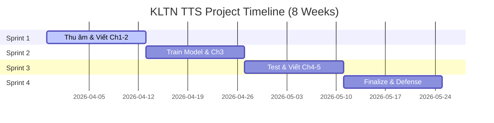

### 1.1 Sprint Overview

| Sprint                                        | Weeks    | Key Deliverables                                                                           |
| --------------------------------------------- | -------- | ------------------------------------------------------------------------------------------ |
| **Sprint 1 — Data & Foundation**       | W1 – W2 | Hoàn thành bộ Dataset (3h+ audio sạch), Báo cáo chương 1 & 2 (Cơ sở lý thuyết) |
| **Sprint 2 — Training & Optimization** | W3 – W4 | Hoàn thành huấn luyện F5-TTS, Có Model Checkpoint tối ưu, Báo cáo chương 3      |
| **Sprint 3 — Evaluation & Full Draft** | W5 – W6 | Kết quả đánh giá MOS & Benchmark, Hoàn thành bản thảo báo cáo 5 chương        |
| **Sprint 4 — Review & Final Defense**  | W7 – W8 | Báo cáo hoàn chỉnh (Final Copy), Slide thuyết trình & Video Demo app                 |

### 1.2 Detailed Schedule

| Activity                                                        |  W1  |  W2  |  W3  |  W4  |  W5  |  W6  |  W7  |  W8  |
| --------------------------------------------------------------- | :--: | :--: | :--: | :--: | :--: | :--: | :--: | :--: |
| **[Sprint 1]** Thu âm & Labeling (Mimic Studio)          | ██ | ██ |      |      |      |      |      |      |
| **[Sprint 1]** Viết Chương 1 & 2 (Cơ sở lý thuyết) | ██ | ██ |      |      |      |      |      |      |
| **[Sprint 2]** Tiền xử lý Data & Config Training       |      |      | ██ |      |      |      |      |      |
| **[Sprint 2]** Huấn luyện chính thức F5-TTS           |      |      | ██ | ██ |      |      |      |      |
| **[Sprint 2]** Viết Chương 3 (Thiết kế hệ thống)   |      |      |      | ██ |      |      |      |      |
| **[Sprint 3]** Thực hiện Inference & Test kết quả     |      |      |      |      | ██ |      |      |      |
| **[Sprint 3]** Đánh giá MOS & Benchmark                |      |      |      |      | ██ | ██ |      |      |
| **[Sprint 3]** Viết Chương 4 & 5 (Thực nghiệm)       |      |      |      |      |      | ██ |      |      |
| **[Sprint 4]** Chỉnh sửa báo cáo (Final Review)       |      |      |      |      |      |      | ██ |      |
| **[Sprint 4]** Quay Video Demo & Làm Slide               |      |      |      |      |      |      | ██ | ██ |
| **[Sprint 4]** Nộp báo cáo & Bảo vệ KLTN             |      |      |      |      |      |      |      | ██ |

### 1.3 Milestones

| Milestone             | Target    | Criteria                                                                      |
| --------------------- | --------- | ----------------------------------------------------------------------------- |
| M1 — Dataset Ready   | End of W2 | Có đầy đủ Audio + Metadata sạch, đã viết xong 2 chương đầu       |
| M2 — Model Success   | End of W4 | Model F5-TTS hội tụ (Loss ổn định), hoàn thành bản thiết kế         |
| M3 — Report Complete | End of W6 | Đã có kết quả đánh giá thực tế và bản thảo đầy đủ 5 chương |
| M4 — Project Defense | End of W8 | Bảo vệ thành công KLTN với đầy đủ App, Báo cáo và Video Demo      |

---

### 1.4 Visual Timeline (Gantt Chart)

